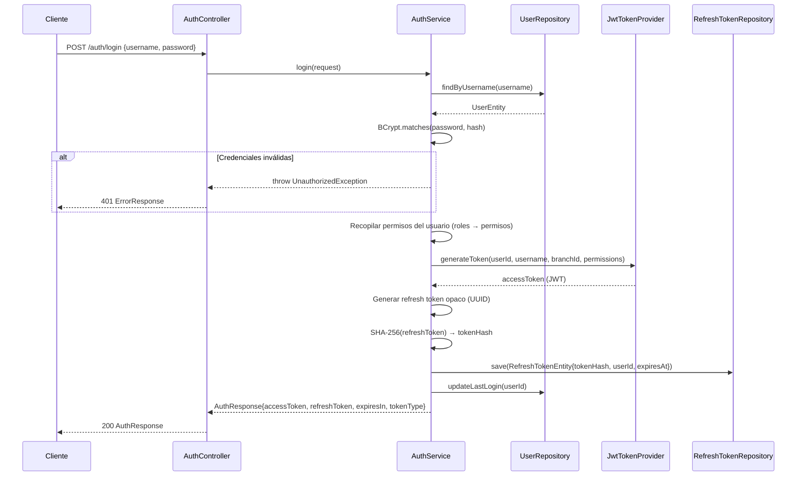
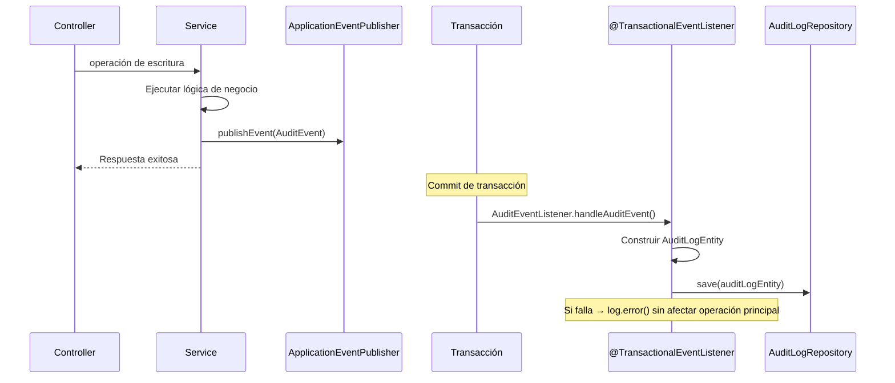

# Documento de Diseño Técnico — Access Service

## Visión General

El Access Service es el microservicio central de autenticación, autorización y configuración del sistema de gestión de ventas e inventario de bar. Opera como un servicio Spring Boot 4.1 con Java 17, arquitectura hexagonal y seguridad stateless basada en JWT.

### Responsabilidades Principales

- **Autenticación**: Login con JWT + refresh token rotation, logout con revocación
- **Autorización**: Gestión de usuarios, roles y permisos con verificación por @RequiresPermission
- **Configuración**: Sucursales, parámetros del sistema, catálogos y opciones de menú
- **Auditoría**: Registro asíncrono post-commit de todas las operaciones de escritura
- **Notificaciones**: Gestión de notificaciones dirigidas a usuarios específicos

### Contexto del Sistema

El servicio se integra con la librería compartida `drinks-common` que provee:
- `JwtTokenProvider`: Generación y validación de JWT (HMAC-SHA256)
- `JwtAuthenticationFilter`: Filtro que intercepta requests y establece el SecurityContext
- `UserPrincipal`: Record con userId, username, branchId y permissions
- `@RequiresPermission` + `PermissionAspect`: Autorización declarativa a nivel de método
- `GlobalExceptionHandler`: Manejo centralizado de excepciones → ErrorResponse
- `CorrelationIdFilter`: Genera/propaga X-Correlation-ID en MDC
- `PageResponse<T>`: Wrapper estándar de paginación
- `AuditEvent`: Record para eventos de auditoría


## Arquitectura

### Diagrama de Componentes

```mermaid
graph TB
    subgraph "Infraestructura - Adaptadores de Entrada (REST)"
        AuthController[AuthController]
        UserController[UserController]
        RoleController[RoleController]
        BranchController[BranchController]
        SystemParameterController[SystemParameterController]
        CatalogController[CatalogController]
        MenuOptionController[MenuOptionController]
        AuditLogController[AuditLogController]
        NotificationController[NotificationController]
        PermissionController[PermissionController]
    end

    subgraph "Aplicación - Servicios (Casos de Uso)"
        AuthService[AuthService]
        UserService[UserService]
        RoleService[RoleService]
        BranchService[BranchService]
        SystemParameterService[SystemParameterService]
        CatalogService[CatalogService]
        MenuOptionService[MenuOptionService]
        AuditService[AuditService]
        NotificationService[NotificationService]
        PermissionService[PermissionService]
    end

    subgraph "Dominio - Puertos"
        direction LR
        PortsIn[Puertos de Entrada<br/>UseCase interfaces]
        PortsOut[Puertos de Salida<br/>Repository interfaces]
    end

    subgraph "Infraestructura - Adaptadores de Salida"
        UserRepo[UserJpaRepository]
        RoleRepo[RoleJpaRepository]
        PermRepo[PermissionJpaRepository]
        BranchRepo[BranchJpaRepository]
        TokenRepo[RefreshTokenJpaRepository]
        MenuRepo[MenuOptionJpaRepository]
        ParamRepo[SystemParameterJpaRepository]
        CatalogRepo[CatalogJpaRepository]
        AuditRepo[AuditLogJpaRepository]
        NotifRepo[NotificationJpaRepository]
    end

    subgraph "drinks-common"
        JwtProvider[JwtTokenProvider]
        JwtFilter[JwtAuthenticationFilter]
        PermAspect[PermissionAspect]
        ExHandler[GlobalExceptionHandler]
        CorrFilter[CorrelationIdFilter]
    end

    AuthController --> AuthService
    UserController --> UserService
    RoleController --> RoleService
    BranchController --> BranchService
    SystemParameterController --> SystemParameterService
    CatalogController --> CatalogService
    MenuOptionController --> MenuOptionService
    AuditLogController --> AuditService
    NotificationController --> NotificationService
    PermissionController --> PermissionService

    AuthService --> JwtProvider
    AuthService --> TokenRepo
    AuthService --> UserRepo

    UserService --> UserRepo
    RoleService --> RoleRepo
    RoleService --> PermRepo
    BranchService --> BranchRepo
    SystemParameterService --> ParamRepo
    CatalogService --> CatalogRepo
    MenuOptionService --> MenuRepo
    AuditService --> AuditRepo
    NotificationService --> NotifRepo
    PermissionService --> PermRepo
```




### Flujo de Autenticación



### Flujo de Auditoría Asíncrona




## Componentes e Interfaces

### Estructura de Paquetes (Hexagonal)

```
drinks.system.accessservice/
├── AccessServiceApplication.java
├── config/
│   ├── FlywayConfig.java                    (existente)
│   ├── SecurityConfig.java                  (configuración Spring Security)
│   ├── PasswordEncoderConfig.java           (BCryptPasswordEncoder bean)
│   ├── AsyncConfig.java                     (habilitar @Async y eventos)
│   └── JpaAuditingConfig.java              (auditoría JPA: createdBy, updatedBy)
├── domain/
│   ├── model/
│   │   ├── User.java                        (dominio puro)
│   │   ├── Role.java
│   │   ├── Permission.java
│   │   ├── Branch.java
│   │   ├── RefreshToken.java
│   │   ├── SystemMenuOption.java
│   │   ├── SystemParameter.java
│   │   ├── Catalog.java
│   │   ├── AuditLog.java
│   │   ├── Notification.java
│   │   └── enums/
│   │       ├── AuditAction.java             (CREATE, UPDATE, DELETE, LOGIN, LOGOUT)
│   │       ├── AuditModule.java             (ACCESS, SALES, INVENTORY, REPORTING)
│   │       ├── DataType.java                (STRING, INTEGER, DECIMAL, BOOLEAN, JSON)
│   │       └── NotificationType.java        (STOCK_BAJO, ALERTA_SISTEMA, INFO)
│   ├── port/
│   │   ├── in/
│   │   │   ├── AuthUseCase.java
│   │   │   ├── UserUseCase.java
│   │   │   ├── RoleUseCase.java
│   │   │   ├── BranchUseCase.java
│   │   │   ├── SystemParameterUseCase.java
│   │   │   ├── CatalogUseCase.java
│   │   │   ├── MenuOptionUseCase.java
│   │   │   ├── AuditUseCase.java
│   │   │   ├── NotificationUseCase.java
│   │   │   └── PermissionUseCase.java
│   │   └── out/
│   │       ├── UserRepositoryPort.java
│   │       ├── RoleRepositoryPort.java
│   │       ├── PermissionRepositoryPort.java
│   │       ├── BranchRepositoryPort.java
│   │       ├── RefreshTokenRepositoryPort.java
│   │       ├── MenuOptionRepositoryPort.java
│   │       ├── SystemParameterRepositoryPort.java
│   │       ├── CatalogRepositoryPort.java
│   │       ├── AuditLogRepositoryPort.java
│   │       └── NotificationRepositoryPort.java
│   └── exception/
│       └── (vacío — se usan las excepciones de drinks-common)
├── application/
│   ├── service/
│   │   ├── AuthServiceImpl.java
│   │   ├── UserServiceImpl.java
│   │   ├── RoleServiceImpl.java
│   │   ├── BranchServiceImpl.java
│   │   ├── SystemParameterServiceImpl.java
│   │   ├── CatalogServiceImpl.java
│   │   ├── MenuOptionServiceImpl.java
│   │   ├── AuditServiceImpl.java
│   │   ├── NotificationServiceImpl.java
│   │   ├── PermissionServiceImpl.java
│   │   └── AuditEventListener.java         (@TransactionalEventListener)
│   ├── dto/
│   │   ├── request/
│   │   │   ├── LoginRequest.java
│   │   │   ├── RefreshTokenRequest.java
│   │   │   ├── LogoutRequest.java
│   │   │   ├── CreateUserRequest.java
│   │   │   ├── UpdateUserRequest.java
│   │   │   ├── ChangeOwnPasswordRequest.java
│   │   │   ├── AdminChangePasswordRequest.java
│   │   │   ├── AssignRolesRequest.java
│   │   │   ├── AssignBranchesRequest.java
│   │   │   ├── CreateRoleRequest.java
│   │   │   ├── UpdateRoleRequest.java
│   │   │   ├── AssignPermissionsRequest.java
│   │   │   ├── CreateBranchRequest.java
│   │   │   ├── UpdateBranchRequest.java
│   │   │   ├── BranchStatusRequest.java
│   │   │   ├── CreateSystemParameterRequest.java
│   │   │   ├── UpdateSystemParameterRequest.java
│   │   │   ├── CreateCatalogRequest.java
│   │   │   ├── UpdateCatalogRequest.java
│   │   │   ├── CreateMenuOptionRequest.java
│   │   │   ├── UpdateMenuOptionRequest.java
│   │   │   └── CreateNotificationRequest.java
│   │   └── response/
│   │       ├── AuthResponse.java
│   │       ├── UserResponse.java
│   │       ├── UserDetailResponse.java
│   │       ├── UserProfileResponse.java
│   │       ├── RoleResponse.java
│   │       ├── RoleDetailResponse.java
│   │       ├── PermissionResponse.java
│   │       ├── PermissionsByModuleResponse.java
│   │       ├── BranchResponse.java
│   │       ├── SystemParameterResponse.java
│   │       ├── CatalogResponse.java
│   │       ├── MenuOptionResponse.java
│   │       ├── MenuTreeResponse.java
│   │       ├── AuditLogResponse.java
│   │       ├── NotificationResponse.java
│   │       └── UnreadCountResponse.java
│   └── mapper/
│       ├── UserMapper.java
│       ├── RoleMapper.java
│       ├── PermissionMapper.java
│       ├── BranchMapper.java
│       ├── SystemParameterMapper.java
│       ├── CatalogMapper.java
│       ├── MenuOptionMapper.java
│       ├── AuditLogMapper.java
│       └── NotificationMapper.java
└── infrastructure/
    ├── adapter/
    │   ├── in/
    │   │   └── rest/
    │   │       ├── AuthController.java
    │   │       ├── UserController.java
    │   │       ├── RoleController.java
    │   │       ├── BranchController.java
    │   │       ├── SystemParameterController.java
    │   │       ├── CatalogController.java
    │   │       ├── MenuOptionController.java
    │   │       ├── AuditLogController.java
    │   │       ├── NotificationController.java
    │   │       └── PermissionController.java
    │   └── out/
    │       └── persistence/
    │           ├── entity/
    │           │   ├── UserEntity.java
    │           │   ├── RoleEntity.java
    │           │   ├── PermissionEntity.java
    │           │   ├── BranchEntity.java
    │           │   ├── RefreshTokenEntity.java
    │           │   ├── SystemMenuOptionEntity.java
    │           │   ├── SystemParameterEntity.java
    │           │   ├── CatalogEntity.java
    │           │   ├── AuditLogEntity.java
    │           │   ├── NotificationEntity.java
    │           │   ├── UserRoleEntity.java
    │           │   ├── UserBranchEntity.java
    │           │   └── RolePermissionEntity.java
    │           ├── repository/
    │           │   ├── UserJpaRepository.java
    │           │   ├── RoleJpaRepository.java
    │           │   ├── PermissionJpaRepository.java
    │           │   ├── BranchJpaRepository.java
    │           │   ├── RefreshTokenJpaRepository.java
    │           │   ├── SystemMenuOptionJpaRepository.java
    │           │   ├── SystemParameterJpaRepository.java
    │           │   ├── CatalogJpaRepository.java
    │           │   ├── AuditLogJpaRepository.java
    │           │   ├── NotificationJpaRepository.java
    │           │   ├── UserRoleJpaRepository.java
    │           │   ├── UserBranchJpaRepository.java
    │           │   └── RolePermissionJpaRepository.java
    │           └── adapter/
    │               ├── UserRepositoryAdapter.java
    │               ├── RoleRepositoryAdapter.java
    │               ├── PermissionRepositoryAdapter.java
    │               ├── BranchRepositoryAdapter.java
    │               ├── RefreshTokenRepositoryAdapter.java
    │               ├── MenuOptionRepositoryAdapter.java
    │               ├── SystemParameterRepositoryAdapter.java
    │               ├── CatalogRepositoryAdapter.java
    │               ├── AuditLogRepositoryAdapter.java
    │               └── NotificationRepositoryAdapter.java
    └── config/
        └── (vacío — configuraciones de infra si se necesitan)
```


### Interfaces de Puertos de Entrada (Use Cases)

#### AuthUseCase

```java
public interface AuthUseCase {
    AuthResponse login(LoginRequest request, String ipAddress);
    AuthResponse refresh(RefreshTokenRequest request);
    void logout(LogoutRequest request);
}
```

#### UserUseCase

```java
public interface UserUseCase {
    UserDetailResponse create(CreateUserRequest request, Long currentUserId);
    PageResponse<UserResponse> findAll(Pageable pageable, Boolean isActive, Long branchId, String search);
    UserDetailResponse findById(Long id);
    UserDetailResponse update(Long id, UpdateUserRequest request, Long currentUserId);
    void delete(Long id, Long currentUserId);
    void assignRoles(Long userId, AssignRolesRequest request);
    void removeRole(Long userId, Long roleId);
    void assignBranches(Long userId, AssignBranchesRequest request);
    void removeBranch(Long userId, Long branchId);
    void changeOwnPassword(Long userId, ChangeOwnPasswordRequest request);
    void adminChangePassword(Long userId, AdminChangePasswordRequest request);
    UserProfileResponse getProfile(Long userId);
}
```

#### RoleUseCase

```java
public interface RoleUseCase {
    RoleDetailResponse create(CreateRoleRequest request);
    PageResponse<RoleResponse> findAll(Pageable pageable);
    RoleDetailResponse findById(Long id);
    RoleDetailResponse update(Long id, UpdateRoleRequest request);
    void delete(Long id);
    void assignPermissions(Long roleId, AssignPermissionsRequest request);
}
```

#### BranchUseCase

```java
public interface BranchUseCase {
    BranchResponse create(CreateBranchRequest request, Long currentUserId);
    PageResponse<BranchResponse> findAll(Pageable pageable, Boolean isActive);
    BranchResponse findById(Long id);
    BranchResponse update(Long id, UpdateBranchRequest request, Long currentUserId);
    void updateStatus(Long id, BranchStatusRequest request, Long currentUserId);
}
```

#### SystemParameterUseCase

```java
public interface SystemParameterUseCase {
    SystemParameterResponse create(CreateSystemParameterRequest request, Long currentUserId);
    PageResponse<SystemParameterResponse> findAll(Pageable pageable, String module, Boolean isActive);
    SystemParameterResponse findById(Long id);
    SystemParameterResponse findByKey(String key);
    SystemParameterResponse update(Long id, UpdateSystemParameterRequest request, Long currentUserId);
    void delete(Long id);
}
```

#### CatalogUseCase

```java
public interface CatalogUseCase {
    CatalogResponse create(CreateCatalogRequest request);
    List<CatalogResponse> findByType(String catalogType);
    List<String> findDistinctTypes();
    CatalogResponse findById(Long id);
    CatalogResponse update(Long id, UpdateCatalogRequest request);
    void delete(Long id);
}
```

#### MenuOptionUseCase

```java
public interface MenuOptionUseCase {
    MenuOptionResponse create(CreateMenuOptionRequest request);
    List<MenuOptionResponse> findAll();
    MenuOptionResponse findById(Long id);
    MenuOptionResponse update(Long id, UpdateMenuOptionRequest request);
    void delete(Long id);
    List<MenuTreeResponse> getMyMenu(Long userId, List<String> permissions);
}
```

#### AuditUseCase

```java
public interface AuditUseCase {
    PageResponse<AuditLogResponse> findAll(Pageable pageable, Long userId, String module,
                                            String entityName, Instant dateFrom, Instant dateTo);
}
```

#### NotificationUseCase

```java
public interface NotificationUseCase {
    PageResponse<NotificationResponse> findByUser(Long userId, Pageable pageable, Boolean isRead, String type);
    UnreadCountResponse getUnreadCount(Long userId);
    void markAsRead(Long notificationId, Long userId);
    void markAllAsRead(Long userId);
    NotificationResponse create(CreateNotificationRequest request);
}
```

#### PermissionUseCase

```java
public interface PermissionUseCase {
    List<PermissionResponse> findAll();
    List<PermissionsByModuleResponse> findGroupedByModule();
}
```


### Interfaces de Puertos de Salida (Repository Ports)

#### UserRepositoryPort

```java
public interface UserRepositoryPort {
    Optional<User> findById(Long id);
    Optional<User> findByUsername(String username);
    boolean existsByUsername(String username);
    boolean existsByEmail(String email);
    User save(User user);
    Page<User> findAll(Pageable pageable, Boolean isActive, Long branchId, String search);
    void updateLastLogin(Long userId, Instant lastLogin);
}
```

#### RefreshTokenRepositoryPort

```java
public interface RefreshTokenRepositoryPort {
    Optional<RefreshToken> findByTokenHash(String tokenHash);
    RefreshToken save(RefreshToken refreshToken);
    void revokeByTokenHash(String tokenHash);
    void revokeAllByUserId(Long userId);
}
```

#### RoleRepositoryPort

```java
public interface RoleRepositoryPort {
    Optional<Role> findById(Long id);
    boolean existsByCode(String code);
    Role save(Role role);
    Page<Role> findAll(Pageable pageable);
    List<Role> findByUserId(Long userId);
}
```

#### PermissionRepositoryPort

```java
public interface PermissionRepositoryPort {
    List<Permission> findAll();
    List<Permission> findByRoleIds(List<Long> roleIds);
    List<Permission> findByIds(List<Long> ids);
    Optional<Permission> findById(Long id);
}
```

#### BranchRepositoryPort

```java
public interface BranchRepositoryPort {
    Optional<Branch> findById(Long id);
    Branch save(Branch branch);
    Page<Branch> findAll(Pageable pageable, Boolean isActive);
}
```

#### SystemParameterRepositoryPort

```java
public interface SystemParameterRepositoryPort {
    Optional<SystemParameter> findById(Long id);
    Optional<SystemParameter> findByKey(String key);
    boolean existsByKey(String key);
    SystemParameter save(SystemParameter param);
    Page<SystemParameter> findAll(Pageable pageable, String module, Boolean isActive);
}
```

#### CatalogRepositoryPort

```java
public interface CatalogRepositoryPort {
    Optional<Catalog> findById(Long id);
    boolean existsByTypeAndCode(String type, String code);
    Catalog save(Catalog catalog);
    List<Catalog> findByType(String catalogType);
    List<String> findDistinctTypes();
}
```

#### MenuOptionRepositoryPort

```java
public interface MenuOptionRepositoryPort {
    Optional<SystemMenuOption> findById(Long id);
    SystemMenuOption save(SystemMenuOption menuOption);
    List<SystemMenuOption> findAll();
    List<SystemMenuOption> findActiveByPermissionIds(List<Long> permissionIds);
    List<SystemMenuOption> findActiveWithoutPermission();
}
```

#### AuditLogRepositoryPort

```java
public interface AuditLogRepositoryPort {
    AuditLog save(AuditLog auditLog);
    Page<AuditLog> findAll(Pageable pageable, Long userId, String module,
                           String entityName, Instant dateFrom, Instant dateTo);
}
```

#### NotificationRepositoryPort

```java
public interface NotificationRepositoryPort {
    Optional<Notification> findById(Long id);
    Notification save(Notification notification);
    Page<Notification> findByUserId(Long userId, Pageable pageable, Boolean isRead, String type);
    long countUnreadByUserId(Long userId);
    void markAllAsReadByUserId(Long userId);
}
```


### Endpoints REST

#### AuthController — `/api/access/v1/auth`

| Método | Ruta | Permiso | Descripción |
|--------|------|---------|-------------|
| POST | `/login` | Público | Login con credenciales |
| POST | `/refresh` | Público | Renovar token |
| POST | `/logout` | Autenticado | Revocar refresh token |

#### UserController — `/api/access/v1/users`

| Método | Ruta | Permiso | Descripción |
|--------|------|---------|-------------|
| POST | `/` | USERS_CREATE | Crear usuario |
| GET | `/` | USERS_READ | Listar usuarios (paginado) |
| GET | `/{id}` | USERS_READ | Obtener detalle de usuario |
| PUT | `/{id}` | USERS_UPDATE | Actualizar usuario |
| DELETE | `/{id}` | USERS_DELETE | Soft delete de usuario |
| POST | `/{id}/roles` | USERS_UPDATE | Asignar roles |
| DELETE | `/{id}/roles/{roleId}` | USERS_UPDATE | Remover rol |
| POST | `/{id}/branches` | USERS_UPDATE | Asignar sucursales |
| DELETE | `/{id}/branches/{branchId}` | USERS_UPDATE | Remover sucursal |
| PUT | `/me/password` | Autenticado | Cambiar contraseña propia |
| PUT | `/{id}/password` | USERS_UPDATE | Reset de contraseña por admin |
| GET | `/me` | Autenticado | Perfil del usuario autenticado |

#### RoleController — `/api/access/v1/roles`

| Método | Ruta | Permiso | Descripción |
|--------|------|---------|-------------|
| POST | `/` | CONFIG_PARAMS | Crear rol |
| GET | `/` | CONFIG_PARAMS | Listar roles (paginado) |
| GET | `/{id}` | CONFIG_PARAMS | Detalle del rol con permisos |
| PUT | `/{id}` | CONFIG_PARAMS | Actualizar rol |
| DELETE | `/{id}` | CONFIG_PARAMS | Desactivar rol |
| PUT | `/{id}/permissions` | CONFIG_PARAMS | Reemplazar permisos del rol |

#### BranchController — `/api/access/v1/branches`

| Método | Ruta | Permiso | Descripción |
|--------|------|---------|-------------|
| POST | `/` | BRANCHES_CREATE | Crear sucursal |
| GET | `/` | BRANCHES_READ | Listar sucursales (paginado) |
| GET | `/{id}` | BRANCHES_READ | Detalle de sucursal |
| PUT | `/{id}` | BRANCHES_UPDATE | Actualizar sucursal |
| PATCH | `/{id}/status` | BRANCHES_UPDATE | Activar/desactivar sucursal |

#### SystemParameterController — `/api/access/v1/system-parameters`

| Método | Ruta | Permiso | Descripción |
|--------|------|---------|-------------|
| POST | `/` | CONFIG_PARAMS | Crear parámetro |
| GET | `/` | CONFIG_PARAMS | Listar parámetros (paginado) |
| GET | `/{id}` | CONFIG_PARAMS | Detalle por ID |
| GET | `/key/{key}` | CONFIG_PARAMS | Obtener por clave |
| PUT | `/{id}` | CONFIG_PARAMS | Actualizar parámetro |
| DELETE | `/{id}` | CONFIG_PARAMS | Desactivar parámetro |

#### CatalogController — `/api/access/v1/catalogs`

| Método | Ruta | Permiso | Descripción |
|--------|------|---------|-------------|
| POST | `/` | CONFIG_CATALOGS | Crear catálogo |
| GET | `/` | CONFIG_CATALOGS | Listar catálogos por tipo |
| GET | `/types` | CONFIG_CATALOGS | Tipos de catálogo distintos |
| GET | `/{id}` | CONFIG_CATALOGS | Detalle de catálogo |
| PUT | `/{id}` | CONFIG_CATALOGS | Actualizar catálogo |
| DELETE | `/{id}` | CONFIG_CATALOGS | Desactivar catálogo |

#### MenuOptionController — `/api/access/v1/menu-options`

| Método | Ruta | Permiso | Descripción |
|--------|------|---------|-------------|
| POST | `/` | CONFIG_PARAMS | Crear opción de menú |
| GET | `/` | CONFIG_PARAMS | Listar todas (plano) |
| GET | `/{id}` | CONFIG_PARAMS | Detalle de opción |
| PUT | `/{id}` | CONFIG_PARAMS | Actualizar opción |
| DELETE | `/{id}` | CONFIG_PARAMS | Desactivar opción |
| GET | `/my-menu` | Autenticado | Árbol de menú personalizado |

#### AuditLogController — `/api/access/v1/audit-logs`

| Método | Ruta | Permiso | Descripción |
|--------|------|---------|-------------|
| GET | `/` | CONFIG_PARAMS | Consultar logs de auditoría |

#### NotificationController — `/api/access/v1/notifications`

| Método | Ruta | Permiso | Descripción |
|--------|------|---------|-------------|
| GET | `/` | Autenticado | Listar notificaciones propias |
| GET | `/unread-count` | Autenticado | Conteo de no leídas |
| PATCH | `/{id}/read` | Autenticado | Marcar como leída |
| PATCH | `/read-all` | Autenticado | Marcar todas como leídas |
| POST | `/` | CONFIG_PARAMS | Crear notificación (admin/servicio) |

#### PermissionController — `/api/access/v1/permissions`

| Método | Ruta | Permiso | Descripción |
|--------|------|---------|-------------|
| GET | `/` | CONFIG_PARAMS | Listar todos los permisos |
| GET | `/modules` | CONFIG_PARAMS | Permisos agrupados por módulo |


## Modelos de Datos

### Decisión de Diseño: Entidades JPA vs Modelos de Dominio

**Decisión**: Mantener separación entre entidades JPA y modelos de dominio.

**Justificación**:
- Las entidades JPA son artefactos de infraestructura con anotaciones de persistencia (`@Entity`, `@Table`, `@Column`)
- Los modelos de dominio son objetos puros sin dependencias de frameworks
- Los servicios de aplicación trabajan con modelos de dominio
- Los adaptadores de repositorio traducen entre entidades JPA y modelos de dominio
- Esto permite evolucionar el esquema de BD y el dominio de forma independiente

**Trade-off**: Mayor cantidad de código (mappers) a cambio de un dominio limpio y testeable.

### Entidades JPA (Infraestructura)

Cada entidad mapea exactamente a una tabla del esquema `access` según las migraciones Flyway.

#### UserEntity

```java
@Entity
@Table(name = "users", schema = "access")
@Getter @Setter @NoArgsConstructor
public class UserEntity {
    @Id @GeneratedValue(strategy = GenerationType.IDENTITY)
    private Long id;

    @Column(nullable = false, unique = true, length = 50)
    private String username;

    @Column(name = "password_hash", nullable = false, length = 255)
    private String passwordHash;

    @Column(nullable = false, length = 150)
    private String email;

    @Column(name = "full_name", nullable = false, length = 200)
    private String fullName;

    @Column(name = "branch_id")
    private Long branchId;

    @Column(name = "is_active", nullable = false)
    private Boolean isActive = true;

    @Column(name = "last_login")
    private Instant lastLogin;

    @Column(name = "deleted_at")
    private Instant deletedAt;

    @Column(name = "created_at", nullable = false, updatable = false)
    private Instant createdAt;

    @Column(name = "updated_at", nullable = false)
    private Instant updatedAt;

    @Column(name = "created_by")
    private Long createdBy;

    @Column(name = "updated_by")
    private Long updatedBy;

    @OneToMany(mappedBy = "user", fetch = FetchType.LAZY)
    private List<UserRoleEntity> userRoles = new ArrayList<>();

    @OneToMany(mappedBy = "user", fetch = FetchType.LAZY)
    private List<UserBranchEntity> userBranches = new ArrayList<>();

    @PrePersist
    void prePersist() { createdAt = updatedAt = Instant.now(); }

    @PreUpdate
    void preUpdate() { updatedAt = Instant.now(); }
}
```

#### RoleEntity

```java
@Entity
@Table(name = "roles", schema = "access")
@Getter @Setter @NoArgsConstructor
public class RoleEntity {
    @Id @GeneratedValue(strategy = GenerationType.IDENTITY)
    private Long id;

    @Column(nullable = false, unique = true, length = 50)
    private String code;

    @Column(nullable = false, length = 100)
    private String name;

    @Column(length = 300)
    private String description;

    @Column(name = "is_active", nullable = false)
    private Boolean isActive = true;

    @Column(name = "created_at", nullable = false, updatable = false)
    private Instant createdAt;

    @Column(name = "updated_at", nullable = false)
    private Instant updatedAt;

    @OneToMany(mappedBy = "role", fetch = FetchType.LAZY)
    private List<RolePermissionEntity> rolePermissions = new ArrayList<>();

    @PrePersist
    void prePersist() { createdAt = updatedAt = Instant.now(); }

    @PreUpdate
    void preUpdate() { updatedAt = Instant.now(); }
}
```

#### PermissionEntity

```java
@Entity
@Table(name = "permissions", schema = "access")
@Getter @Setter @NoArgsConstructor
public class PermissionEntity {
    @Id @GeneratedValue(strategy = GenerationType.IDENTITY)
    private Long id;

    @Column(nullable = false, unique = true, length = 80)
    private String code;

    @Column(nullable = false, length = 150)
    private String name;

    @Column(length = 300)
    private String description;

    @Column(nullable = false, length = 50)
    private String module;

    @Column(name = "is_active", nullable = false)
    private Boolean isActive = true;

    @Column(name = "created_at", nullable = false, updatable = false)
    private Instant createdAt;

    @Column(name = "updated_at", nullable = false)
    private Instant updatedAt;

    @PrePersist
    void prePersist() { createdAt = updatedAt = Instant.now(); }

    @PreUpdate
    void preUpdate() { updatedAt = Instant.now(); }
}
```

#### BranchEntity

```java
@Entity
@Table(name = "branches", schema = "access")
@Getter @Setter @NoArgsConstructor
public class BranchEntity {
    @Id @GeneratedValue(strategy = GenerationType.IDENTITY)
    private Long id;

    @Column(nullable = false, length = 150)
    private String name;

    @Column(length = 300)
    private String address;

    @Column(length = 20)
    private String phone;

    @Column(length = 150)
    private String email;

    @Column(name = "is_active", nullable = false)
    private Boolean isActive = true;

    @Column(name = "deleted_at")
    private Instant deletedAt;

    @Column(name = "created_at", nullable = false, updatable = false)
    private Instant createdAt;

    @Column(name = "updated_at", nullable = false)
    private Instant updatedAt;

    @Column(name = "created_by")
    private Long createdBy;

    @Column(name = "updated_by")
    private Long updatedBy;

    @PrePersist
    void prePersist() { createdAt = updatedAt = Instant.now(); }

    @PreUpdate
    void preUpdate() { updatedAt = Instant.now(); }
}
```

#### RefreshTokenEntity

```java
@Entity
@Table(name = "refresh_tokens", schema = "access")
@Getter @Setter @NoArgsConstructor
public class RefreshTokenEntity {
    @Id @GeneratedValue(strategy = GenerationType.IDENTITY)
    private Long id;

    @Column(name = "user_id", nullable = false)
    private Long userId;

    @Column(name = "token_hash", nullable = false, length = 512)
    private String tokenHash;

    @Column(name = "expires_at", nullable = false)
    private Instant expiresAt;

    @Column(name = "is_revoked", nullable = false)
    private Boolean isRevoked = false;

    @Column(name = "device_info", length = 300)
    private String deviceInfo;

    @Column(name = "created_at", nullable = false, updatable = false)
    private Instant createdAt;

    @PrePersist
    void prePersist() { createdAt = Instant.now(); }
}
```

#### SystemMenuOptionEntity

```java
@Entity
@Table(name = "system_menu_options", schema = "access")
@Getter @Setter @NoArgsConstructor
public class SystemMenuOptionEntity {
    @Id @GeneratedValue(strategy = GenerationType.IDENTITY)
    private Long id;

    @Column(nullable = false, length = 100)
    private String name;

    @Column(length = 200)
    private String route;

    @Column(length = 50)
    private String icon;

    @Column(name = "parent_id")
    private Long parentId;

    @Column(name = "permission_id")
    private Long permissionId;

    @Column(name = "sort_order", nullable = false)
    private Integer sortOrder = 0;

    @Column(name = "is_active", nullable = false)
    private Boolean isActive = true;

    @Column(name = "created_at", nullable = false, updatable = false)
    private Instant createdAt;

    @Column(name = "updated_at", nullable = false)
    private Instant updatedAt;

    @PrePersist
    void prePersist() { createdAt = updatedAt = Instant.now(); }

    @PreUpdate
    void preUpdate() { updatedAt = Instant.now(); }
}
```

#### SystemParameterEntity

```java
@Entity
@Table(name = "system_parameters", schema = "access")
@Getter @Setter @NoArgsConstructor
public class SystemParameterEntity {
    @Id @GeneratedValue(strategy = GenerationType.IDENTITY)
    private Long id;

    @Column(name = "parameter_key", nullable = false, unique = true, length = 100)
    private String parameterKey;

    @Column(name = "parameter_value", nullable = false, columnDefinition = "TEXT")
    private String parameterValue;

    @Column(name = "data_type", nullable = false, length = 30)
    private String dataType;

    @Column(length = 300)
    private String description;

    @Column(length = 50)
    private String module;

    @Column(name = "is_active", nullable = false)
    private Boolean isActive = true;

    @Column(name = "created_at", nullable = false, updatable = false)
    private Instant createdAt;

    @Column(name = "updated_at", nullable = false)
    private Instant updatedAt;

    @Column(name = "created_by")
    private Long createdBy;

    @Column(name = "updated_by")
    private Long updatedBy;

    @PrePersist
    void prePersist() { createdAt = updatedAt = Instant.now(); }

    @PreUpdate
    void preUpdate() { updatedAt = Instant.now(); }
}
```

#### CatalogEntity

```java
@Entity
@Table(name = "catalogs", schema = "access")
@Getter @Setter @NoArgsConstructor
public class CatalogEntity {
    @Id @GeneratedValue(strategy = GenerationType.IDENTITY)
    private Long id;

    @Column(name = "catalog_type", nullable = false, length = 50)
    private String catalogType;

    @Column(nullable = false, length = 50)
    private String code;

    @Column(nullable = false, length = 150)
    private String name;

    @Column(length = 300)
    private String description;

    @Column(name = "sort_order", nullable = false)
    private Integer sortOrder = 0;

    @Column(name = "is_active", nullable = false)
    private Boolean isActive = true;

    @Column(name = "parent_id")
    private Long parentId;

    @Column(name = "created_at", nullable = false, updatable = false)
    private Instant createdAt;

    @Column(name = "updated_at", nullable = false)
    private Instant updatedAt;

    @PrePersist
    void prePersist() { createdAt = updatedAt = Instant.now(); }

    @PreUpdate
    void preUpdate() { updatedAt = Instant.now(); }
}
```

#### AuditLogEntity

```java
@Entity
@Table(name = "audit_logs", schema = "access")
@Getter @Setter @NoArgsConstructor
public class AuditLogEntity {
    @Id @GeneratedValue(strategy = GenerationType.IDENTITY)
    private Long id;

    @Column(name = "user_id")
    private Long userId;

    @Column(length = 50)
    private String username;

    @Column(nullable = false, length = 50)
    private String action;

    @Column(nullable = false, length = 50)
    private String module;

    @Column(name = "entity_name", nullable = false, length = 100)
    private String entityName;

    @Column(name = "entity_id")
    private Long entityId;

    @Column(name = "old_values", columnDefinition = "jsonb")
    @JdbcTypeCode(SqlTypes.JSON)
    private String oldValues;

    @Column(name = "new_values", columnDefinition = "jsonb")
    @JdbcTypeCode(SqlTypes.JSON)
    private String newValues;

    @Column(name = "ip_address", length = 45)
    private String ipAddress;

    @Column(columnDefinition = "TEXT")
    private String description;

    @Column(name = "created_at", nullable = false, updatable = false)
    private Instant createdAt;

    @PrePersist
    void prePersist() { createdAt = Instant.now(); }
}
```

#### NotificationEntity

```java
@Entity
@Table(name = "notifications", schema = "access")
@Getter @Setter @NoArgsConstructor
public class NotificationEntity {
    @Id @GeneratedValue(strategy = GenerationType.IDENTITY)
    private Long id;

    @Column(name = "branch_id")
    private Long branchId;

    @Column(name = "user_id", nullable = false)
    private Long userId;

    @Column(name = "notification_type", nullable = false, length = 50)
    private String notificationType;

    @Column(nullable = false, length = 200)
    private String title;

    @Column(nullable = false, columnDefinition = "TEXT")
    private String message;

    @Column(name = "entity_name", length = 100)
    private String entityName;

    @Column(name = "entity_id")
    private Long entityId;

    @Column(name = "is_read", nullable = false)
    private Boolean isRead = false;

    @Column(name = "created_at", nullable = false, updatable = false)
    private Instant createdAt;

    @Column(name = "read_at")
    private Instant readAt;

    @PrePersist
    void prePersist() { createdAt = Instant.now(); }
}
```

#### Entidades de Relación N:M

```java
@Entity
@Table(name = "user_roles", schema = "access")
@Getter @Setter @NoArgsConstructor
public class UserRoleEntity {
    @Id @GeneratedValue(strategy = GenerationType.IDENTITY)
    private Long id;

    @ManyToOne(fetch = FetchType.LAZY)
    @JoinColumn(name = "user_id", nullable = false)
    private UserEntity user;

    @ManyToOne(fetch = FetchType.LAZY)
    @JoinColumn(name = "role_id", nullable = false)
    private RoleEntity role;
}

@Entity
@Table(name = "user_branches", schema = "access")
@Getter @Setter @NoArgsConstructor
public class UserBranchEntity {
    @Id @GeneratedValue(strategy = GenerationType.IDENTITY)
    private Long id;

    @ManyToOne(fetch = FetchType.LAZY)
    @JoinColumn(name = "user_id", nullable = false)
    private UserEntity user;

    @ManyToOne(fetch = FetchType.LAZY)
    @JoinColumn(name = "branch_id", nullable = false)
    private BranchEntity branch;
}

@Entity
@Table(name = "role_permissions", schema = "access")
@Getter @Setter @NoArgsConstructor
public class RolePermissionEntity {
    @Id @GeneratedValue(strategy = GenerationType.IDENTITY)
    private Long id;

    @ManyToOne(fetch = FetchType.LAZY)
    @JoinColumn(name = "role_id", nullable = false)
    private RoleEntity role;

    @ManyToOne(fetch = FetchType.LAZY)
    @JoinColumn(name = "permission_id", nullable = false)
    private PermissionEntity permission;
}
```


### Modelos de Dominio

Los modelos de dominio son records Java inmutables sin anotaciones de frameworks:

```java
public record User(
    Long id, String username, String passwordHash, String email, String fullName,
    Long branchId, Boolean isActive, Instant lastLogin, Instant deletedAt,
    Instant createdAt, Instant updatedAt, Long createdBy, Long updatedBy,
    List<Role> roles, List<Branch> branches
) {}

public record Role(
    Long id, String code, String name, String description, Boolean isActive,
    Instant createdAt, Instant updatedAt, List<Permission> permissions
) {}

public record Permission(
    Long id, String code, String name, String description, String module, Boolean isActive
) {}

public record Branch(
    Long id, String name, String address, String phone, String email,
    Boolean isActive, Instant deletedAt, Instant createdAt, Instant updatedAt,
    Long createdBy, Long updatedBy
) {}

public record RefreshToken(
    Long id, Long userId, String tokenHash, Instant expiresAt,
    Boolean isRevoked, String deviceInfo, Instant createdAt
) {}

public record SystemMenuOption(
    Long id, String name, String route, String icon, Long parentId,
    Long permissionId, Integer sortOrder, Boolean isActive,
    Instant createdAt, Instant updatedAt
) {}

public record SystemParameter(
    Long id, String parameterKey, String parameterValue, DataType dataType,
    String description, String module, Boolean isActive,
    Instant createdAt, Instant updatedAt, Long createdBy, Long updatedBy
) {}

public record Catalog(
    Long id, String catalogType, String code, String name, String description,
    Integer sortOrder, Boolean isActive, Long parentId,
    Instant createdAt, Instant updatedAt
) {}

public record AuditLog(
    Long id, Long userId, String username, String action, String module,
    String entityName, Long entityId, String oldValues, String newValues,
    String ipAddress, String description, Instant createdAt
) {}

public record Notification(
    Long id, Long branchId, Long userId, String notificationType,
    String title, String message, String entityName, Long entityId,
    Boolean isRead, Instant createdAt, Instant readAt
) {}
```

### DTOs de Request

```java
// === Auth ===
public record LoginRequest(
    @NotBlank String username,
    @NotBlank String password
) {}

public record RefreshTokenRequest(
    @NotBlank String refreshToken
) {}

public record LogoutRequest(
    @NotBlank String refreshToken
) {}

// === Users ===
public record CreateUserRequest(
    @NotBlank @Size(max = 50) String username,
    @NotBlank @Size(min = 8) String password,
    @NotBlank @Email @Size(max = 150) String email,
    @NotBlank @Size(max = 200) String fullName,
    @NotNull Long branchId
) {}

public record UpdateUserRequest(
    @Email @Size(max = 150) String email,
    @Size(max = 200) String fullName,
    Long branchId
) {}

public record ChangeOwnPasswordRequest(
    @NotBlank String currentPassword,
    @NotBlank @Size(min = 8) String newPassword
) {}

public record AdminChangePasswordRequest(
    @NotBlank @Size(min = 8) String newPassword
) {}

public record AssignRolesRequest(
    @NotEmpty List<Long> roleIds
) {}

public record AssignBranchesRequest(
    @NotEmpty List<Long> branchIds
) {}

// === Roles ===
public record CreateRoleRequest(
    @NotBlank @Size(max = 50) String code,
    @NotBlank @Size(max = 100) String name,
    @Size(max = 300) String description
) {}

public record UpdateRoleRequest(
    @NotBlank @Size(max = 100) String name,
    @Size(max = 300) String description
) {}

public record AssignPermissionsRequest(
    @NotNull List<Long> permissionIds
) {}

// === Branches ===
public record CreateBranchRequest(
    @NotBlank @Size(max = 150) String name,
    @Size(max = 300) String address,
    @Size(max = 20) String phone,
    @Email @Size(max = 150) String email
) {}

public record UpdateBranchRequest(
    @Size(max = 150) String name,
    @Size(max = 300) String address,
    @Size(max = 20) String phone,
    @Email @Size(max = 150) String email
) {}

public record BranchStatusRequest(
    @NotNull Boolean isActive
) {}

// === System Parameters ===
public record CreateSystemParameterRequest(
    @NotBlank @Size(max = 100) String parameterKey,
    @NotBlank String parameterValue,
    @NotBlank String dataType,  // STRING, INTEGER, DECIMAL, BOOLEAN, JSON
    @Size(max = 300) String description,
    @Size(max = 50) String module
) {}

public record UpdateSystemParameterRequest(
    String parameterValue,
    String dataType,
    @Size(max = 300) String description,
    @Size(max = 50) String module
) {}

// === Catalogs ===
public record CreateCatalogRequest(
    @NotBlank @Size(max = 50) String catalogType,
    @NotBlank @Size(max = 50) String code,
    @NotBlank @Size(max = 150) String name,
    @Size(max = 300) String description,
    Integer sortOrder,
    Long parentId
) {}

public record UpdateCatalogRequest(
    @Size(max = 150) String name,
    @Size(max = 300) String description,
    Integer sortOrder,
    Long parentId
) {}

// === Menu Options ===
public record CreateMenuOptionRequest(
    @NotBlank @Size(max = 100) String name,
    @Size(max = 200) String route,
    @Size(max = 50) String icon,
    Long parentId,
    Long permissionId,
    Integer sortOrder
) {}

public record UpdateMenuOptionRequest(
    @Size(max = 100) String name,
    @Size(max = 200) String route,
    @Size(max = 50) String icon,
    Long parentId,
    Long permissionId,
    Integer sortOrder
) {}

// === Notifications ===
public record CreateNotificationRequest(
    Long branchId,
    @NotNull Long userId,
    @NotBlank @Size(max = 50) String notificationType,
    @NotBlank @Size(max = 200) String title,
    @NotBlank String message
) {}
```

### DTOs de Response

```java
public record AuthResponse(
    String accessToken,
    String refreshToken,
    long expiresIn,
    String tokenType  // siempre "Bearer"
) {}

public record UserResponse(
    Long id, String username, String email, String fullName,
    Long branchId, Boolean isActive, Instant lastLogin
) {}

public record UserDetailResponse(
    Long id, String username, String email, String fullName,
    Long branchId, Boolean isActive, Instant lastLogin, Instant createdAt,
    List<RoleResponse> roles, List<BranchResponse> branches
) {}

public record UserProfileResponse(
    Long id, String username, String email, String fullName,
    Long branchId, List<RoleResponse> roles, List<String> permissions
) {}

public record RoleResponse(
    Long id, String code, String name, String description,
    Boolean isActive, int permissionCount, int userCount
) {}

public record RoleDetailResponse(
    Long id, String code, String name, String description,
    Boolean isActive, List<PermissionResponse> permissions
) {}

public record PermissionResponse(
    Long id, String code, String name, String description, String module
) {}

public record PermissionsByModuleResponse(
    String module,
    List<PermissionResponse> permissions
) {}

public record BranchResponse(
    Long id, String name, String address, String phone,
    String email, Boolean isActive
) {}

public record SystemParameterResponse(
    Long id, String parameterKey, String parameterValue,
    String dataType, String description, String module, Boolean isActive
) {}

public record CatalogResponse(
    Long id, String catalogType, String code, String name,
    String description, Integer sortOrder, Boolean isActive, Long parentId
) {}

public record MenuOptionResponse(
    Long id, String name, String route, String icon,
    Long parentId, Long permissionId, Integer sortOrder, Boolean isActive
) {}

public record MenuTreeResponse(
    Long id, String name, String route, String icon,
    Integer sortOrder, List<MenuTreeResponse> children
) {}

public record AuditLogResponse(
    Long id, Long userId, String username, String action, String module,
    String entityName, Long entityId, Object oldValues, Object newValues,
    String ipAddress, String description, Instant createdAt
) {}

public record NotificationResponse(
    Long id, Long branchId, String notificationType, String title,
    String message, Boolean isRead, Instant createdAt, Instant readAt
) {}

public record UnreadCountResponse(long count) {}
```


### Decisiones de Diseño Clave

#### 1. Refresh Token: Generación y Almacenamiento

- **Generación**: `UUID.randomUUID().toString()` → 36 caracteres opacos
- **Almacenamiento**: Solo se guarda el `SHA-256(token)` en la columna `token_hash`
- **Validación**: Al recibir un refresh token, se calcula `SHA-256(input)` y se busca por `token_hash`
- **Rotación**: Al usar un refresh token, se revoca el anterior (`is_revoked = true`) y se emite uno nuevo
- **Detección de robo**: Si un token ya revocado se presenta, se revocan TODOS los tokens del usuario

```java
// Pseudocódigo de la lógica de refresh
String tokenHash = sha256(incomingRefreshToken);
RefreshToken stored = repository.findByTokenHash(tokenHash);

if (stored == null || stored.isExpired()) → 401
if (stored.isRevoked()) {
    // Posible robo: revocar toda la familia de tokens
    repository.revokeAllByUserId(stored.getUserId());
    → 401
}

// Rotación normal
repository.revokeByTokenHash(tokenHash);
String newToken = UUID.randomUUID().toString();
repository.save(new RefreshToken(sha256(newToken), userId, newExpiry));
return newToken;
```

#### 2. Auditoría Asíncrona con Spring Events

- **Mecanismo**: `ApplicationEventPublisher.publishEvent(AuditEvent)` dentro del servicio
- **Listener**: `@TransactionalEventListener(phase = AFTER_COMMIT)` en `AuditEventListener`
- **Ejecución**: `@Async` para no bloquear el hilo principal post-commit
- **Tolerancia a fallos**: Try/catch en el listener → `log.error()` sin propagar la excepción
- **Justificación**: El listener se ejecuta solo si la transacción principal commitea. Si falla la auditoría, la operación principal ya se completó exitosamente.

#### 3. Construcción del Árbol de Menú

El endpoint `/my-menu` construye el árbol de menú personalizado:

1. Obtener los `permission_ids` efectivos del usuario (de sus roles activos)
2. Consultar opciones activas cuyo `permission_id` esté en la lista O cuyo `permission_id` sea NULL
3. Construir árbol agrupando por `parent_id` y ordenando por `sort_order`
4. Filtrar ramas vacías (padres sin hijos visibles)

```java
// Algoritmo simplificado
List<SystemMenuOption> all = menuRepo.findActiveByPermissionIds(permIds);
all.addAll(menuRepo.findActiveWithoutPermission());

Map<Long, List<MenuTreeResponse>> childrenMap = groupByParentId(all);
List<MenuTreeResponse> roots = childrenMap.getOrDefault(null, emptyList());
roots.forEach(root -> attachChildren(root, childrenMap));
return roots;
```

#### 4. Configuración de Seguridad (SecurityConfig)

```java
@Configuration
@EnableMethodSecurity
public class SecurityConfig {
    @Bean
    public SecurityFilterChain filterChain(HttpSecurity http,
                                           JwtAuthenticationFilter jwtFilter) {
        return http
            .csrf(AbstractHttpConfigurer::disable)
            .sessionManagement(s -> s.sessionCreationPolicy(STATELESS))
            .authorizeHttpRequests(auth -> auth
                .requestMatchers("/api/access/v1/auth/login", "/api/access/v1/auth/refresh").permitAll()
                .requestMatchers("/actuator/**").permitAll()
                .requestMatchers("/swagger-ui/**", "/v3/api-docs/**").permitAll()
                .anyRequest().authenticated()
            )
            .addFilterBefore(jwtFilter, UsernamePasswordAuthenticationFilter.class)
            .build();
    }
}
```

#### 5. BCrypt Password Encoder

```java
@Configuration
public class PasswordEncoderConfig {
    @Bean
    public BCryptPasswordEncoder passwordEncoder() {
        return new BCryptPasswordEncoder(10); // Factor de costo 10
    }
}
```

#### 6. IP Address Extraction

Para capturar la IP del cliente (requerimiento de auditoría):

```java
public static String extractClientIp(HttpServletRequest request) {
    String xForwardedFor = request.getHeader("X-Forwarded-For");
    if (xForwardedFor != null && !xForwardedFor.isBlank()) {
        return xForwardedFor.split(",")[0].trim();
    }
    return request.getRemoteAddr();
}
```


## Propiedades de Correctitud

*Una propiedad es una característica o comportamiento que debe cumplirse en todas las ejecuciones válidas de un sistema — esencialmente, una declaración formal sobre lo que el sistema debe hacer. Las propiedades sirven como puente entre especificaciones legibles por humanos y garantías de correctitud verificables por máquina.*

### Propiedad 1: Permisos efectivos en JWT reflejan la unión de roles

*Para cualquier* usuario con un conjunto arbitrario de roles activos, el JWT generado en el login SHALL contener en el claim `permissions` exactamente la unión (sin duplicados) de todos los códigos de permisos asignados a todos los roles activos del usuario.

**Valida: Requerimiento 1.2**

### Propiedad 2: Round-trip de hashing de refresh token

*Para cualquier* string aleatorio generado como refresh token, al almacenar `SHA-256(token)` en la base de datos, computar `SHA-256(token)` nuevamente con el mismo input debe producir el mismo hash almacenado, permitiendo la recuperación por `token_hash`.

**Valida: Requerimientos 1.4, 2.5**

### Propiedad 3: Rotación de refresh token

*Para cualquier* refresh token válido (no revocado, no expirado) almacenado en la base de datos, al ejecutar la operación de refresh: (a) el token anterior debe quedar marcado como `is_revoked = true`, (b) debe existir un nuevo registro con un `token_hash` diferente al anterior, y (c) un nuevo JWT debe ser emitido.

**Valida: Requerimientos 2.1, 2.2**

### Propiedad 4: Detección de robo revoca toda la familia de tokens

*Para cualquier* usuario con N refresh tokens activos (N ≥ 1), si se presenta un refresh token cuyo hash corresponde a un registro con `is_revoked = true`, entonces todos los refresh tokens de ese usuario deben quedar con `is_revoked = true`.

**Valida: Requerimiento 2.4**

### Propiedad 5: Cambio de contraseña invalida todas las sesiones

*Para cualquier* usuario con N refresh tokens activos (N ≥ 0), después de un cambio exitoso de contraseña (propio o forzado por admin), todos los refresh tokens del usuario deben quedar con `is_revoked = true`.

**Valida: Requerimiento 5.5**

### Propiedad 6: Reemplazo de permisos de un rol es exacto

*Para cualquier* rol existente y *para cualquier* subconjunto S de permisos del sistema, después de ejecutar PUT `/roles/{id}/permissions` con la lista S, el rol debe tener asignados exactamente los permisos en S (ni más, ni menos), independientemente de los permisos que tenía previamente.

**Valida: Requerimiento 6.7**

### Propiedad 7: Árbol de menú contiene solo opciones autorizadas

*Para cualquier* conjunto de opciones de menú activas y *para cualquier* conjunto de permisos P de un usuario, el árbol retornado por `/my-menu` debe contener únicamente opciones cuyo `permission_id` esté en P o cuyo `permission_id` sea NULL. Además, las opciones deben estar organizadas jerárquicamente por `parent_id` y ordenadas por `sort_order` dentro de cada nivel.

**Valida: Requerimientos 10.6, 10.8**

### Propiedad 8: Mapeo de AuditEvent preserva todos los campos

*Para cualquier* `AuditEvent` con campos arbitrarios (userId, username, action, module, entityName, entityId, oldValues, newValues, ipAddress, description), el `AuditLog` persistido debe contener exactamente los mismos valores en sus campos correspondientes.

**Valida: Requerimiento 11.1**

### Propiedad 9: Agrupación de permisos por módulo es correcta

*Para cualquier* conjunto de permisos activos en el sistema, al agruparlos por módulo, cada grupo debe contener exactamente los permisos cuyo campo `module` coincide con la clave del grupo, y la unión de todos los grupos debe ser igual al conjunto total de permisos.

**Valida: Requerimiento 13.1**


## Manejo de Errores

### Estrategia General

El Access Service aprovecha el `GlobalExceptionHandler` de drinks-common para el manejo centralizado. Los servicios de aplicación lanzan excepciones tipadas que se traducen automáticamente a respuestas HTTP con `ErrorResponse`.

### Mapeo de Excepciones

| Excepción | HTTP Status | Caso de Uso |
|-----------|-------------|-------------|
| `UnauthorizedException` | 401 | Credenciales inválidas, token expirado, cuenta desactivada |
| `ForbiddenException` | 403 | Sin permiso requerido, acceso a recurso ajeno |
| `ResourceNotFoundException` | 404 | Entidad no encontrada por ID |
| `BusinessConflictException` | 409 | Username/email/code duplicado, restricciones de negocio |
| `ValidationException` | 400 | Validación de negocio (password actual incorrecto, data_type inválido) |
| `MethodArgumentNotValidException` | 400 | Validación Bean Validation (@NotBlank, @Email, @Size) con field errors |

### Flujo de Excepciones

```
Controller → Service lanza excepción tipada
    → GlobalExceptionHandler intercepta
    → Construye ErrorResponse con:
        - timestamp
        - status (código HTTP)
        - error (reason phrase)
        - message (descripción legible)
        - path (URI del request)
        - correlationId (del MDC via CorrelationIdFilter)
        - fieldErrors (solo para validación de campos)
    → Retorna ResponseEntity con el ErrorResponse
```

### Errores Específicos del Servicio

| Operación | Error | Respuesta |
|-----------|-------|-----------|
| Login - usuario no existe | `UnauthorizedException("Credenciales inválidas")` | 401 (mensaje genérico) |
| Login - password incorrecto | `UnauthorizedException("Credenciales inválidas")` | 401 (mismo mensaje) |
| Login - cuenta desactivada | `UnauthorizedException("Cuenta desactivada")` | 401 |
| Refresh - token inválido | `UnauthorizedException("Token de refresco inválido")` | 401 |
| Refresh - token robado | `UnauthorizedException("Token de refresco inválido")` | 401 (revoca todos) |
| Crear usuario - username duplicado | `BusinessConflictException("El username ya existe")` | 409 |
| Crear usuario - email duplicado | `BusinessConflictException("El email ya existe")` | 409 |
| Cambio password - actual incorrecto | `ValidationException("Contraseña actual incorrecta")` | 400 |
| DataType inválido | `ValidationException("Tipo de dato no válido")` | 400 |
| Notificación ajena | `ForbiddenException("No tiene acceso a esta notificación")` | 403 |

### Tolerancia a Fallos en Auditoría

```java
@TransactionalEventListener(phase = TransactionPhase.AFTER_COMMIT)
@Async
public void handleAuditEvent(AuditEvent event) {
    try {
        AuditLog log = mapToAuditLog(event);
        auditLogRepository.save(log);
    } catch (Exception e) {
        log.error("Error al registrar auditoría: {}", e.getMessage(), e);
        // No se propaga — la operación principal ya fue exitosa
    }
}
```


## Estrategia de Testing

### Enfoque Dual: Tests Unitarios + Tests de Propiedad

El Access Service combina tests de integración con Testcontainers (PostgreSQL real), tests unitarios con mocks, y tests basados en propiedades para la lógica de negocio pura.

### Librería de Property-Based Testing

**Librería**: [jqwik](https://jqwik.net/) — librería PBT nativa para JUnit 5 en Java.

**Configuración**:
- Mínimo 100 iteraciones por propiedad
- Cada test referencia su propiedad del documento de diseño
- Tag format: `Feature: access-service, Property {N}: {descripción}`

**Dependencia Maven**:
```xml
<dependency>
    <groupId>net.jqwik</groupId>
    <artifactId>jqwik</artifactId>
    <version>1.9.2</version>
    <scope>test</scope>
</dependency>
```

### Tests de Propiedad (PBT)

Cada propiedad de correctitud se implementa como un test jqwik con generadores personalizados:

| Propiedad | Clase de Test | Generadores |
|-----------|---------------|-------------|
| P1: Permisos efectivos en JWT | `AuthServicePropertyTest` | Generadores de usuarios con roles/permisos aleatorios |
| P2: Round-trip SHA-256 | `RefreshTokenPropertyTest` | Strings aleatorios como tokens |
| P3: Rotación de refresh token | `RefreshTokenPropertyTest` | Tokens válidos con estados aleatorios |
| P4: Detección de robo | `RefreshTokenPropertyTest` | Usuarios con N tokens activos |
| P5: Cambio password revoca tokens | `PasswordChangePropertyTest` | Usuarios con tokens activos aleatorios |
| P6: Reemplazo de permisos | `RolePermissionPropertyTest` | Roles con subconjuntos aleatorios de permisos |
| P7: Árbol de menú autorizado | `MenuTreePropertyTest` | Menús jerárquicos con permisos aleatorios |
| P8: Mapeo AuditEvent → AuditLog | `AuditMappingPropertyTest` | AuditEvents con campos aleatorios |
| P9: Agrupación por módulo | `PermissionGroupPropertyTest` | Conjuntos aleatorios de permisos con módulos variados |

### Tests Unitarios (Mocks)

- **Servicios de aplicación**: Mock de puertos de salida con Mockito
- **Mappers**: Tests de conversión entity ↔ domain ↔ DTO
- **Validaciones de negocio**: Casos específicos (duplicados, password incorrecto)
- **Edge cases**: Tokens expirados, usuarios inactivos, listas vacías

### Tests de Integración (Testcontainers)

- **Repositorios JPA**: Contra PostgreSQL real con esquema Flyway
- **Controllers REST**: MockMvc con SecurityContext configurado
- **Flujo completo de auth**: Login → refresh → logout
- **Paginación y filtrado**: Verificación con datos reales

### Estructura de Tests

```
src/test/java/drinks/system/accessservice/
├── application/
│   ├── service/
│   │   ├── AuthServiceTest.java              (unitario con mocks)
│   │   ├── AuthServicePropertyTest.java      (PBT - P1)
│   │   ├── UserServiceTest.java
│   │   ├── RoleServiceTest.java
│   │   ├── MenuOptionServiceTest.java
│   │   └── ...
│   └── mapper/
│       ├── UserMapperTest.java
│       └── ...
├── infrastructure/
│   ├── adapter/
│   │   ├── in/rest/
│   │   │   ├── AuthControllerIntegrationTest.java
│   │   │   ├── UserControllerIntegrationTest.java
│   │   │   └── ...
│   │   └── out/persistence/
│   │       ├── UserRepositoryIntegrationTest.java
│   │       └── ...
│   └── config/
│       └── SecurityConfigTest.java
├── domain/
│   └── property/
│       ├── RefreshTokenPropertyTest.java     (PBT - P2, P3, P4)
│       ├── PasswordChangePropertyTest.java   (PBT - P5)
│       ├── RolePermissionPropertyTest.java   (PBT - P6)
│       ├── MenuTreePropertyTest.java         (PBT - P7)
│       ├── AuditMappingPropertyTest.java     (PBT - P8)
│       └── PermissionGroupPropertyTest.java  (PBT - P9)
└── TestcontainersConfig.java                 (PostgreSQL shared container)
```

### Cobertura de Tests por Requerimiento

| Requerimiento | Tipo de Test |
|---------------|-------------|
| R1: Login | Integración (flujo completo) + PBT (P1) |
| R2: Refresh | Integración + PBT (P2, P3, P4) |
| R3: Logout | Integración |
| R4: Usuarios CRUD | Integración |
| R5: Cambio password | Integración + PBT (P5) |
| R6: Roles CRUD | Integración + PBT (P6) |
| R7: Sucursales | Integración |
| R8: Parámetros | Integración |
| R9: Catálogos | Integración |
| R10: Menú | Integración + PBT (P7) |
| R11: Auditoría | Integración + PBT (P8) |
| R12: Notificaciones | Integración |
| R13: Permisos | Integración + PBT (P9) |
| R14: Perfil /me | Integración |
| R15: Validación/Errores | Integración + Unitario |
| R16: Paginación | Integración |

