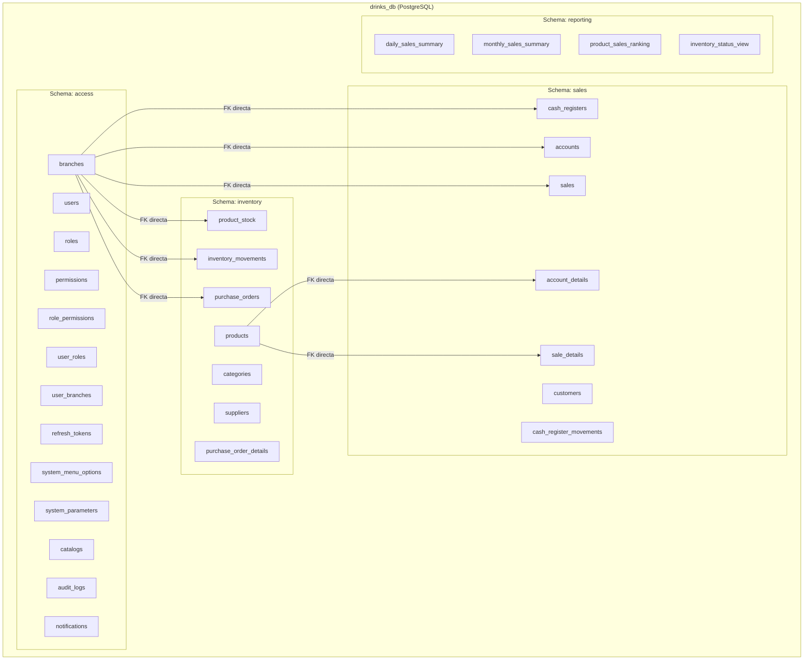
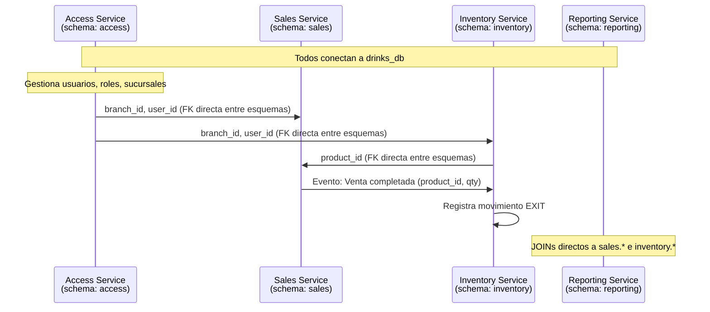
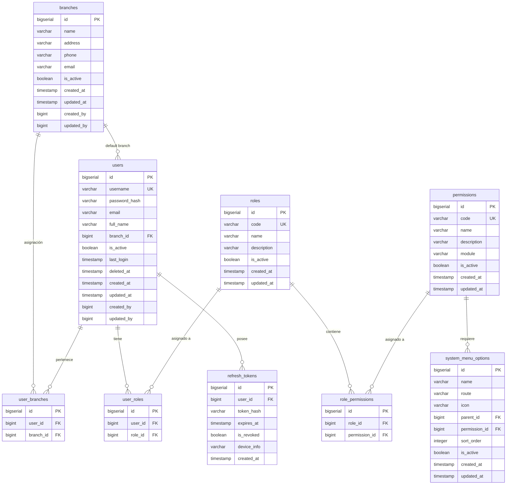
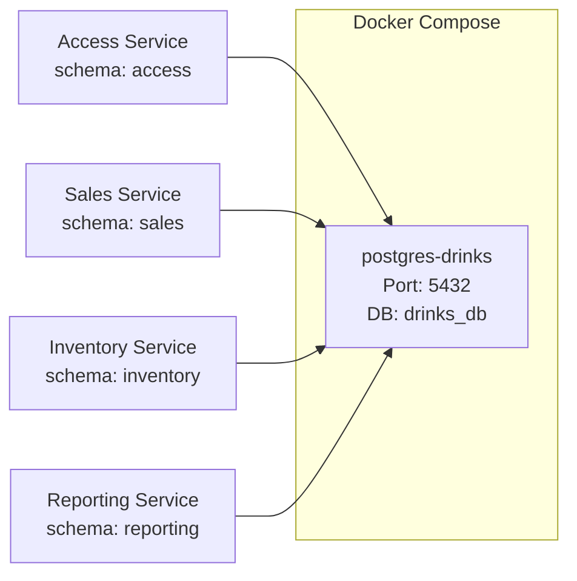
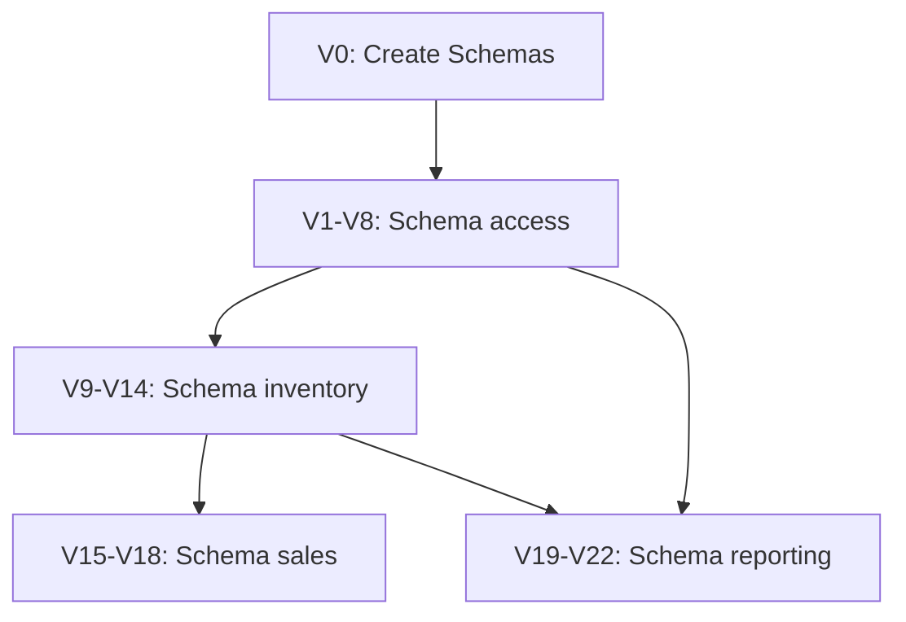

# Documento de Diseño Técnico: Base de Datos del Sistema de Gestión de Bar

## Visión General

Este documento define el diseño completo de la base de datos para el Sistema de Gestión de Ventas e Inventario de Bar. El sistema utiliza una arquitectura de microservicios donde todos los servicios comparten UNA ÚNICA base de datos PostgreSQL (`drinks_db`), utilizando **esquemas PostgreSQL** para la separación lógica de datos por servicio.

### Base de Datos Única con Esquemas

| Microservicio | Esquema PostgreSQL | Responsabilidad |
|---|---|---|
| Access Service | `access` | Usuarios, roles, permisos, sucursales, tokens JWT, menú del sistema, parámetros, catálogos, auditoría, notificaciones |
| Sales Service | `sales` | Cuentas/comandas, ventas, facturación, cajas, clientes |
| Inventory Service | `inventory` | Productos, categorías, stock, movimientos, proveedores, compras |
| Reporting Service | `reporting` | Vistas materializadas, tablas de resumen, soporte para dashboards |

### Principios de Diseño

- **Una base de datos, múltiples esquemas**: Todos los microservicios comparten `drinks_db` con separación lógica por esquema PostgreSQL
- **FK cruzadas entre esquemas**: Las referencias entre servicios usan FK reales entre esquemas (posible dentro de la misma DB)
- **Soft delete**: Entidades críticas usan `is_active` + `deleted_at` en lugar de eliminación física
- **Auditoría completa**: Todas las tablas incluyen `created_at`, `updated_at`, `created_by`, `updated_by`
- **Convención snake_case**: Todas las tablas y columnas siguen snake_case
- **BIGSERIAL para PKs**: Claves primarias con BIGSERIAL para rendimiento y simplicidad
- **JSONB para flexibilidad**: Campos de auditoría de valores antiguos/nuevos en formato JSONB
- **Sin tablas de referencia duplicadas**: No se necesitan `branches_ref` — los servicios referencian directamente `access.branches`

### Beneficios del Enfoque de Base de Datos Única

- **Operaciones simplificadas**: Un solo backup, un solo contenedor, menor consumo de recursos
- **Integridad referencial real**: FK cruzadas entre esquemas con enforcement de PostgreSQL
- **JOINs entre esquemas**: Posibilidad de JOINs directos para reporting sin sincronización
- **Menor complejidad de despliegue**: Una sola instancia PostgreSQL, un solo connection string base
- **Flyway unificado**: Un solo conjunto de migraciones organizado por esquema
- **Future-ready**: Los esquemas pueden extraerse a bases de datos separadas si se necesita escalar independientemente

## Arquitectura

### Diagrama de Arquitectura de Datos



### Estrategia de Separación por Esquemas

Todos los microservicios se conectan a la misma base de datos `drinks_db` pero cada uno opera sobre su propio esquema PostgreSQL mediante la configuración `hibernate.default_schema`. Las FK cruzadas entre esquemas son posibles y enforced por PostgreSQL dentro de la misma instancia.

**Referencias cruzadas entre esquemas (FK reales):**

| FK Origen | Esquema Origen | Referencia a | Esquema Destino |
|---|---|---|---|
| `sales.cash_registers.branch_id` | sales | `access.branches.id` | access |
| `sales.accounts.branch_id` | sales | `access.branches.id` | access |
| `sales.sales.branch_id` | sales | `access.branches.id` | access |
| `inventory.product_stock.branch_id` | inventory | `access.branches.id` | access |
| `inventory.inventory_movements.branch_id` | inventory | `access.branches.id` | access |
| `inventory.purchase_orders.branch_id` | inventory | `access.branches.id` | access |
| `sales.account_details.product_id` | sales | `inventory.products.id` | inventory |
| `sales.sale_details.product_id` | sales | `inventory.products.id` | inventory |

**Ventajas de FK cruzadas reales:**
- Integridad referencial garantizada por el motor de base de datos
- No se necesitan tablas `branches_ref` duplicadas
- No se necesita sincronización entre servicios para datos de referencia
- Queries de reporting pueden hacer JOINs directos entre esquemas

### Flujo de Datos entre Microservicios



## Componentes e Interfaces

### Schema: access

#### Diagrama ER - Schema access



### Schema: sales

#### Diagrama ER - Schema sales

```mermaid
erDiagram
    customers ||--o{ sales : "compra"
    cash_registers ||--o{ cash_register_movements : "registra"
    cash_registers ||--o{ sales : "procesa"
    accounts ||--o{ account_details : "contiene"
    accounts ||--o| sales : "genera"
    sales ||--o{ sale_details : "incluye"

    customers {
        bigserial id PK
        varchar first_name
        varchar last_name
        varchar nit_ci
        varchar phone
        varchar email
        boolean is_active
        timestamp deleted_at
        timestamp created_at
        timestamp updated_at
        bigint created_by
        bigint updated_by
    }

    cash_registers {
        bigserial id PK
        bigint branch_id FK_cross
        bigint user_id
        decimal opening_amount
        decimal closing_amount
        decimal expected_amount
        decimal difference
        varchar status
        timestamp opened_at
        timestamp closed_at
        text notes
        timestamp created_at
        timestamp updated_at
        bigint created_by
        bigint updated_by
    }

    cash_register_movements {
        bigserial id PK
        bigint cash_register_id FK
        varchar movement_type
        decimal amount
        varchar description
        timestamp created_at
        bigint created_by
    }

    accounts {
        bigserial id PK
        bigint branch_id FK_cross
        varchar customer_name
        varchar customer_last_name
        varchar table_number
        varchar internal_code
        varchar status
        timestamp opened_at
        timestamp closed_at
        bigint opened_by
        bigint closed_by
        text notes
        timestamp created_at
        timestamp updated_at
    }

    account_details {
        bigserial id PK
        bigint account_id FK
        bigint product_id FK_cross
        integer quantity
        decimal unit_price
        decimal subtotal
        timestamp added_at
        bigint added_by
        boolean is_cancelled
    }

    sales {
        bigserial id PK
        bigint branch_id FK_cross
        bigint account_id FK
        bigint customer_id FK
        bigint cash_register_id FK
        varchar sale_number
        decimal subtotal
        decimal discount_amount
        decimal tax_amount
        decimal total_amount
        varchar payment_method
        varchar status
        timestamp sale_date
        timestamp created_at
        timestamp updated_at
        bigint created_by
        bigint updated_by
    }

    sale_details {
        bigserial id PK
        bigint sale_id FK
        bigint product_id FK_cross
        integer quantity
        decimal unit_price
        decimal subtotal
        decimal discount
    }
```

### Schema: inventory

#### Diagrama ER - Schema inventory

```mermaid
erDiagram
    categories ||--o{ categories : "padre-hijo"
    categories ||--o{ products : "clasifica"
    products ||--o{ product_stock : "stock por sucursal"
    products ||--o{ inventory_movements : "movimientos"
    products ||--o{ purchase_order_details : "comprado"
    suppliers ||--o{ purchase_orders : "provee"
    purchase_orders ||--o{ purchase_order_details : "detalla"

    categories {
        bigserial id PK
        varchar name
        varchar description
        bigint parent_category_id FK
        boolean is_active
        timestamp deleted_at
        timestamp created_at
        timestamp updated_at
        bigint created_by
        bigint updated_by
    }

    products {
        bigserial id PK
        varchar code UK
        varchar name
        bigint category_id FK
        varchar size
        text description
        decimal cost_price
        decimal sale_price
        boolean is_active
        timestamp deleted_at
        timestamp created_at
        timestamp updated_at
        bigint created_by
        bigint updated_by
    }

    product_stock {
        bigserial id PK
        bigint product_id FK
        bigint branch_id FK_cross
        integer current_stock
        integer minimum_stock
        timestamp updated_at
    }

    inventory_movements {
        bigserial id PK
        bigint product_id FK
        bigint branch_id FK_cross
        varchar movement_type
        integer quantity
        integer previous_stock
        integer new_stock
        varchar reference_type
        bigint reference_id
        text notes
        timestamp created_at
        bigint created_by
    }

    suppliers {
        bigserial id PK
        varchar name
        varchar contact_name
        varchar phone
        varchar email
        varchar address
        varchar nit
        boolean is_active
        timestamp deleted_at
        timestamp created_at
        timestamp updated_at
        bigint created_by
        bigint updated_by
    }

    purchase_orders {
        bigserial id PK
        bigint supplier_id FK
        bigint branch_id FK_cross
        varchar order_number
        varchar status
        decimal total_amount
        timestamp order_date
        timestamp received_date
        timestamp created_at
        timestamp updated_at
        bigint created_by
        bigint updated_by
    }

    purchase_order_details {
        bigserial id PK
        bigint purchase_order_id FK
        bigint product_id FK
        integer quantity_ordered
        integer quantity_received
        decimal unit_cost
        decimal subtotal
    }
```

### Schema: reporting

El esquema de reporting utiliza tablas de resumen que se refrescan periódicamente. Al estar en la misma base de datos, puede hacer JOINs directos a `sales.*` e `inventory.*` para generar los datos.

```mermaid
erDiagram
    daily_sales_summary {
        bigserial id PK
        bigint branch_id FK_cross
        date summary_date
        integer total_sales_count
        decimal total_revenue
        decimal total_discount
        decimal total_tax
        decimal net_revenue
        timestamp refreshed_at
    }

    monthly_sales_summary {
        bigserial id PK
        bigint branch_id FK_cross
        integer year
        integer month
        integer total_sales_count
        decimal total_revenue
        decimal total_discount
        decimal total_tax
        decimal net_revenue
        timestamp refreshed_at
    }

    product_sales_ranking {
        bigserial id PK
        bigint product_id FK_cross
        bigint branch_id FK_cross
        varchar product_name
        varchar category_name
        integer total_quantity_sold
        decimal total_revenue
        decimal profit
        date period_start
        date period_end
        timestamp refreshed_at
    }

    inventory_status_view {
        bigserial id PK
        bigint product_id FK_cross
        bigint branch_id FK_cross
        varchar product_name
        varchar category_name
        integer current_stock
        integer minimum_stock
        decimal cost_price
        decimal sale_price
        boolean is_low_stock
        timestamp refreshed_at
    }
```

### Tablas de Configuración Global (Schema: access)

Las siguientes tablas residen en el esquema `access` y sirven como configuración global del sistema:

| Tabla | Propósito | Acceso |
|---|---|---|
| `access.system_parameters` | Configuración clave-valor del sistema | Todos los servicios (lectura) |
| `access.catalogs` | Catálogos enumerables (métodos de pago, tipos de movimiento) | Todos los servicios (lectura) |
| `access.audit_logs` | Bitácora de operaciones críticas | Todos los servicios (escritura) |
| `access.notifications` | Notificaciones del sistema por usuario | Access Service (principal) |

## Modelos de Datos

### Convenciones Generales

| Aspecto | Convención |
|---|---|
| Naming | snake_case para tablas y columnas |
| Primary Keys | BIGSERIAL (auto-increment 64-bit) |
| Timestamps | `TIMESTAMP WITH TIME ZONE` con default `NOW()` |
| Soft Delete | `is_active BOOLEAN DEFAULT true` + `deleted_at TIMESTAMPTZ NULL` |
| Auditoría | `created_at`, `updated_at`, `created_by`, `updated_by` en toda tabla mutable |
| Decimales | `NUMERIC(12,2)` para montos monetarios |
| Status/Enum | `VARCHAR(30)` con CHECK constraint en lugar de ENUM type |
| FK behavior | `ON DELETE RESTRICT` por defecto, `ON DELETE SET NULL` donde se especifica |
| Esquemas | Prefijo de esquema explícito en FK cruzadas: `REFERENCES access.branches(id)` |

### Creación de Esquemas

```sql
-- Creación inicial de la base de datos y esquemas
-- V0__create_schemas.sql

CREATE SCHEMA IF NOT EXISTS access;
CREATE SCHEMA IF NOT EXISTS sales;
CREATE SCHEMA IF NOT EXISTS inventory;
CREATE SCHEMA IF NOT EXISTS reporting;
```

---

### Schema: access — Definiciones Completas

#### Tabla: `access.branches`

```sql
SET search_path TO access;

CREATE TABLE access.branches (
    id              BIGSERIAL PRIMARY KEY,
    name            VARCHAR(150) NOT NULL,
    address         VARCHAR(300),
    phone           VARCHAR(20),
    email           VARCHAR(150),
    is_active       BOOLEAN NOT NULL DEFAULT true,
    deleted_at      TIMESTAMPTZ,
    created_at      TIMESTAMPTZ NOT NULL DEFAULT NOW(),
    updated_at      TIMESTAMPTZ NOT NULL DEFAULT NOW(),
    created_by      BIGINT,
    updated_by      BIGINT
);

CREATE INDEX idx_branches_is_active ON access.branches(is_active) WHERE is_active = true;
```

#### Tabla: `access.users`

```sql
CREATE TABLE access.users (
    id              BIGSERIAL PRIMARY KEY,
    username        VARCHAR(50) NOT NULL UNIQUE,
    password_hash   VARCHAR(255) NOT NULL,
    email           VARCHAR(150) NOT NULL,
    full_name       VARCHAR(200) NOT NULL,
    branch_id       BIGINT REFERENCES access.branches(id) ON DELETE SET NULL,
    is_active       BOOLEAN NOT NULL DEFAULT true,
    last_login      TIMESTAMPTZ,
    deleted_at      TIMESTAMPTZ,
    created_at      TIMESTAMPTZ NOT NULL DEFAULT NOW(),
    updated_at      TIMESTAMPTZ NOT NULL DEFAULT NOW(),
    created_by      BIGINT,
    updated_by      BIGINT
);

CREATE INDEX idx_users_branch_id ON access.users(branch_id);
CREATE INDEX idx_users_username ON access.users(username);
CREATE INDEX idx_users_is_active ON access.users(is_active) WHERE is_active = true;
CREATE INDEX idx_users_email ON access.users(email);
```

#### Tabla: `access.roles`

```sql
CREATE TABLE access.roles (
    id              BIGSERIAL PRIMARY KEY,
    code            VARCHAR(50) NOT NULL UNIQUE,
    name            VARCHAR(100) NOT NULL,
    description     VARCHAR(300),
    is_active       BOOLEAN NOT NULL DEFAULT true,
    created_at      TIMESTAMPTZ NOT NULL DEFAULT NOW(),
    updated_at      TIMESTAMPTZ NOT NULL DEFAULT NOW()
);
```

#### Tabla: `access.permissions`

```sql
CREATE TABLE access.permissions (
    id              BIGSERIAL PRIMARY KEY,
    code            VARCHAR(80) NOT NULL UNIQUE,
    name            VARCHAR(150) NOT NULL,
    description     VARCHAR(300),
    module          VARCHAR(50) NOT NULL,
    is_active       BOOLEAN NOT NULL DEFAULT true,
    created_at      TIMESTAMPTZ NOT NULL DEFAULT NOW(),
    updated_at      TIMESTAMPTZ NOT NULL DEFAULT NOW()
);

CREATE INDEX idx_permissions_module ON access.permissions(module);
```

#### Tabla: `access.role_permissions`

```sql
CREATE TABLE access.role_permissions (
    id              BIGSERIAL PRIMARY KEY,
    role_id         BIGINT NOT NULL REFERENCES access.roles(id) ON DELETE CASCADE,
    permission_id   BIGINT NOT NULL REFERENCES access.permissions(id) ON DELETE CASCADE,
    UNIQUE(role_id, permission_id)
);

CREATE INDEX idx_role_permissions_role_id ON access.role_permissions(role_id);
CREATE INDEX idx_role_permissions_permission_id ON access.role_permissions(permission_id);
```

#### Tabla: `access.user_roles`

```sql
CREATE TABLE access.user_roles (
    id              BIGSERIAL PRIMARY KEY,
    user_id         BIGINT NOT NULL REFERENCES access.users(id) ON DELETE CASCADE,
    role_id         BIGINT NOT NULL REFERENCES access.roles(id) ON DELETE RESTRICT,
    UNIQUE(user_id, role_id)
);

CREATE INDEX idx_user_roles_user_id ON access.user_roles(user_id);
CREATE INDEX idx_user_roles_role_id ON access.user_roles(role_id);
```

#### Tabla: `access.user_branches`

```sql
CREATE TABLE access.user_branches (
    id              BIGSERIAL PRIMARY KEY,
    user_id         BIGINT NOT NULL REFERENCES access.users(id) ON DELETE CASCADE,
    branch_id       BIGINT NOT NULL REFERENCES access.branches(id) ON DELETE CASCADE,
    UNIQUE(user_id, branch_id)
);

CREATE INDEX idx_user_branches_user_id ON access.user_branches(user_id);
CREATE INDEX idx_user_branches_branch_id ON access.user_branches(branch_id);
```

#### Tabla: `access.refresh_tokens`

```sql
CREATE TABLE access.refresh_tokens (
    id              BIGSERIAL PRIMARY KEY,
    user_id         BIGINT NOT NULL REFERENCES access.users(id) ON DELETE CASCADE,
    token_hash      VARCHAR(512) NOT NULL,
    expires_at      TIMESTAMPTZ NOT NULL,
    is_revoked      BOOLEAN NOT NULL DEFAULT false,
    device_info     VARCHAR(300),
    created_at      TIMESTAMPTZ NOT NULL DEFAULT NOW()
);

CREATE INDEX idx_refresh_tokens_user_id ON access.refresh_tokens(user_id);
CREATE INDEX idx_refresh_tokens_token_hash ON access.refresh_tokens(token_hash);
CREATE INDEX idx_refresh_tokens_expires_at ON access.refresh_tokens(expires_at);
```

#### Tabla: `access.system_menu_options`

```sql
CREATE TABLE access.system_menu_options (
    id              BIGSERIAL PRIMARY KEY,
    name            VARCHAR(100) NOT NULL,
    route           VARCHAR(200),
    icon            VARCHAR(50),
    parent_id       BIGINT REFERENCES access.system_menu_options(id) ON DELETE SET NULL,
    permission_id   BIGINT REFERENCES access.permissions(id) ON DELETE SET NULL,
    sort_order      INTEGER NOT NULL DEFAULT 0,
    is_active       BOOLEAN NOT NULL DEFAULT true,
    created_at      TIMESTAMPTZ NOT NULL DEFAULT NOW(),
    updated_at      TIMESTAMPTZ NOT NULL DEFAULT NOW()
);

CREATE INDEX idx_menu_options_parent_id ON access.system_menu_options(parent_id);
CREATE INDEX idx_menu_options_permission_id ON access.system_menu_options(permission_id);
```

#### Tabla: `access.system_parameters`

```sql
CREATE TABLE access.system_parameters (
    id              BIGSERIAL PRIMARY KEY,
    parameter_key   VARCHAR(100) NOT NULL UNIQUE,
    parameter_value TEXT NOT NULL,
    data_type       VARCHAR(30) NOT NULL CHECK (data_type IN ('STRING', 'INTEGER', 'DECIMAL', 'BOOLEAN', 'JSON')),
    description     VARCHAR(300),
    module          VARCHAR(50),
    is_active       BOOLEAN NOT NULL DEFAULT true,
    created_at      TIMESTAMPTZ NOT NULL DEFAULT NOW(),
    updated_at      TIMESTAMPTZ NOT NULL DEFAULT NOW(),
    created_by      BIGINT,
    updated_by      BIGINT
);

CREATE INDEX idx_system_parameters_module ON access.system_parameters(module);
CREATE INDEX idx_system_parameters_key ON access.system_parameters(parameter_key);
```

#### Tabla: `access.catalogs`

```sql
CREATE TABLE access.catalogs (
    id              BIGSERIAL PRIMARY KEY,
    catalog_type    VARCHAR(50) NOT NULL,
    code            VARCHAR(50) NOT NULL,
    name            VARCHAR(150) NOT NULL,
    description     VARCHAR(300),
    sort_order      INTEGER NOT NULL DEFAULT 0,
    is_active       BOOLEAN NOT NULL DEFAULT true,
    parent_id       BIGINT REFERENCES access.catalogs(id) ON DELETE SET NULL,
    created_at      TIMESTAMPTZ NOT NULL DEFAULT NOW(),
    updated_at      TIMESTAMPTZ NOT NULL DEFAULT NOW(),
    UNIQUE(catalog_type, code)
);

CREATE INDEX idx_catalogs_type ON access.catalogs(catalog_type);
CREATE INDEX idx_catalogs_parent_id ON access.catalogs(parent_id);
```

#### Tabla: `access.audit_logs`

```sql
CREATE TABLE access.audit_logs (
    id              BIGSERIAL PRIMARY KEY,
    user_id         BIGINT,
    username        VARCHAR(50),
    action          VARCHAR(50) NOT NULL,
    module          VARCHAR(50) NOT NULL,
    entity_name     VARCHAR(100) NOT NULL,
    entity_id       BIGINT,
    old_values      JSONB,
    new_values      JSONB,
    ip_address      VARCHAR(45),
    description     TEXT,
    created_at      TIMESTAMPTZ NOT NULL DEFAULT NOW()
) PARTITION BY RANGE (created_at);

-- Partición por mes para gestión de crecimiento
CREATE TABLE access.audit_logs_default PARTITION OF access.audit_logs DEFAULT;

CREATE INDEX idx_audit_logs_user_id ON access.audit_logs(user_id);
CREATE INDEX idx_audit_logs_module ON access.audit_logs(module);
CREATE INDEX idx_audit_logs_entity ON access.audit_logs(entity_name, entity_id);
CREATE INDEX idx_audit_logs_created_at ON access.audit_logs(created_at);
CREATE INDEX idx_audit_logs_action ON access.audit_logs(action);
```

**Nota sobre particionamiento:** Las particiones de `audit_logs` se crean automáticamente mediante un script programado o extensión como `pg_partman`. La estrategia inicial es una partición por mes:

```sql
-- Ejemplo de creación de partición mensual
CREATE TABLE access.audit_logs_2025_01 PARTITION OF access.audit_logs
    FOR VALUES FROM ('2025-01-01') TO ('2025-02-01');
```

#### Tabla: `access.notifications`

```sql
CREATE TABLE access.notifications (
    id                  BIGSERIAL PRIMARY KEY,
    branch_id           BIGINT REFERENCES access.branches(id) ON DELETE CASCADE,
    user_id             BIGINT REFERENCES access.users(id) ON DELETE CASCADE,
    notification_type   VARCHAR(50) NOT NULL,
    title               VARCHAR(200) NOT NULL,
    message             TEXT NOT NULL,
    entity_name         VARCHAR(100),
    entity_id           BIGINT,
    is_read             BOOLEAN NOT NULL DEFAULT false,
    created_at          TIMESTAMPTZ NOT NULL DEFAULT NOW(),
    read_at             TIMESTAMPTZ
);

CREATE INDEX idx_notifications_user_read ON access.notifications(user_id, is_read);
CREATE INDEX idx_notifications_branch_id ON access.notifications(branch_id);
CREATE INDEX idx_notifications_created_at ON access.notifications(created_at);
```

---

### Schema: sales — Definiciones Completas

#### Tabla: `sales.customers`

```sql
CREATE TABLE sales.customers (
    id              BIGSERIAL PRIMARY KEY,
    first_name      VARCHAR(100) NOT NULL,
    last_name       VARCHAR(100),
    nit_ci          VARCHAR(30),
    phone           VARCHAR(20),
    email           VARCHAR(150),
    is_active       BOOLEAN NOT NULL DEFAULT true,
    deleted_at      TIMESTAMPTZ,
    created_at      TIMESTAMPTZ NOT NULL DEFAULT NOW(),
    updated_at      TIMESTAMPTZ NOT NULL DEFAULT NOW(),
    created_by      BIGINT,
    updated_by      BIGINT
);

CREATE INDEX idx_customers_nit_ci ON sales.customers(nit_ci);
CREATE INDEX idx_customers_name ON sales.customers(first_name, last_name);
CREATE INDEX idx_customers_is_active ON sales.customers(is_active) WHERE is_active = true;
```

#### Tabla: `sales.cash_registers`

```sql
CREATE TABLE sales.cash_registers (
    id              BIGSERIAL PRIMARY KEY,
    branch_id       BIGINT NOT NULL REFERENCES access.branches(id) ON DELETE RESTRICT,
    user_id         BIGINT NOT NULL,
    opening_amount  NUMERIC(12,2) NOT NULL DEFAULT 0,
    closing_amount  NUMERIC(12,2),
    expected_amount NUMERIC(12,2),
    difference      NUMERIC(12,2),
    status          VARCHAR(30) NOT NULL DEFAULT 'OPEN' CHECK (status IN ('OPEN', 'CLOSED')),
    opened_at       TIMESTAMPTZ NOT NULL DEFAULT NOW(),
    closed_at       TIMESTAMPTZ,
    notes           TEXT,
    created_at      TIMESTAMPTZ NOT NULL DEFAULT NOW(),
    updated_at      TIMESTAMPTZ NOT NULL DEFAULT NOW(),
    created_by      BIGINT,
    updated_by      BIGINT
);

CREATE INDEX idx_cash_registers_branch_id ON sales.cash_registers(branch_id);
CREATE INDEX idx_cash_registers_user_id ON sales.cash_registers(user_id);
CREATE INDEX idx_cash_registers_status ON sales.cash_registers(status);
CREATE INDEX idx_cash_registers_branch_status ON sales.cash_registers(branch_id, status);
CREATE INDEX idx_cash_registers_opened_at ON sales.cash_registers(opened_at);
```

#### Tabla: `sales.cash_register_movements`

```sql
CREATE TABLE sales.cash_register_movements (
    id                  BIGSERIAL PRIMARY KEY,
    cash_register_id    BIGINT NOT NULL REFERENCES sales.cash_registers(id) ON DELETE RESTRICT,
    movement_type       VARCHAR(30) NOT NULL CHECK (movement_type IN ('DEPOSIT', 'WITHDRAWAL', 'SALE_INCOME')),
    amount              NUMERIC(12,2) NOT NULL,
    description         VARCHAR(300),
    created_at          TIMESTAMPTZ NOT NULL DEFAULT NOW(),
    created_by          BIGINT
);

CREATE INDEX idx_cash_reg_mov_register_id ON sales.cash_register_movements(cash_register_id);
CREATE INDEX idx_cash_reg_mov_type ON sales.cash_register_movements(movement_type);
CREATE INDEX idx_cash_reg_mov_created_at ON sales.cash_register_movements(created_at);
```

#### Tabla: `sales.accounts`

```sql
CREATE TABLE sales.accounts (
    id                  BIGSERIAL PRIMARY KEY,
    branch_id           BIGINT NOT NULL REFERENCES access.branches(id) ON DELETE RESTRICT,
    customer_name       VARCHAR(100),
    customer_last_name  VARCHAR(100),
    table_number        VARCHAR(20),
    internal_code       VARCHAR(50),
    status              VARCHAR(30) NOT NULL DEFAULT 'OPEN' CHECK (status IN ('OPEN', 'CLOSED', 'CANCELLED')),
    opened_at           TIMESTAMPTZ NOT NULL DEFAULT NOW(),
    closed_at           TIMESTAMPTZ,
    opened_by           BIGINT NOT NULL,
    closed_by           BIGINT,
    notes               TEXT,
    created_at          TIMESTAMPTZ NOT NULL DEFAULT NOW(),
    updated_at          TIMESTAMPTZ NOT NULL DEFAULT NOW()
);

CREATE INDEX idx_accounts_branch_id ON sales.accounts(branch_id);
CREATE INDEX idx_accounts_status ON sales.accounts(status);
CREATE INDEX idx_accounts_branch_status ON sales.accounts(branch_id, status);
CREATE INDEX idx_accounts_opened_at ON sales.accounts(opened_at);
CREATE INDEX idx_accounts_opened_by ON sales.accounts(opened_by);
```

#### Tabla: `sales.account_details`

```sql
CREATE TABLE sales.account_details (
    id              BIGSERIAL PRIMARY KEY,
    account_id      BIGINT NOT NULL REFERENCES sales.accounts(id) ON DELETE RESTRICT,
    product_id      BIGINT NOT NULL REFERENCES inventory.products(id) ON DELETE RESTRICT,
    quantity        INTEGER NOT NULL CHECK (quantity > 0),
    unit_price      NUMERIC(12,2) NOT NULL,
    subtotal        NUMERIC(12,2) NOT NULL,
    added_at        TIMESTAMPTZ NOT NULL DEFAULT NOW(),
    added_by        BIGINT NOT NULL,
    is_cancelled    BOOLEAN NOT NULL DEFAULT false
);

CREATE INDEX idx_account_details_account_id ON sales.account_details(account_id);
CREATE INDEX idx_account_details_product_id ON sales.account_details(product_id);
CREATE INDEX idx_account_details_added_at ON sales.account_details(added_at);
```

#### Tabla: `sales.sales`

```sql
CREATE TABLE sales.sales (
    id              BIGSERIAL PRIMARY KEY,
    branch_id       BIGINT NOT NULL REFERENCES access.branches(id) ON DELETE RESTRICT,
    account_id      BIGINT REFERENCES sales.accounts(id) ON DELETE SET NULL,
    customer_id     BIGINT REFERENCES sales.customers(id) ON DELETE SET NULL,
    cash_register_id BIGINT REFERENCES sales.cash_registers(id) ON DELETE RESTRICT,
    sale_number     VARCHAR(30) NOT NULL,
    subtotal        NUMERIC(12,2) NOT NULL DEFAULT 0,
    discount_amount NUMERIC(12,2) NOT NULL DEFAULT 0,
    tax_amount      NUMERIC(12,2) NOT NULL DEFAULT 0,
    total_amount    NUMERIC(12,2) NOT NULL DEFAULT 0,
    payment_method  VARCHAR(30) NOT NULL DEFAULT 'CASH',
    status          VARCHAR(30) NOT NULL DEFAULT 'COMPLETED' CHECK (status IN ('COMPLETED', 'CANCELLED', 'PENDING')),
    sale_date       TIMESTAMPTZ NOT NULL DEFAULT NOW(),
    created_at      TIMESTAMPTZ NOT NULL DEFAULT NOW(),
    updated_at      TIMESTAMPTZ NOT NULL DEFAULT NOW(),
    created_by      BIGINT NOT NULL,
    updated_by      BIGINT
);

CREATE INDEX idx_sales_branch_id ON sales.sales(branch_id);
CREATE INDEX idx_sales_customer_id ON sales.sales(customer_id);
CREATE INDEX idx_sales_cash_register_id ON sales.sales(cash_register_id);
CREATE INDEX idx_sales_account_id ON sales.sales(account_id);
CREATE INDEX idx_sales_sale_date ON sales.sales(sale_date);
CREATE INDEX idx_sales_branch_date ON sales.sales(branch_id, sale_date);
CREATE INDEX idx_sales_status ON sales.sales(status);
CREATE INDEX idx_sales_sale_number ON sales.sales(sale_number);
CREATE UNIQUE INDEX idx_sales_branch_sale_number ON sales.sales(branch_id, sale_number);
```

#### Tabla: `sales.sale_details`

```sql
CREATE TABLE sales.sale_details (
    id              BIGSERIAL PRIMARY KEY,
    sale_id         BIGINT NOT NULL REFERENCES sales.sales(id) ON DELETE CASCADE,
    product_id      BIGINT NOT NULL REFERENCES inventory.products(id) ON DELETE RESTRICT,
    quantity        INTEGER NOT NULL CHECK (quantity > 0),
    unit_price      NUMERIC(12,2) NOT NULL,
    subtotal        NUMERIC(12,2) NOT NULL,
    discount        NUMERIC(12,2) NOT NULL DEFAULT 0
);

CREATE INDEX idx_sale_details_sale_id ON sales.sale_details(sale_id);
CREATE INDEX idx_sale_details_product_id ON sales.sale_details(product_id);
```

---

### Schema: inventory — Definiciones Completas

#### Tabla: `inventory.categories`

```sql
CREATE TABLE inventory.categories (
    id                  BIGSERIAL PRIMARY KEY,
    name                VARCHAR(100) NOT NULL,
    description         VARCHAR(300),
    parent_category_id  BIGINT REFERENCES inventory.categories(id) ON DELETE SET NULL,
    is_active           BOOLEAN NOT NULL DEFAULT true,
    deleted_at          TIMESTAMPTZ,
    created_at          TIMESTAMPTZ NOT NULL DEFAULT NOW(),
    updated_at          TIMESTAMPTZ NOT NULL DEFAULT NOW(),
    created_by          BIGINT,
    updated_by          BIGINT
);

CREATE INDEX idx_categories_parent ON inventory.categories(parent_category_id);
CREATE INDEX idx_categories_is_active ON inventory.categories(is_active) WHERE is_active = true;
```

#### Tabla: `inventory.products`

```sql
CREATE TABLE inventory.products (
    id              BIGSERIAL PRIMARY KEY,
    code            VARCHAR(50) NOT NULL UNIQUE,
    name            VARCHAR(150) NOT NULL,
    category_id     BIGINT REFERENCES inventory.categories(id) ON DELETE SET NULL,
    size            VARCHAR(50),
    description     TEXT,
    cost_price      NUMERIC(12,2) NOT NULL DEFAULT 0,
    sale_price      NUMERIC(12,2) NOT NULL DEFAULT 0,
    is_active       BOOLEAN NOT NULL DEFAULT true,
    deleted_at      TIMESTAMPTZ,
    created_at      TIMESTAMPTZ NOT NULL DEFAULT NOW(),
    updated_at      TIMESTAMPTZ NOT NULL DEFAULT NOW(),
    created_by      BIGINT,
    updated_by      BIGINT
);

CREATE INDEX idx_products_category_id ON inventory.products(category_id);
CREATE INDEX idx_products_code ON inventory.products(code);
CREATE INDEX idx_products_is_active ON inventory.products(is_active) WHERE is_active = true;
CREATE INDEX idx_products_name ON inventory.products(name);
```

#### Tabla: `inventory.product_stock`

```sql
CREATE TABLE inventory.product_stock (
    id              BIGSERIAL PRIMARY KEY,
    product_id      BIGINT NOT NULL REFERENCES inventory.products(id) ON DELETE CASCADE,
    branch_id       BIGINT NOT NULL REFERENCES access.branches(id) ON DELETE RESTRICT,
    current_stock   INTEGER NOT NULL DEFAULT 0,
    minimum_stock   INTEGER NOT NULL DEFAULT 0,
    updated_at      TIMESTAMPTZ NOT NULL DEFAULT NOW(),
    UNIQUE(product_id, branch_id)
);

CREATE INDEX idx_product_stock_product_id ON inventory.product_stock(product_id);
CREATE INDEX idx_product_stock_branch_id ON inventory.product_stock(branch_id);
CREATE INDEX idx_product_stock_low ON inventory.product_stock(branch_id) WHERE current_stock <= minimum_stock;
```

#### Tabla: `inventory.inventory_movements`

```sql
CREATE TABLE inventory.inventory_movements (
    id              BIGSERIAL PRIMARY KEY,
    product_id      BIGINT NOT NULL REFERENCES inventory.products(id) ON DELETE RESTRICT,
    branch_id       BIGINT NOT NULL REFERENCES access.branches(id) ON DELETE RESTRICT,
    movement_type   VARCHAR(30) NOT NULL CHECK (movement_type IN ('ENTRY', 'EXIT', 'ADJUSTMENT', 'SALE', 'PURCHASE', 'TRANSFER')),
    quantity        INTEGER NOT NULL,
    previous_stock  INTEGER NOT NULL,
    new_stock       INTEGER NOT NULL,
    reference_type  VARCHAR(50),
    reference_id    BIGINT,
    notes           TEXT,
    created_at      TIMESTAMPTZ NOT NULL DEFAULT NOW(),
    created_by      BIGINT NOT NULL
);

CREATE INDEX idx_inv_movements_product_id ON inventory.inventory_movements(product_id);
CREATE INDEX idx_inv_movements_branch_id ON inventory.inventory_movements(branch_id);
CREATE INDEX idx_inv_movements_type ON inventory.inventory_movements(movement_type);
CREATE INDEX idx_inv_movements_product_branch ON inventory.inventory_movements(product_id, branch_id);
CREATE INDEX idx_inv_movements_created_at ON inventory.inventory_movements(created_at);
CREATE INDEX idx_inv_movements_reference ON inventory.inventory_movements(reference_type, reference_id);
```

#### Tabla: `inventory.suppliers`

```sql
CREATE TABLE inventory.suppliers (
    id              BIGSERIAL PRIMARY KEY,
    name            VARCHAR(200) NOT NULL,
    contact_name    VARCHAR(150),
    phone           VARCHAR(20),
    email           VARCHAR(150),
    address         VARCHAR(300),
    nit             VARCHAR(30),
    is_active       BOOLEAN NOT NULL DEFAULT true,
    deleted_at      TIMESTAMPTZ,
    created_at      TIMESTAMPTZ NOT NULL DEFAULT NOW(),
    updated_at      TIMESTAMPTZ NOT NULL DEFAULT NOW(),
    created_by      BIGINT,
    updated_by      BIGINT
);

CREATE INDEX idx_suppliers_is_active ON inventory.suppliers(is_active) WHERE is_active = true;
CREATE INDEX idx_suppliers_nit ON inventory.suppliers(nit);
```

#### Tabla: `inventory.purchase_orders`

```sql
CREATE TABLE inventory.purchase_orders (
    id              BIGSERIAL PRIMARY KEY,
    supplier_id     BIGINT NOT NULL REFERENCES inventory.suppliers(id) ON DELETE RESTRICT,
    branch_id       BIGINT NOT NULL REFERENCES access.branches(id) ON DELETE RESTRICT,
    order_number    VARCHAR(30) NOT NULL,
    status          VARCHAR(30) NOT NULL DEFAULT 'PENDING' CHECK (status IN ('PENDING', 'RECEIVED', 'PARTIAL', 'CANCELLED')),
    total_amount    NUMERIC(12,2) NOT NULL DEFAULT 0,
    order_date      TIMESTAMPTZ NOT NULL DEFAULT NOW(),
    received_date   TIMESTAMPTZ,
    created_at      TIMESTAMPTZ NOT NULL DEFAULT NOW(),
    updated_at      TIMESTAMPTZ NOT NULL DEFAULT NOW(),
    created_by      BIGINT NOT NULL,
    updated_by      BIGINT
);

CREATE INDEX idx_purchase_orders_supplier_id ON inventory.purchase_orders(supplier_id);
CREATE INDEX idx_purchase_orders_branch_id ON inventory.purchase_orders(branch_id);
CREATE INDEX idx_purchase_orders_status ON inventory.purchase_orders(status);
CREATE INDEX idx_purchase_orders_order_date ON inventory.purchase_orders(order_date);
```

#### Tabla: `inventory.purchase_order_details`

```sql
CREATE TABLE inventory.purchase_order_details (
    id                  BIGSERIAL PRIMARY KEY,
    purchase_order_id   BIGINT NOT NULL REFERENCES inventory.purchase_orders(id) ON DELETE CASCADE,
    product_id          BIGINT NOT NULL REFERENCES inventory.products(id) ON DELETE RESTRICT,
    quantity_ordered    INTEGER NOT NULL CHECK (quantity_ordered > 0),
    quantity_received   INTEGER NOT NULL DEFAULT 0 CHECK (quantity_received >= 0),
    unit_cost           NUMERIC(12,2) NOT NULL,
    subtotal            NUMERIC(12,2) NOT NULL
);

CREATE INDEX idx_po_details_order_id ON inventory.purchase_order_details(purchase_order_id);
CREATE INDEX idx_po_details_product_id ON inventory.purchase_order_details(product_id);
```

---

### Schema: reporting — Definiciones Completas

Las tablas de reporting se alimentan mediante queries directos a `sales.*` e `inventory.*` (posible al estar en la misma base de datos) o mediante procesos de refresh periódico.

#### Tabla: `reporting.daily_sales_summary`

```sql
CREATE TABLE reporting.daily_sales_summary (
    id                  BIGSERIAL PRIMARY KEY,
    branch_id           BIGINT NOT NULL REFERENCES access.branches(id) ON DELETE RESTRICT,
    summary_date        DATE NOT NULL,
    total_sales_count   INTEGER NOT NULL DEFAULT 0,
    total_revenue       NUMERIC(14,2) NOT NULL DEFAULT 0,
    total_discount      NUMERIC(14,2) NOT NULL DEFAULT 0,
    total_tax           NUMERIC(14,2) NOT NULL DEFAULT 0,
    net_revenue         NUMERIC(14,2) NOT NULL DEFAULT 0,
    refreshed_at        TIMESTAMPTZ NOT NULL DEFAULT NOW(),
    UNIQUE(branch_id, summary_date)
);

CREATE INDEX idx_daily_summary_branch ON reporting.daily_sales_summary(branch_id);
CREATE INDEX idx_daily_summary_date ON reporting.daily_sales_summary(summary_date);
CREATE INDEX idx_daily_summary_branch_date ON reporting.daily_sales_summary(branch_id, summary_date);
```

#### Tabla: `reporting.monthly_sales_summary`

```sql
CREATE TABLE reporting.monthly_sales_summary (
    id                  BIGSERIAL PRIMARY KEY,
    branch_id           BIGINT NOT NULL REFERENCES access.branches(id) ON DELETE RESTRICT,
    year                INTEGER NOT NULL,
    month               INTEGER NOT NULL CHECK (month BETWEEN 1 AND 12),
    total_sales_count   INTEGER NOT NULL DEFAULT 0,
    total_revenue       NUMERIC(14,2) NOT NULL DEFAULT 0,
    total_discount      NUMERIC(14,2) NOT NULL DEFAULT 0,
    total_tax           NUMERIC(14,2) NOT NULL DEFAULT 0,
    net_revenue         NUMERIC(14,2) NOT NULL DEFAULT 0,
    refreshed_at        TIMESTAMPTZ NOT NULL DEFAULT NOW(),
    UNIQUE(branch_id, year, month)
);

CREATE INDEX idx_monthly_summary_branch ON reporting.monthly_sales_summary(branch_id);
CREATE INDEX idx_monthly_summary_period ON reporting.monthly_sales_summary(year, month);
```

#### Tabla: `reporting.product_sales_ranking`

```sql
CREATE TABLE reporting.product_sales_ranking (
    id                      BIGSERIAL PRIMARY KEY,
    product_id              BIGINT NOT NULL REFERENCES inventory.products(id) ON DELETE RESTRICT,
    branch_id               BIGINT NOT NULL REFERENCES access.branches(id) ON DELETE RESTRICT,
    product_name            VARCHAR(150) NOT NULL,
    category_name           VARCHAR(100),
    total_quantity_sold     INTEGER NOT NULL DEFAULT 0,
    total_revenue           NUMERIC(14,2) NOT NULL DEFAULT 0,
    profit                  NUMERIC(14,2) NOT NULL DEFAULT 0,
    period_start            DATE NOT NULL,
    period_end              DATE NOT NULL,
    refreshed_at            TIMESTAMPTZ NOT NULL DEFAULT NOW()
);

CREATE INDEX idx_product_ranking_branch ON reporting.product_sales_ranking(branch_id);
CREATE INDEX idx_product_ranking_product ON reporting.product_sales_ranking(product_id);
CREATE INDEX idx_product_ranking_period ON reporting.product_sales_ranking(period_start, period_end);
CREATE INDEX idx_product_ranking_revenue ON reporting.product_sales_ranking(total_revenue DESC);
```

#### Tabla: `reporting.inventory_status_view`

```sql
CREATE TABLE reporting.inventory_status_view (
    id              BIGSERIAL PRIMARY KEY,
    product_id      BIGINT NOT NULL REFERENCES inventory.products(id) ON DELETE RESTRICT,
    branch_id       BIGINT NOT NULL REFERENCES access.branches(id) ON DELETE RESTRICT,
    product_name    VARCHAR(150) NOT NULL,
    category_name   VARCHAR(100),
    current_stock   INTEGER NOT NULL DEFAULT 0,
    minimum_stock   INTEGER NOT NULL DEFAULT 0,
    cost_price      NUMERIC(12,2) NOT NULL DEFAULT 0,
    sale_price      NUMERIC(12,2) NOT NULL DEFAULT 0,
    is_low_stock    BOOLEAN NOT NULL DEFAULT false,
    refreshed_at    TIMESTAMPTZ NOT NULL DEFAULT NOW()
);

CREATE INDEX idx_inv_status_branch ON reporting.inventory_status_view(branch_id);
CREATE INDEX idx_inv_status_product ON reporting.inventory_status_view(product_id);
CREATE INDEX idx_inv_status_low_stock ON reporting.inventory_status_view(is_low_stock) WHERE is_low_stock = true;
```

## Manejo de Errores

### Estrategia de Integridad de Datos

| Escenario | Mecanismo | Comportamiento |
|---|---|---|
| Eliminación de entidad referenciada | `ON DELETE RESTRICT` | PostgreSQL rechaza la operación con error |
| Eliminación de entidad con dependencias opcionales | `ON DELETE SET NULL` | Se anula la referencia sin bloquear |
| Eliminación de entidad padre en cascada | `ON DELETE CASCADE` | Se eliminan registros hijos automáticamente |
| Violación de constraint UNIQUE | Error 23505 | Aplicación retorna conflicto al usuario |
| Violación de CHECK constraint | Error 23514 | Aplicación valida antes de persistir |
| Violación de NOT NULL | Error 23502 | Validación en capa de servicio previene |
| Violación de FK cruzada entre esquemas | Error 23503 | PostgreSQL rechaza si la referencia no existe |

### Soft Delete como Prevención de Errores

Las entidades con `is_active` y `deleted_at` nunca se eliminan físicamente:
- **users**: No se eliminan, se desactivan
- **products**: No se eliminan, se desactivan (historial de ventas depende de ellos)
- **customers**: No se eliminan, se desactivan
- **categories**: No se eliminan, se desactivan
- **suppliers**: No se eliminan, se desactivan
- **branches**: No se eliminan, se desactivan

### Manejo de Concurrencia

| Situación | Solución |
|---|---|
| Dos cajeros cerrando la misma caja | Optimistic locking con `updated_at` en JPA (`@Version`) |
| Actualización simultánea de stock | Transacción serializable + `SELECT FOR UPDATE` en `product_stock` |
| Número de venta duplicado | Constraint UNIQUE en `(branch_id, sale_number)` + retry en la aplicación |
| Movimientos de inventario concurrentes | Secuencialización por producto usando `advisory lock` en PostgreSQL |

### Manejo de Errores en Migraciones

| Escenario | Estrategia |
|---|---|
| Migración falla a mitad de ejecución | Flyway marca como `FAILED`, requiere `repair` manual |
| Datos inconsistentes post-migración | Scripts de validación post-migración incluidos |
| Rollback necesario | Cada migración incluye script `undo` correspondiente |

### Manejo de Esquemas y Permisos

| Escenario | Estrategia |
|---|---|
| Servicio intenta escribir en esquema ajeno | Permisos de PostgreSQL a nivel de esquema (GRANT/REVOKE) |
| FK cruzada a tabla inexistente | Orden de creación de esquemas garantizado por Flyway |
| Cambio de esquema en caliente | Migraciones Flyway con transacciones DDL |

## Estrategia de Testing

### Evaluación de Property-Based Testing

**El Property-Based Testing (PBT) NO es apropiado para este spec.** Este diseño es puramente infraestructura de base de datos — definiciones DDL, constraints, indexes, y scripts de migración. No hay funciones puras con entrada/salida variable que se beneficien de testing con inputs aleatorios.

**Razones para no usar PBT:**
- Los requisitos son declarativos (la tabla SHALL tener estos campos)
- No hay lógica de transformación de datos para probar
- Los constraints y relaciones se verifican con tests de integración específicos
- Es configuración de infraestructura, no lógica de negocio

### Estrategia de Testing Adoptada

#### 1. Tests de Esquema (Schema Validation Tests)

Verifican que la estructura de la base de datos coincide con el diseño:

```java
@DataJpaTest
class SchemaValidationTest {
    @Autowired
    private DataSource dataSource;

    @Test
    void shouldHaveAllExpectedSchemas() {
        // Verifica existencia de schemas: access, sales, inventory, reporting
    }

    @Test
    void shouldHaveAllExpectedTables() {
        // Verifica existencia de tablas en cada schema
    }

    @Test
    void shouldHaveCorrectColumnTypes() {
        // Verifica tipos de columna via DatabaseMetaData
    }

    @Test
    void shouldHaveExpectedIndexes() {
        // Verifica que los índices definidos existen
    }

    @Test
    void shouldEnforceUniqueConstraints() {
        // Intenta insertar duplicados, espera ConstraintViolationException
    }

    @Test
    void shouldEnforceCheckConstraints() {
        // Intenta insertar valores inválidos para status
    }

    @Test
    void shouldEnforceCrossSchemaForeignKeys() {
        // Verifica que FK entre esquemas funcionan correctamente
    }
}
```

#### 2. Tests de Migración (Flyway Migration Tests)

Verifican que las migraciones se ejecutan correctamente:

```java
@SpringBootTest
@TestPropertySource(properties = {
    "spring.flyway.enabled=true",
    "spring.flyway.locations=classpath:db/migration"
})
class FlywayMigrationTest {
    @Autowired
    private Flyway flyway;

    @Test
    void shouldRunAllMigrationsSuccessfully() {
        MigrationInfoService info = flyway.info();
        assertThat(info.pending()).isEmpty();
        assertThat(info.applied()).isNotEmpty();
    }

    @Test
    void shouldCreateAllSchemasInCorrectOrder() {
        // Verifica que access se crea antes que sales/inventory (dependencia FK)
    }
}
```

#### 3. Tests de Integridad Referencial

Verifican que las FK y constraints funcionan correctamente:

```java
@DataJpaTest
class ReferentialIntegrityTest {

    @Test
    void shouldPreventDeletingBranchWithActiveCashRegisters() {
        // ON DELETE RESTRICT impide eliminar branch referenciada desde sales.cash_registers
    }

    @Test
    void shouldCascadeDeleteUserRolesWhenUserDeleted() {
        // ON DELETE CASCADE elimina access.user_roles
    }

    @Test
    void shouldEnforceCrossSchemaFK_SalesToBranch() {
        // sales.sales.branch_id debe existir en access.branches
    }

    @Test
    void shouldEnforceCrossSchemaFK_AccountDetailsToProduct() {
        // sales.account_details.product_id debe existir en inventory.products
    }
}
```

#### 4. Tests de Seed Data

Verifican que los datos iniciales se insertan correctamente:

```java
@SpringBootTest
class SeedDataTest {

    @Test
    void shouldHaveDefaultRoles() {
        // ADMINISTRADOR_SISTEMA, GERENTE_SUCURSAL, CAJERO
    }

    @Test
    void shouldHaveDefaultCustomer() {
        // Consumidor Final existe en sales.customers
    }

    @Test
    void shouldHaveSystemParameters() {
        // Parámetros de sistema iniciales presentes en access.system_parameters
    }
}
```

#### 5. Tests de Rendimiento de Queries

Verifican que los índices optimizan las consultas esperadas:

```java
@DataJpaTest
class QueryPerformanceTest {

    @Test
    void shouldUseBranchStatusIndexOnAccountQuery() {
        // EXPLAIN ANALYZE muestra uso de idx_accounts_branch_status
    }

    @Test
    void shouldUsePartialIndexOnSoftDelete() {
        // Queries con is_active = true usan el partial index
    }

    @Test
    void shouldPerformCrossSchemaJoinEfficiently() {
        // JOIN entre sales.sales y access.branches usa índices
    }
}
```

### Herramientas de Testing

| Herramienta | Propósito |
|---|---|
| Testcontainers | PostgreSQL real en Docker para tests de integración |
| Spring Boot Test | Contexto de aplicación para tests de esquema |
| Flyway Test | Validación de migraciones |
| JUnit 5 | Framework de testing principal |
| AssertJ | Assertions fluidas y expresivas |

## Decisiones de Diseño

### D1: Base de Datos Única con Esquemas vs Bases de Datos Separadas

**Decisión:** Una sola base de datos `drinks_db` con 4 esquemas PostgreSQL (`access`, `sales`, `inventory`, `reporting`)

**Justificación:**
- **Operaciones simplificadas**: Un solo contenedor Docker, un solo backup, menor consumo de recursos para desarrollo local
- **Integridad referencial real**: FK cruzadas entre esquemas enforced por PostgreSQL (imposible entre bases de datos separadas)
- **JOINs directos para reporting**: El servicio de reporting puede hacer JOINs directos a `sales.*` e `inventory.*` sin necesidad de sincronización
- **Eliminación de tablas duplicadas**: No se necesitan `branches_ref` ni mecanismos de sincronización
- **Single Flyway**: Un solo pipeline de migraciones con orden garantizado entre esquemas
- **Future-ready**: Si se necesita escalar independientemente, los esquemas pueden extraerse a bases de datos separadas con cambios mínimos (solo strings de conexión y eliminar FK cruzadas)
- **Menor complejidad**: No hay necesidad de coordinar sincronización eventual entre servicios para datos de referencia

**Trade-offs aceptados:**
- Los servicios comparten la misma instancia PostgreSQL (single point of failure mitigable con réplicas)
- Las migraciones deben ejecutarse en orden (esquema `access` primero, luego los demás)
- Se pierde algo de aislamiento entre servicios (mitigable con permisos GRANT/REVOKE por esquema)

### D2: BIGSERIAL vs UUID para Primary Keys

**Decisión:** BIGSERIAL (auto-increment 64-bit)

**Justificación:**
- Mejor rendimiento en JOINs y índices B-tree (8 bytes vs 16 bytes)
- Menor consumo de almacenamiento
- Ordenamiento natural temporal por ID
- Spring Boot / JPA genera secuencias optimizadas con `@GeneratedValue(strategy = GenerationType.IDENTITY)`
- UUID solo sería necesario si los IDs se expusieran públicamente como URLs predecibles — en este caso usamos tokens de sesión

### D3: CHECK constraints en VARCHAR vs ENUM type

**Decisión:** VARCHAR con CHECK constraint

**Justificación:**
- Los ENUM de PostgreSQL requieren migración `ALTER TYPE` para agregar valores (operación costosa)
- VARCHAR + CHECK permite agregar nuevos valores con un simple `ALTER TABLE ... DROP CONSTRAINT ... ADD CONSTRAINT`
- La tabla `catalogs` permite gestionar valores válidos dinámicamente desde la aplicación
- Más compatible con herramientas de migración (Flyway/Liquibase)

### D4: Particionamiento de audit_logs

**Decisión:** Particionamiento por rango de fecha (mensual)

**Justificación:**
- La tabla de auditoría crece ilimitadamente
- Las queries casi siempre filtran por rango de fecha
- Permite archivar particiones antiguas (mover a storage barato)
- PostgreSQL 12+ maneja particiones transparentemente
- `pg_partman` automatiza la creación de nuevas particiones

### D5: FK cruzadas entre esquemas vs IDs sin enforcement

**Decisión:** FK cruzadas con enforcement real de PostgreSQL

**Justificación:**
- Al estar en la misma base de datos, PostgreSQL puede enforcer FK entre esquemas
- Garantiza integridad referencial a nivel de motor (no depende de validación aplicativa)
- Elimina la posibilidad de referencias huérfanas
- Simplifica enormemente el modelo (no hay `branches_ref` ni sincronización)
- El costo es el acoplamiento a nivel de DB, aceptable para este tamaño de sistema

### D6: Flyway vs Liquibase para migraciones

**Decisión:** Flyway

**Justificación:**
- Filosofía de SQL nativo vs XML/YAML abstracto (más control sobre PostgreSQL-specific features)
- Convención simple de versionado: `V1__description.sql`, `V2__description.sql`
- Integración nativa con Spring Boot (`spring.flyway.*`)
- Equipo prefiere escribir SQL directo para DDL
- Soporte de rollback con `U1__description.sql` (undo migrations)
- Un solo Flyway gestiona todos los esquemas con orden correcto

### D7: Números de venta secuenciales por sucursal

**Decisión:** Secuencia PostgreSQL por sucursal + formato `{branch_code}-{sequence}`

**Justificación:**
- Cada sucursal necesita numeración independiente para facturación
- Constraint UNIQUE en `(branch_id, sale_number)` garantiza unicidad
- La generación se realiza en la capa de aplicación usando `nextval` de secuencias dedicadas
- Formato ejemplo: `SUC01-000001`, `SUC01-000002`

### D8: JSONB para old_values/new_values en audit_logs

**Decisión:** JSONB sin esquema fijo

**Justificación:**
- Flexibilidad ante evolución del esquema (nuevas columnas no rompen auditoría)
- Permite auditar cualquier entidad sin tablas de auditoría dedicadas por entidad
- PostgreSQL ofrece operadores JSONB eficientes para búsqueda
- Indexación con GIN posible si se necesita buscar dentro de los valores

### D9: Permisos por Esquema (Aislamiento lógico)

**Decisión:** Usar GRANT/REVOKE de PostgreSQL para controlar acceso por servicio

**Justificación:**
- Cada microservicio usa un usuario de DB con permisos solo sobre su esquema propio + lectura de esquemas compartidos
- Previene escrituras accidentales en esquemas ajenos
- Mantiene el principio de responsabilidad única a nivel de datos
- Ejemplo: `sales_user` tiene USAGE + ALL en `sales`, solo SELECT en `access.branches`

## Estrategia de Indexación

### Tipos de Índices Utilizados

| Tipo | Uso | Ejemplo |
|---|---|---|
| B-tree (default) | Columnas de búsqueda/filtro general | `idx_users_branch_id` |
| Partial Index | Filtros frecuentes con valor constante | `WHERE is_active = true` |
| Composite Index | Queries con múltiples condiciones AND | `(branch_id, status)` |
| Unique Index | Constraints de unicidad | `(branch_id, sale_number)` |
| GIN (futuro) | Búsqueda dentro de JSONB si necesario | `access.audit_logs.new_values` |

### Justificación de Índices No Obvios

| Índice | Tabla | Justificación |
|---|---|---|
| `idx_product_stock_low` | inventory.product_stock | Partial index para alertas de stock bajo — consulta frecuente del dashboard |
| `idx_sales_branch_date` | sales.sales | Composite para reportes diarios de ventas por sucursal |
| `idx_accounts_branch_status` | sales.accounts | Pantalla principal del cajero: cuentas abiertas de su sucursal |
| `idx_inv_movements_product_branch` | inventory.inventory_movements | Historial de movimientos por producto en una sucursal |
| `idx_cash_registers_branch_status` | sales.cash_registers | Verificación de caja abierta antes de registrar venta |
| `idx_notifications_user_read` | access.notifications | Badge de notificaciones no leídas en el frontend |
| `idx_audit_logs_entity` | access.audit_logs | Consulta de historial de cambios de una entidad específica |
| `idx_product_ranking_revenue` | reporting.product_sales_ranking | Ordenar productos por venta descendente (Top N) |

### Estrategia de Partial Indexes para Soft Delete

Todas las tablas con soft delete incluyen un partial index:

```sql
CREATE INDEX idx_{table}_is_active ON {schema}.{table}(is_active) WHERE is_active = true;
```

**Beneficio:** Las queries que filtran `WHERE is_active = true` (99% de las consultas operacionales) usan un índice más pequeño y rápido, ignorando registros eliminados lógicamente.

## Estrategia de Seed Data

### Organización de Scripts

Con una sola base de datos y Flyway unificado, los scripts se organizan en un solo directorio con convenciones de naming que indican el esquema:

```
db/migration/
├── V0__create_schemas.sql
├── V1__access_create_branches.sql
├── V2__access_create_users_roles_permissions.sql
├── V3__access_create_refresh_tokens.sql
├── V4__access_create_menu_options.sql
├── V5__access_create_system_parameters.sql
├── V6__access_create_catalogs.sql
├── V7__access_create_audit_logs.sql
├── V8__access_create_notifications.sql
├── V9__inventory_create_categories.sql
├── V10__inventory_create_products.sql
├── V11__inventory_create_product_stock.sql
├── V12__inventory_create_inventory_movements.sql
├── V13__inventory_create_suppliers.sql
├── V14__inventory_create_purchase_orders.sql
├── V15__sales_create_customers.sql
├── V16__sales_create_cash_registers.sql
├── V17__sales_create_accounts.sql
├── V18__sales_create_sales.sql
├── V19__reporting_create_daily_sales_summary.sql
├── V20__reporting_create_monthly_sales_summary.sql
├── V21__reporting_create_product_sales_ranking.sql
├── V22__reporting_create_inventory_status_view.sql
├── V23__seed_roles_permissions.sql
├── V24__seed_admin_user.sql
├── V25__seed_system_parameters.sql
├── V26__seed_catalogs.sql
└── V27__seed_default_customer.sql
```

**Nota:** El orden es crítico — `access` se crea primero porque `sales` e `inventory` tienen FK hacia `access.branches`. Luego `inventory` (productos deben existir antes de `sales.account_details` y `sales.sale_details`). Finalmente `sales` y `reporting`.

### Datos Semilla Iniciales

#### Roles Iniciales

```sql
-- V23__seed_roles_permissions.sql
SET search_path TO access;

INSERT INTO access.roles (code, name, description) VALUES
('ADMINISTRADOR_SISTEMA', 'Administrador del Sistema', 'Acceso total a todas las funcionalidades'),
('GERENTE_SUCURSAL', 'Gerente de Sucursal', 'Gestión completa de una sucursal específica'),
('CAJERO', 'Cajero', 'Operaciones de caja, cuentas y ventas');
```

#### Permisos Iniciales por Módulo

```sql
-- Módulo: USUARIOS
INSERT INTO access.permissions (code, name, module) VALUES
('USERS_CREATE', 'Crear usuarios', 'USUARIOS'),
('USERS_READ', 'Ver usuarios', 'USUARIOS'),
('USERS_UPDATE', 'Editar usuarios', 'USUARIOS'),
('USERS_DELETE', 'Eliminar usuarios', 'USUARIOS');

-- Módulo: SUCURSALES
INSERT INTO access.permissions (code, name, module) VALUES
('BRANCHES_CREATE', 'Crear sucursales', 'SUCURSALES'),
('BRANCHES_READ', 'Ver sucursales', 'SUCURSALES'),
('BRANCHES_UPDATE', 'Editar sucursales', 'SUCURSALES');

-- Módulo: VENTAS
INSERT INTO access.permissions (code, name, module) VALUES
('SALES_CREATE', 'Registrar ventas', 'VENTAS'),
('SALES_READ', 'Ver ventas', 'VENTAS'),
('SALES_CANCEL', 'Anular ventas', 'VENTAS');

-- Módulo: CAJA
INSERT INTO access.permissions (code, name, module) VALUES
('CASH_OPEN', 'Abrir caja', 'CAJA'),
('CASH_CLOSE', 'Cerrar caja', 'CAJA'),
('CASH_MOVEMENTS', 'Registrar movimientos de caja', 'CAJA');

-- Módulo: INVENTARIO
INSERT INTO access.permissions (code, name, module) VALUES
('INVENTORY_READ', 'Ver inventario', 'INVENTARIO'),
('INVENTORY_MOVEMENTS', 'Registrar movimientos', 'INVENTARIO'),
('PRODUCTS_CREATE', 'Crear productos', 'INVENTARIO'),
('PRODUCTS_UPDATE', 'Editar productos', 'INVENTARIO');

-- Módulo: COMPRAS
INSERT INTO access.permissions (code, name, module) VALUES
('PURCHASES_CREATE', 'Crear órdenes de compra', 'COMPRAS'),
('PURCHASES_READ', 'Ver órdenes de compra', 'COMPRAS'),
('PURCHASES_RECEIVE', 'Recibir compras', 'COMPRAS');

-- Módulo: REPORTES
INSERT INTO access.permissions (code, name, module) VALUES
('REPORTS_VIEW', 'Ver reportes', 'REPORTES'),
('REPORTS_EXPORT', 'Exportar reportes', 'REPORTES');

-- Módulo: CONFIGURACIÓN
INSERT INTO access.permissions (code, name, module) VALUES
('CONFIG_PARAMS', 'Gestionar parámetros', 'CONFIGURACION'),
('CONFIG_CATALOGS', 'Gestionar catálogos', 'CONFIGURACION');
```

#### Asignación de Permisos a Roles

```sql
-- ADMINISTRADOR_SISTEMA: todos los permisos
INSERT INTO access.role_permissions (role_id, permission_id)
SELECT r.id, p.id FROM access.roles r, access.permissions p WHERE r.code = 'ADMINISTRADOR_SISTEMA';

-- GERENTE_SUCURSAL: todos menos configuración del sistema
INSERT INTO access.role_permissions (role_id, permission_id)
SELECT r.id, p.id FROM access.roles r, access.permissions p
WHERE r.code = 'GERENTE_SUCURSAL' AND p.module NOT IN ('CONFIGURACION');

-- CAJERO: ventas, caja, inventario (solo lectura)
INSERT INTO access.role_permissions (role_id, permission_id)
SELECT r.id, p.id FROM access.roles r, access.permissions p
WHERE r.code = 'CAJERO' AND p.code IN (
    'SALES_CREATE', 'SALES_READ', 'CASH_OPEN', 'CASH_CLOSE',
    'CASH_MOVEMENTS', 'INVENTORY_READ'
);
```

#### Usuario Admin Inicial

```sql
-- V24__seed_admin_user.sql
SET search_path TO access;

-- Password: admin123 (BCrypt hash - CAMBIAR EN PRODUCCIÓN)
INSERT INTO access.users (username, password_hash, email, full_name, is_active)
VALUES ('admin', '$2a$12$placeholder_hash_change_in_production', 'admin@system.local', 'Administrador del Sistema', true);

INSERT INTO access.user_roles (user_id, role_id)
SELECT u.id, r.id FROM access.users u, access.roles r
WHERE u.username = 'admin' AND r.code = 'ADMINISTRADOR_SISTEMA';
```

#### Parámetros del Sistema

```sql
-- V25__seed_system_parameters.sql
SET search_path TO access;

INSERT INTO access.system_parameters (parameter_key, parameter_value, data_type, description, module) VALUES
('TAX_RATE', '13', 'DECIMAL', 'Tasa de impuesto IVA en porcentaje', 'VENTAS'),
('DEFAULT_CURRENCY', 'BOB', 'STRING', 'Moneda por defecto (Bolivianos)', 'GENERAL'),
('TICKET_HEADER', 'BAR DRINKS SYSTEM', 'STRING', 'Encabezado del ticket de venta', 'VENTAS'),
('TICKET_FOOTER', 'Gracias por su preferencia', 'STRING', 'Pie de página del ticket', 'VENTAS'),
('LOW_STOCK_THRESHOLD', '5', 'INTEGER', 'Umbral global de stock bajo si no se define por producto', 'INVENTARIO'),
('SESSION_TIMEOUT_MINUTES', '480', 'INTEGER', 'Timeout de sesión en minutos', 'SEGURIDAD'),
('MAX_OPEN_ACCOUNTS_PER_BRANCH', '50', 'INTEGER', 'Máximo de cuentas abiertas simultáneas por sucursal', 'VENTAS'),
('SALE_NUMBER_PREFIX', 'VTA', 'STRING', 'Prefijo para números de venta', 'VENTAS');
```

#### Catálogos

```sql
-- V26__seed_catalogs.sql
SET search_path TO access;

-- Métodos de pago
INSERT INTO access.catalogs (catalog_type, code, name, sort_order) VALUES
('PAYMENT_METHOD', 'CASH', 'Efectivo', 1),
('PAYMENT_METHOD', 'CARD', 'Tarjeta', 2),
('PAYMENT_METHOD', 'TRANSFER', 'Transferencia', 3),
('PAYMENT_METHOD', 'MIXED', 'Mixto', 4),
('PAYMENT_METHOD', 'QR', 'Pago QR', 5);

-- Tipos de movimiento de inventario
INSERT INTO access.catalogs (catalog_type, code, name, sort_order) VALUES
('MOVEMENT_TYPE', 'ENTRY', 'Entrada', 1),
('MOVEMENT_TYPE', 'EXIT', 'Salida', 2),
('MOVEMENT_TYPE', 'ADJUSTMENT', 'Ajuste', 3),
('MOVEMENT_TYPE', 'SALE', 'Venta', 4),
('MOVEMENT_TYPE', 'PURCHASE', 'Compra', 5),
('MOVEMENT_TYPE', 'TRANSFER', 'Transferencia', 6);

-- Tipos de notificación
INSERT INTO access.catalogs (catalog_type, code, name, sort_order) VALUES
('NOTIFICATION_TYPE', 'LOW_STOCK', 'Stock bajo', 1),
('NOTIFICATION_TYPE', 'CASH_CLOSED', 'Caja cerrada', 2),
('NOTIFICATION_TYPE', 'ORDER_RECEIVED', 'Orden recibida', 3),
('NOTIFICATION_TYPE', 'SYSTEM_ALERT', 'Alerta del sistema', 4);

-- Estados de cuenta
INSERT INTO access.catalogs (catalog_type, code, name, sort_order) VALUES
('ACCOUNT_STATUS', 'OPEN', 'Abierta', 1),
('ACCOUNT_STATUS', 'CLOSED', 'Cerrada', 2),
('ACCOUNT_STATUS', 'CANCELLED', 'Anulada', 3);

-- Estados de orden de compra
INSERT INTO access.catalogs (catalog_type, code, name, sort_order) VALUES
('PURCHASE_STATUS', 'PENDING', 'Pendiente', 1),
('PURCHASE_STATUS', 'RECEIVED', 'Recibida', 2),
('PURCHASE_STATUS', 'PARTIAL', 'Parcial', 3),
('PURCHASE_STATUS', 'CANCELLED', 'Cancelada', 4);
```

#### Cliente por Defecto

```sql
-- V27__seed_default_customer.sql
SET search_path TO sales;

INSERT INTO sales.customers (id, first_name, last_name, nit_ci, is_active)
VALUES (1, 'Consumidor', 'Final', '0', true);

-- Asegurar que la secuencia no colisione
SELECT setval('sales.customers_id_seq', 1, true);
```

## Despliegue con Docker

### Estructura de Contenedores



### Docker Compose para Base de Datos

```yaml
# docker-compose.yml (fragmento de database)
version: '3.8'

services:
  postgres-drinks:
    image: postgres:16-alpine
    container_name: drinks-db
    environment:
      POSTGRES_DB: ${DB_NAME:-drinks_db}
      POSTGRES_USER: ${DB_ADMIN_USER:-drinks_admin}
      POSTGRES_PASSWORD: ${DB_ADMIN_PASSWORD}
    ports:
      - "${DB_PORT:-5432}:5432"
    volumes:
      - drinks_data:/var/lib/postgresql/data
      - ./docker/init-schemas.sql:/docker-entrypoint-initdb.d/01-init-schemas.sql
    healthcheck:
      test: ["CMD-SHELL", "pg_isready -U ${DB_ADMIN_USER:-drinks_admin} -d ${DB_NAME:-drinks_db}"]
      interval: 10s
      timeout: 5s
      retries: 5

volumes:
  drinks_data:
```

### Script de Inicialización de Esquemas y Usuarios

```sql
-- docker/init-schemas.sql
-- Se ejecuta automáticamente al crear el contenedor por primera vez

-- Crear esquemas
CREATE SCHEMA IF NOT EXISTS access;
CREATE SCHEMA IF NOT EXISTS sales;
CREATE SCHEMA IF NOT EXISTS inventory;
CREATE SCHEMA IF NOT EXISTS reporting;

-- Crear usuarios por servicio con permisos limitados
CREATE USER access_user WITH PASSWORD '${ACCESS_DB_PASSWORD}';
CREATE USER sales_user WITH PASSWORD '${SALES_DB_PASSWORD}';
CREATE USER inventory_user WITH PASSWORD '${INVENTORY_DB_PASSWORD}';
CREATE USER reporting_user WITH PASSWORD '${REPORTING_DB_PASSWORD}';

-- Permisos para access_user
GRANT USAGE ON SCHEMA access TO access_user;
GRANT ALL PRIVILEGES ON ALL TABLES IN SCHEMA access TO access_user;
GRANT ALL PRIVILEGES ON ALL SEQUENCES IN SCHEMA access TO access_user;
ALTER DEFAULT PRIVILEGES IN SCHEMA access GRANT ALL ON TABLES TO access_user;
ALTER DEFAULT PRIVILEGES IN SCHEMA access GRANT ALL ON SEQUENCES TO access_user;

-- Permisos para sales_user (su esquema + lectura de access e inventory)
GRANT USAGE ON SCHEMA sales TO sales_user;
GRANT ALL PRIVILEGES ON ALL TABLES IN SCHEMA sales TO sales_user;
GRANT ALL PRIVILEGES ON ALL SEQUENCES IN SCHEMA sales TO sales_user;
ALTER DEFAULT PRIVILEGES IN SCHEMA sales GRANT ALL ON TABLES TO sales_user;
ALTER DEFAULT PRIVILEGES IN SCHEMA sales GRANT ALL ON SEQUENCES TO sales_user;
GRANT USAGE ON SCHEMA access TO sales_user;
GRANT SELECT ON ALL TABLES IN SCHEMA access TO sales_user;
GRANT USAGE ON SCHEMA inventory TO sales_user;
GRANT SELECT ON ALL TABLES IN SCHEMA inventory TO sales_user;

-- Permisos para inventory_user (su esquema + lectura de access)
GRANT USAGE ON SCHEMA inventory TO inventory_user;
GRANT ALL PRIVILEGES ON ALL TABLES IN SCHEMA inventory TO inventory_user;
GRANT ALL PRIVILEGES ON ALL SEQUENCES IN SCHEMA inventory TO inventory_user;
ALTER DEFAULT PRIVILEGES IN SCHEMA inventory GRANT ALL ON TABLES TO inventory_user;
ALTER DEFAULT PRIVILEGES IN SCHEMA inventory GRANT ALL ON SEQUENCES TO inventory_user;
GRANT USAGE ON SCHEMA access TO inventory_user;
GRANT SELECT ON ALL TABLES IN SCHEMA access TO inventory_user;

-- Permisos para reporting_user (su esquema + lectura de todos)
GRANT USAGE ON SCHEMA reporting TO reporting_user;
GRANT ALL PRIVILEGES ON ALL TABLES IN SCHEMA reporting TO reporting_user;
GRANT ALL PRIVILEGES ON ALL SEQUENCES IN SCHEMA reporting TO reporting_user;
ALTER DEFAULT PRIVILEGES IN SCHEMA reporting GRANT ALL ON TABLES TO reporting_user;
ALTER DEFAULT PRIVILEGES IN SCHEMA reporting GRANT ALL ON SEQUENCES TO reporting_user;
GRANT USAGE ON SCHEMA access TO reporting_user;
GRANT SELECT ON ALL TABLES IN SCHEMA access TO reporting_user;
GRANT USAGE ON SCHEMA sales TO reporting_user;
GRANT SELECT ON ALL TABLES IN SCHEMA sales TO reporting_user;
GRANT USAGE ON SCHEMA inventory TO reporting_user;
GRANT SELECT ON ALL TABLES IN SCHEMA inventory TO reporting_user;
```

### Configuración Spring Boot por Servicio

Cada microservicio se conecta a la misma base de datos pero usa un esquema diferente mediante `hibernate.default_schema`:

```yaml
# application.yml (Access Service)
spring:
  datasource:
    url: jdbc:postgresql://${DB_HOST:localhost}:${DB_PORT:5432}/${DB_NAME:drinks_db}
    username: ${DB_USER:access_user}
    password: ${DB_PASSWORD}
    driver-class-name: org.postgresql.Driver
  flyway:
    enabled: true
    locations: classpath:db/migration
    schemas: access,sales,inventory,reporting
    default-schema: access
    baseline-on-migrate: true
  jpa:
    hibernate:
      ddl-auto: validate
    properties:
      hibernate:
        default_schema: access
        dialect: org.hibernate.dialect.PostgreSQLDialect
```

```yaml
# application.yml (Sales Service)
spring:
  datasource:
    url: jdbc:postgresql://${DB_HOST:localhost}:${DB_PORT:5432}/${DB_NAME:drinks_db}
    username: ${DB_USER:sales_user}
    password: ${DB_PASSWORD}
    driver-class-name: org.postgresql.Driver
  jpa:
    hibernate:
      ddl-auto: validate
    properties:
      hibernate:
        default_schema: sales
        dialect: org.hibernate.dialect.PostgreSQLDialect
```

```yaml
# application.yml (Inventory Service)
spring:
  datasource:
    url: jdbc:postgresql://${DB_HOST:localhost}:${DB_PORT:5432}/${DB_NAME:drinks_db}
    username: ${DB_USER:inventory_user}
    password: ${DB_PASSWORD}
    driver-class-name: org.postgresql.Driver
  jpa:
    hibernate:
      ddl-auto: validate
    properties:
      hibernate:
        default_schema: inventory
        dialect: org.hibernate.dialect.PostgreSQLDialect
```

```yaml
# application.yml (Reporting Service)
spring:
  datasource:
    url: jdbc:postgresql://${DB_HOST:localhost}:${DB_PORT:5432}/${DB_NAME:drinks_db}
    username: ${DB_USER:reporting_user}
    password: ${DB_PASSWORD}
    driver-class-name: org.postgresql.Driver
  jpa:
    hibernate:
      ddl-auto: validate
    properties:
      hibernate:
        default_schema: reporting
        dialect: org.hibernate.dialect.PostgreSQLDialect
```

**Nota sobre Flyway:** Solo un servicio (Access Service) ejecuta las migraciones Flyway que cubren todos los esquemas. Los demás servicios tienen `spring.flyway.enabled=false` y solo validan el esquema con `ddl-auto: validate`. Esto evita conflictos de migración entre servicios.

### Variables de Entorno (.env.example)

```env
# Base de datos única
DB_HOST=localhost
DB_PORT=5432
DB_NAME=drinks_db
DB_ADMIN_USER=drinks_admin
DB_ADMIN_PASSWORD=change_me_admin

# Usuarios por servicio (permisos limitados por esquema)
ACCESS_DB_USER=access_user
ACCESS_DB_PASSWORD=change_me_access

SALES_DB_USER=sales_user
SALES_DB_PASSWORD=change_me_sales

INVENTORY_DB_USER=inventory_user
INVENTORY_DB_PASSWORD=change_me_inventory

REPORTING_DB_USER=reporting_user
REPORTING_DB_PASSWORD=change_me_reporting
```

## Estrategia de Migraciones con Flyway

### Enfoque Unificado

Con una sola base de datos, todas las migraciones se gestionan desde un único pipeline de Flyway. El Access Service es el responsable de ejecutar las migraciones al arrancar (es el primero en desplegarse).

### Convenciones de Versionado

| Patrón | Uso | Ejemplo |
|---|---|---|
| `V{n}__{schema}_{description}.sql` | Migración forward | `V1__access_create_branches.sql` |
| `U{n}__{schema}_{description}.sql` | Undo/rollback | `U1__access_drop_branches.sql` |
| `R__{description}.sql` | Repeatable (vistas, funciones) | `R__refresh_daily_summary.sql` |

### Reglas de Migración

1. **Inmutabilidad**: Una migración aplicada NUNCA se modifica. Correcciones van en nuevas migraciones.
2. **Atomicidad**: Cada migración es una unidad atómica. Si falla, se revierte completamente.
3. **Orden de dependencia**: Esquema `access` se crea primero, luego `inventory`, luego `sales` (por dependencias FK), finalmente `reporting`.
4. **Orden determinista**: Flyway aplica migraciones en orden numérico estricto.
5. **Validación pre-deploy**: `flyway validate` se ejecuta antes de `flyway migrate` en CI/CD.
6. **SET search_path**: Cada migración inicia con `SET search_path TO {schema}` para claridad.

### Orden de Creación de Esquemas (Dependencias)



**Justificación del orden:**
- `access` primero (V1-V8): todas las demás referencian `access.branches`
- `inventory` segundo (V9-V14): `sales` referencia `inventory.products`
- `sales` tercero (V15-V18): depende de `access.branches` e `inventory.products`
- `reporting` último (V19-V22): referencia tablas de todos los esquemas

### Integración con CI/CD

```yaml
# Paso en pipeline de CI/CD
database-migration:
  stage: deploy
  script:
    - flyway -url="jdbc:postgresql://${DB_HOST}:${DB_PORT}/${DB_NAME}" 
             -user="${DB_ADMIN_USER}" 
             -password="${DB_ADMIN_PASSWORD}" 
             -locations="filesystem:./db/migration" 
             -schemas="access,sales,inventory,reporting"
             validate
    - flyway -url="jdbc:postgresql://${DB_HOST}:${DB_PORT}/${DB_NAME}" 
             -user="${DB_ADMIN_USER}" 
             -password="${DB_ADMIN_PASSWORD}" 
             -locations="filesystem:./db/migration" 
             -schemas="access,sales,inventory,reporting"
             migrate
```

## Resumen de Cobertura de Requisitos

| Requisito | Componente Principal | Estado |
|---|---|---|
| Req 1: Multi-Sucursal | `access.branches` + FK directas desde todos los esquemas | ✓ Cubierto |
| Req 2: Usuarios/Roles/Permisos | `access.users`, `access.roles`, `access.permissions`, tablas M:N | ✓ Cubierto |
| Req 3: JWT Tokens | `access.refresh_tokens` con índices optimizados | ✓ Cubierto |
| Req 4: Cajas | `sales.cash_registers`, `sales.cash_register_movements` | ✓ Cubierto |
| Req 5: Clientes | `sales.customers` con "Consumidor Final" default | ✓ Cubierto |
| Req 6: Productos/Categorías | `inventory.categories` (jerárquica), `inventory.products`, `inventory.product_stock` | ✓ Cubierto |
| Req 7: Movimientos Inventario | `inventory.inventory_movements` con tipos y trazabilidad | ✓ Cubierto |
| Req 8: Cuentas/Comandas | `sales.accounts`, `sales.account_details` con soft cancel | ✓ Cubierto |
| Req 9: Ventas/Facturación | `sales.sales`, `sales.sale_details` con numeración secuencial | ✓ Cubierto |
| Req 10: Proveedores/Compras | `inventory.suppliers`, `inventory.purchase_orders`, `inventory.purchase_order_details` | ✓ Cubierto |
| Req 11: Bitácora | `access.audit_logs` particionado con JSONB | ✓ Cubierto |
| Req 12: Parámetros/Catálogos | `access.system_parameters`, `access.catalogs` con constraints | ✓ Cubierto |
| Req 13: Notificaciones | `access.notifications` con índice user+read | ✓ Cubierto |
| Req 14: Reporting | `reporting.*` tablas de resumen diario, mensual, rankings con FK a otros esquemas | ✓ Cubierto |
| Req 15: Estándares | snake_case, BIGSERIAL, audit cols, soft delete | ✓ Cubierto |
| Req 16: Indexación | Partial, composite, FK indexes documentados | ✓ Cubierto |
| Req 17: Separación por Servicio | 4 esquemas PostgreSQL en `drinks_db` con FK cruzadas y permisos GRANT/REVOKE | ✓ Cubierto |
| Req 18: Seed Data | Scripts DML separados de DDL, datos iniciales completos | ✓ Cubierto |
| Req 19: Deployment | Docker Compose (un contenedor), Flyway unificado, variables de entorno | ✓ Cubierto |
