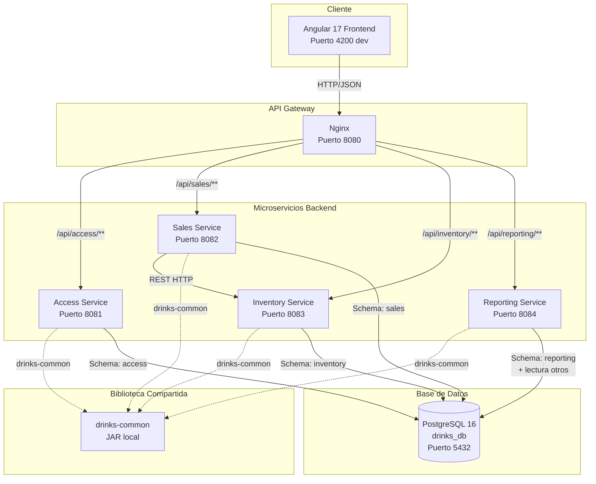
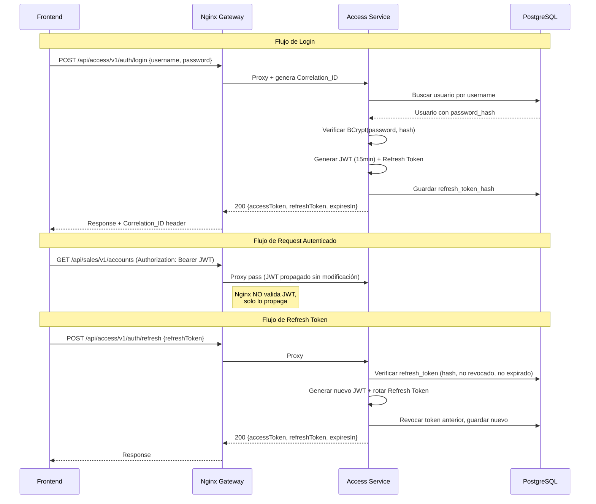
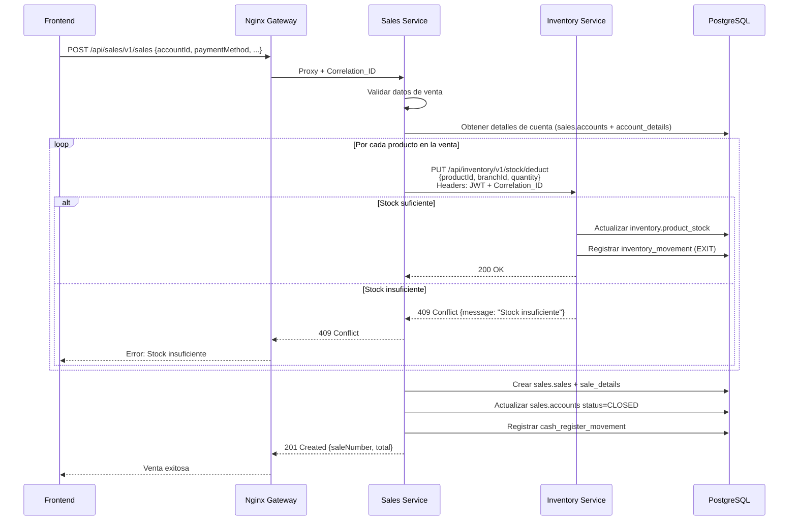
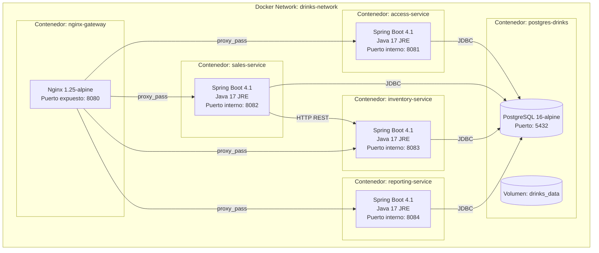
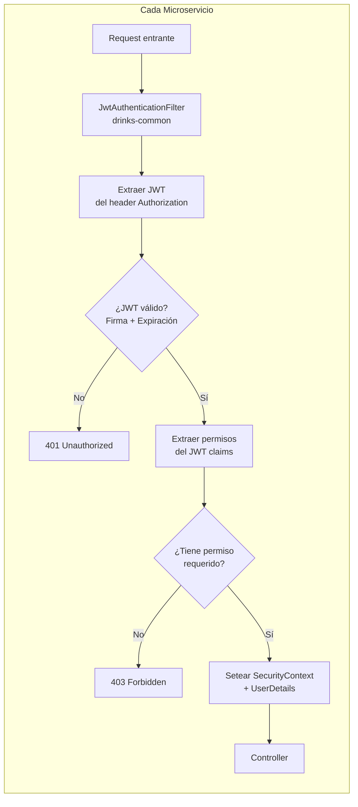

# Documento de Diseño Técnico: Arquitectura General del Sistema

## Visión General

Este documento define la arquitectura completa del Sistema de Gestión de Ventas e Inventario de Bar. El sistema se compone de cuatro microservicios backend (Access, Sales, Inventory, Reporting), un API Gateway basado en Nginx, un frontend Angular 17 y una base de datos PostgreSQL 16 compartida con esquemas separados por dominio.

### Decisiones Arquitectónicas Clave

| Decisión | Elección | Justificación |
|---|---|---|
| API Gateway | **Nginx** (reverse proxy) | Menor consumo de recursos, configuración simple, no requiere JVM adicional, probado en producción a gran escala |
| JWT Signing | **Clave secreta compartida (HMAC-SHA256)** | Suficiente para comunicación interna entre servicios del mismo equipo; evita complejidad de PKI |
| Comunicación entre servicios | **REST síncrono** | Consistencia inmediata requerida para operaciones como descuento de stock en ventas |
| Estructura Maven | **Proyectos independientes + biblioteca compartida** | Ciclo de vida de build independiente por servicio, sin acoplamiento de versiones |
| Estado frontend | **Signals de Angular 17 + servicios con estado local** | Nativo del framework, sin dependencias adicionales, suficiente para la complejidad actual |
| Connection Pool | **HikariCP** (incluido en Spring Boot) | Pool por defecto de Spring Boot, alto rendimiento, configuración simple |


### Justificación: Nginx vs Spring Cloud Gateway

| Criterio | Nginx | Spring Cloud Gateway |
|---|---|---|
| Consumo de recursos | ~10 MB RAM | ~256+ MB RAM (JVM) |
| Latencia | Sub-milisegundo | 5-15ms overhead |
| Configuración | Archivo estático `nginx.conf` | Código Java/YAML, compilación |
| Funcionalidades necesarias | Routing por prefijo, CORS, timeouts, headers | Las mismas, pero con overhead de JVM |
| Complejidad operacional | Un binario ligero | Un microservicio Spring Boot completo |
| Escalabilidad | Excelente (C10K nativo) | Buena (Reactor/Netty) |

**Conclusión:** Para este sistema donde el gateway solo necesita routing estático por prefijo, CORS y propagación de headers, Nginx es la opción óptima. Spring Cloud Gateway se justificaría si se necesitara lógica dinámica de routing, rate limiting complejo o circuit breakers integrados a nivel de gateway.

## Arquitectura

### Diagrama de Arquitectura del Sistema




### Diagrama de Flujo de Autenticación



### Diagrama de Flujo de Venta con Descuento de Stock




### Diagrama de Despliegue Docker



### Diagrama de Seguridad: Validación JWT



## Componentes e Interfaces

### Arquitectura Hexagonal: Estructura de Paquetes por Servicio

Cada microservicio sigue la misma estructura de paquetes base:

```
drinks.system.{servicename}/
├── domain/
│   ├── model/                    # Entidades de dominio, Value Objects
│   │   ├── {Entity}.java
│   │   └── {ValueObject}.java
│   ├── port/
│   │   ├── in/                   # Puertos de entrada (interfaces de casos de uso)
│   │   │   └── {UseCase}Port.java
│   │   └── out/                  # Puertos de salida (interfaces de repositorios/servicios externos)
│   │       ├── {Entity}Repository.java
│   │       └── {ExternalService}Client.java
│   └── exception/                # Excepciones de dominio
│       ├── {Entity}NotFoundException.java
│       └── BusinessRuleException.java
├── application/
│   ├── service/                  # Implementación de casos de uso
│   │   └── {UseCase}Service.java
│   ├── dto/
│   │   ├── request/              # DTOs de entrada
│   │   │   └── {Action}Request.java
│   │   └── response/            # DTOs de salida
│   │       └── {Entity}Response.java
│   └── mapper/                   # Mappers entidad <-> DTO
│       └── {Entity}Mapper.java
├── infrastructure/
│   ├── adapter/
│   │   ├── in/
│   │   │   └── rest/            # Controllers REST (adaptadores de entrada)
│   │   │       └── {Entity}Controller.java
│   │   └── out/
│   │       ├── persistence/     # Implementaciones JPA (adaptadores de salida)
│   │       │   ├── entity/      # Entidades JPA (@Entity)
│   │       │   │   └── {Entity}JpaEntity.java
│   │       │   ├── repository/  # Interfaces Spring Data JPA
│   │       │   │   └── {Entity}JpaRepository.java
│   │       │   └── adapter/     # Implementación del puerto de repositorio
│   │       │       └── {Entity}PersistenceAdapter.java
│   │       └── client/          # Clientes HTTP a otros servicios
│   │           └── {Service}RestClient.java
│   └── config/                  # Configuraciones Spring
│       ├── SecurityConfig.java
│       ├── WebConfig.java
│       └── OpenApiConfig.java
└── {ServiceName}Application.java
```


### Configuración del API Gateway (Nginx)

**Archivo: `docker/nginx/nginx.conf`**

```nginx
worker_processes auto;
error_log /var/log/nginx/error.log warn;

events {
    worker_connections 1024;
}

http {
    log_format json_combined escape=json '{'
        '"timestamp":"$time_iso8601",'
        '"remote_addr":"$remote_addr",'
        '"method":"$request_method",'
        '"uri":"$request_uri",'
        '"status":$status,'
        '"body_bytes_sent":$body_bytes_sent,'
        '"request_time":$request_time,'
        '"correlation_id":"$request_id"'
    '}';

    access_log /var/log/nginx/access.log json_combined;

    # Timeouts
    proxy_connect_timeout 10s;
    proxy_send_timeout 30s;
    proxy_read_timeout 30s;

    # Upstream definitions
    upstream access_service {
        server access-service:8081;
    }
    upstream sales_service {
        server sales-service:8082;
    }
    upstream inventory_service {
        server inventory-service:8083;
    }
    upstream reporting_service {
        server reporting-service:8084;
    }

    server {
        listen 8080;
        server_name localhost;

        # CORS Configuration
        add_header 'Access-Control-Allow-Origin' '${FRONTEND_ORIGIN}' always;
        add_header 'Access-Control-Allow-Methods' 'GET, POST, PUT, DELETE, PATCH, OPTIONS' always;
        add_header 'Access-Control-Allow-Headers' 'Authorization, Content-Type, X-Correlation-ID' always;
        add_header 'Access-Control-Expose-Headers' 'X-Correlation-ID, X-API-Version' always;

        # Preflight requests
        if ($request_method = 'OPTIONS') {
            add_header 'Access-Control-Allow-Origin' '${FRONTEND_ORIGIN}';
            add_header 'Access-Control-Allow-Methods' 'GET, POST, PUT, DELETE, PATCH, OPTIONS';
            add_header 'Access-Control-Allow-Headers' 'Authorization, Content-Type, X-Correlation-ID';
            add_header 'Access-Control-Max-Age' 3600;
            return 204;
        }

        # Correlation ID generation
        proxy_set_header X-Correlation-ID $request_id;
        proxy_set_header X-Forwarded-For $proxy_add_x_forwarded_for;
        proxy_set_header X-Forwarded-Proto $scheme;
        proxy_set_header Host $host;

        # Routing rules
        location /api/access/ {
            proxy_pass http://access_service/api/access/;
        }

        location /api/sales/ {
            proxy_pass http://sales_service/api/sales/;
        }

        location /api/inventory/ {
            proxy_pass http://inventory_service/api/inventory/;
        }

        location /api/reporting/ {
            proxy_pass http://reporting_service/api/reporting/;
        }

        # Health check endpoint del gateway
        location /health {
            return 200 '{"status": "UP"}';
            add_header Content-Type application/json;
        }

        # Error pages
        error_page 504 /504.json;
        location = /504.json {
            internal;
            return 504 '{"timestamp":"$time_iso8601","status":504,"error":"Gateway Timeout","message":"El servicio destino no respondió a tiempo","correlationId":"$request_id"}';
            add_header Content-Type application/json;
        }
    }
}
```


### Estructura de drinks-common (Biblioteca Compartida)

```
drinks-common/
├── pom.xml
└── src/main/java/drinks/system/common/
    ├── security/
    │   ├── JwtAuthenticationFilter.java      # Filtro Spring Security para validar JWT
    │   ├── JwtTokenProvider.java             # Generación y validación de tokens
    │   ├── SecurityConstants.java            # Constantes (header names, prefijos)
    │   ├── UserPrincipal.java                # UserDetails personalizado con permisos
    │   └── RequiresPermission.java           # Anotación custom para autorización por permiso
    ├── exception/
    │   ├── BaseException.java                # Excepción base abstracta
    │   ├── ResourceNotFoundException.java    # HTTP 404
    │   ├── BusinessConflictException.java    # HTTP 409
    │   ├── ValidationException.java          # HTTP 400
    │   ├── UnauthorizedException.java        # HTTP 401
    │   ├── ForbiddenException.java           # HTTP 403
    │   ├── GlobalExceptionHandler.java       # @ControllerAdvice global
    │   └── ErrorResponse.java                # DTO de respuesta de error estándar
    ├── dto/
    │   ├── PageResponse.java                 # Wrapper genérico de paginación
    │   └── ApiResponse.java                  # Wrapper genérico de respuesta exitosa
    ├── logging/
    │   ├── CorrelationIdFilter.java          # Filtro que extrae/genera Correlation_ID
    │   ├── LoggingInterceptor.java           # Interceptor para log de requests
    │   └── MdcConstants.java                 # Claves MDC (correlationId, userId, service)
    ├── client/
    │   ├── BaseRestClient.java               # Cliente HTTP base con retry y propagación de headers
    │   └── RetryConfig.java                  # Configuración de reintentos (2 max, backoff exponencial)
    └── audit/
        ├── AuditEvent.java                   # DTO de evento de auditoría
        └── Auditable.java                    # Interfaz para entidades auditables
```

### Filtro de Seguridad JWT: Diseño de Implementación

```java
// drinks-common: JwtAuthenticationFilter.java (pseudocódigo de diseño)
@Component
public class JwtAuthenticationFilter extends OncePerRequestFilter {

    @Override
    protected void doFilterInternal(HttpServletRequest request,
                                     HttpServletResponse response,
                                     FilterChain filterChain) {
        // 1. Extraer token del header "Authorization: Bearer {token}"
        String token = extractToken(request);

        if (token == null) {
            filterChain.doFilter(request, response); // continuar sin auth
            return;
        }

        // 2. Validar firma y expiración con clave secreta compartida
        if (!jwtTokenProvider.validateToken(token)) {
            response.setStatus(401);
            writeErrorResponse(response, "Token inválido o expirado");
            return;
        }

        // 3. Extraer claims: userId, username, branchId, permissions
        Claims claims = jwtTokenProvider.getClaims(token);

        // 4. Construir UserPrincipal y setear SecurityContext
        UserPrincipal principal = UserPrincipal.fromClaims(claims);
        SecurityContextHolder.getContext().setAuthentication(
            new UsernamePasswordAuthenticationToken(principal, null, principal.getAuthorities())
        );

        // 5. Setear userId en MDC para logging
        MDC.put("userId", principal.getUserId().toString());

        filterChain.doFilter(request, response);
    }
}
```

### Claims del JWT

```json
{
  "sub": "12",
  "username": "admin",
  "branchId": 1,
  "permissions": ["USER_CREATE", "USER_READ", "SALE_CREATE", "INVENTORY_READ"],
  "iat": 1700000000,
  "exp": 1700000900
}
```


### Cliente REST Inter-Servicio (con Retry y Propagación)

```java
// drinks-common: BaseRestClient.java (diseño)
public abstract class BaseRestClient {

    private final RestClient restClient;
    private static final int MAX_RETRIES = 2;
    private static final Duration INITIAL_BACKOFF = Duration.ofMillis(500);

    /**
     * Ejecuta una llamada HTTP con:
     * - Propagación automática de JWT (del SecurityContext)
     * - Propagación de Correlation_ID (del MDC)
     * - Retry con backoff exponencial (max 2 reintentos solo para 5xx)
     * - Timeout de 30 segundos
     */
    protected <T> T executeWithRetry(String method, String url, Object body, Class<T> responseType) {
        int attempts = 0;
        while (true) {
            try {
                return execute(method, url, body, responseType);
            } catch (HttpServerErrorException ex) {
                attempts++;
                if (attempts > MAX_RETRIES) {
                    log.error("Servicio destino falló después de {} reintentos: {} {}",
                              MAX_RETRIES, method, url);
                    throw ex;
                }
                Duration backoff = INITIAL_BACKOFF.multipliedBy((long) Math.pow(2, attempts - 1));
                Thread.sleep(backoff.toMillis());
            }
        }
    }

    private <T> T execute(String method, String url, Object body, Class<T> responseType) {
        return restClient.method(HttpMethod.valueOf(method))
            .uri(url)
            .header("Authorization", "Bearer " + getCurrentJwt())
            .header("X-Correlation-ID", MDC.get("correlationId"))
            .body(body)
            .retrieve()
            .body(responseType);
    }
}
```

### Manejador Global de Excepciones

```java
// drinks-common: GlobalExceptionHandler.java (diseño)
@RestControllerAdvice
public class GlobalExceptionHandler {

    @ExceptionHandler(ResourceNotFoundException.class)
    public ResponseEntity<ErrorResponse> handleNotFound(ResourceNotFoundException ex) {
        return buildError(HttpStatus.NOT_FOUND, ex.getMessage());
    }

    @ExceptionHandler(BusinessConflictException.class)
    public ResponseEntity<ErrorResponse> handleConflict(BusinessConflictException ex) {
        return buildError(HttpStatus.CONFLICT, ex.getMessage());
    }

    @ExceptionHandler(MethodArgumentNotValidException.class)
    public ResponseEntity<ErrorResponse> handleValidation(MethodArgumentNotValidException ex) {
        Map<String, String> fieldErrors = ex.getBindingResult().getFieldErrors().stream()
            .collect(Collectors.toMap(FieldError::getField, FieldError::getDefaultMessage));
        return buildValidationError(fieldErrors);
    }

    @ExceptionHandler(Exception.class)
    public ResponseEntity<ErrorResponse> handleGeneric(Exception ex) {
        log.error("Excepción no controlada", ex);
        return buildError(HttpStatus.INTERNAL_SERVER_ERROR,
                         "Ha ocurrido un error interno del servidor");
    }

    private ResponseEntity<ErrorResponse> buildError(HttpStatus status, String message) {
        ErrorResponse error = ErrorResponse.builder()
            .timestamp(Instant.now())
            .status(status.value())
            .error(status.getReasonPhrase())
            .message(message)
            .path(getCurrentRequestPath())
            .correlationId(MDC.get("correlationId"))
            .build();
        return ResponseEntity.status(status).body(error);
    }
}
```

**Formato de ErrorResponse:**
```json
{
  "timestamp": "2025-01-15T10:30:00.000Z",
  "status": 404,
  "error": "Not Found",
  "message": "Producto con ID 42 no encontrado",
  "path": "/api/inventory/v1/products/42",
  "correlationId": "abc123-def456-ghi789"
}
```


### Configuración de Logging (JSON Estructurado)

**Archivo: `src/main/resources/logback-spring.xml` (compartido por todos los servicios)**

```xml
<configuration>
    <springProperty name="SERVICE_NAME" source="spring.application.name" defaultValue="unknown"/>

    <appender name="JSON_CONSOLE" class="ch.qos.logback.core.ConsoleAppender">
        <encoder class="net.logstash.logback.encoder.LogstashEncoder">
            <customFields>{"service":"${SERVICE_NAME}"}</customFields>
            <fieldNames>
                <timestamp>timestamp</timestamp>
                <level>level</level>
                <message>message</message>
                <logger>logger</logger>
            </fieldNames>
            <includeMdcKeyName>correlationId</includeMdcKeyName>
            <includeMdcKeyName>userId</includeMdcKeyName>
        </encoder>
    </appender>

    <appender name="PLAIN_CONSOLE" class="ch.qos.logback.core.ConsoleAppender">
        <encoder>
            <pattern>%d{yyyy-MM-dd HH:mm:ss} [%thread] [%X{correlationId}] [%X{userId}] %-5level %logger{36} - %msg%n</pattern>
        </encoder>
    </appender>

    <!-- Perfil dev: log legible para humanos -->
    <springProfile name="dev">
        <root level="INFO">
            <appender-ref ref="PLAIN_CONSOLE"/>
        </root>
        <logger name="drinks.system" level="DEBUG"/>
    </springProfile>

    <!-- Perfil prod: log JSON para parsing automático -->
    <springProfile name="prod">
        <root level="INFO">
            <appender-ref ref="JSON_CONSOLE"/>
        </root>
        <logger name="drinks.system" level="INFO"/>
    </springProfile>
</configuration>
```

**Filtro CorrelationId (drinks-common):**

```java
@Component
@Order(Ordered.HIGHEST_PRECEDENCE)
public class CorrelationIdFilter extends OncePerRequestFilter {

    private static final String CORRELATION_HEADER = "X-Correlation-ID";

    @Override
    protected void doFilterInternal(HttpServletRequest request,
                                     HttpServletResponse response,
                                     FilterChain chain) {
        String correlationId = request.getHeader(CORRELATION_HEADER);
        if (correlationId == null || correlationId.isBlank()) {
            correlationId = UUID.randomUUID().toString();
        }

        MDC.put("correlationId", correlationId);
        response.setHeader(CORRELATION_HEADER, correlationId);

        try {
            chain.doFilter(request, response);
        } finally {
            MDC.remove("correlationId");
        }
    }
}
```

**Ejemplo de log JSON en producción:**
```json
{
  "timestamp": "2025-01-15T10:30:00.123Z",
  "level": "INFO",
  "service": "sales-service",
  "correlationId": "abc123-def456",
  "userId": "12",
  "message": "Venta registrada exitosamente",
  "context": {"saleNumber": "VTA-001-20250115", "total": 150.00}
}
```


### Docker Compose Completo

```yaml
version: '3.8'

services:
  # Base de datos PostgreSQL
  postgres-drinks:
    image: postgres:16-alpine
    container_name: drinks-db
    environment:
      POSTGRES_DB: ${DB_NAME:-drinks_db}
      POSTGRES_USER: ${DB_ADMIN_USER:-drinks_admin}
      POSTGRES_PASSWORD: ${DB_ADMIN_PASSWORD}
    ports:
      - "${DB_PORT:-5432}:5432"
    volumes:
      - drinks_data:/var/lib/postgresql/data
      - ./docker/init-schemas.sql:/docker-entrypoint-initdb.d/01-init-schemas.sql
    healthcheck:
      test: ["CMD-SHELL", "pg_isready -U ${DB_ADMIN_USER:-drinks_admin} -d ${DB_NAME:-drinks_db}"]
      interval: 10s
      timeout: 5s
      retries: 5
    networks:
      - drinks-network

  # API Gateway
  nginx-gateway:
    image: nginx:1.25-alpine
    container_name: drinks-gateway
    ports:
      - "8080:8080"
    volumes:
      - ./docker/nginx/nginx.conf:/etc/nginx/nginx.conf:ro
    depends_on:
      access-service:
        condition: service_healthy
      sales-service:
        condition: service_healthy
      inventory-service:
        condition: service_healthy
      reporting-service:
        condition: service_healthy
    networks:
      - drinks-network

  # Access Service
  access-service:
    build:
      context: ./access-service
      dockerfile: Dockerfile
    container_name: drinks-access
    environment:
      - SPRING_PROFILES_ACTIVE=prod
      - DB_HOST=postgres-drinks
      - DB_PORT=5432
      - DB_NAME=${DB_NAME:-drinks_db}
      - DB_ADMIN_USER=${DB_ADMIN_USER:-drinks_admin}
      - DB_ADMIN_PASSWORD=${DB_ADMIN_PASSWORD}
      - ACCESS_DB_USER=${ACCESS_DB_USER}
      - ACCESS_DB_PASSWORD=${ACCESS_DB_PASSWORD}
      - JWT_SECRET=${JWT_SECRET}
      - JWT_EXPIRATION_MINUTES=15
      - REFRESH_TOKEN_EXPIRATION_DAYS=7
    depends_on:
      postgres-drinks:
        condition: service_healthy
    healthcheck:
      test: ["CMD", "curl", "-f", "http://localhost:8081/actuator/health"]
      interval: 30s
      timeout: 10s
      retries: 3
      start_period: 60s
    networks:
      - drinks-network

  # Sales Service
  sales-service:
    build:
      context: ./sales-service
      dockerfile: Dockerfile
    container_name: drinks-sales
    environment:
      - SPRING_PROFILES_ACTIVE=prod
      - DB_HOST=postgres-drinks
      - DB_PORT=5432
      - DB_NAME=${DB_NAME:-drinks_db}
      - SALES_DB_USER=${SALES_DB_USER}
      - SALES_DB_PASSWORD=${SALES_DB_PASSWORD}
      - JWT_SECRET=${JWT_SECRET}
      - INVENTORY_SERVICE_URL=http://inventory-service:8083
    depends_on:
      postgres-drinks:
        condition: service_healthy
      access-service:
        condition: service_healthy
    healthcheck:
      test: ["CMD", "curl", "-f", "http://localhost:8082/actuator/health"]
      interval: 30s
      timeout: 10s
      retries: 3
      start_period: 60s
    networks:
      - drinks-network

  # Inventory Service
  inventory-service:
    build:
      context: ./inventory-service
      dockerfile: Dockerfile
    container_name: drinks-inventory
    environment:
      - SPRING_PROFILES_ACTIVE=prod
      - DB_HOST=postgres-drinks
      - DB_PORT=5432
      - DB_NAME=${DB_NAME:-drinks_db}
      - INVENTORY_DB_USER=${INVENTORY_DB_USER}
      - INVENTORY_DB_PASSWORD=${INVENTORY_DB_PASSWORD}
      - JWT_SECRET=${JWT_SECRET}
    depends_on:
      postgres-drinks:
        condition: service_healthy
      access-service:
        condition: service_healthy
    healthcheck:
      test: ["CMD", "curl", "-f", "http://localhost:8083/actuator/health"]
      interval: 30s
      timeout: 10s
      retries: 3
      start_period: 60s
    networks:
      - drinks-network

  # Reporting Service
  reporting-service:
    build:
      context: ./reporting-service
      dockerfile: Dockerfile
    container_name: drinks-reporting
    environment:
      - SPRING_PROFILES_ACTIVE=prod
      - DB_HOST=postgres-drinks
      - DB_PORT=5432
      - DB_NAME=${DB_NAME:-drinks_db}
      - REPORTING_DB_USER=${REPORTING_DB_USER}
      - REPORTING_DB_PASSWORD=${REPORTING_DB_PASSWORD}
      - JWT_SECRET=${JWT_SECRET}
    depends_on:
      postgres-drinks:
        condition: service_healthy
      access-service:
        condition: service_healthy
    healthcheck:
      test: ["CMD", "curl", "-f", "http://localhost:8084/actuator/health"]
      interval: 30s
      timeout: 10s
      retries: 3
      start_period: 60s
    networks:
      - drinks-network

volumes:
  drinks_data:

networks:
  drinks-network:
    driver: bridge
```


### Dockerfile Multi-Stage (Patrón Compartido)

```dockerfile
# Stage 1: Build
FROM eclipse-temurin:17-jdk-alpine AS builder
WORKDIR /app

# Copiar dependencias primero para cachear
COPY pom.xml .
COPY .mvn .mvn
COPY mvnw .
RUN chmod +x mvnw && ./mvnw dependency:go-offline -B

# Copiar código fuente y compilar
COPY src ./src
RUN ./mvnw package -DskipTests -B

# Stage 2: Runtime
FROM eclipse-temurin:17-jre-alpine AS runtime
WORKDIR /app

# Crear usuario no-root
RUN addgroup -S appgroup && adduser -S appuser -G appgroup
USER appuser

# Copiar JAR del stage de build
COPY --from=builder /app/target/*.jar app.jar

# Health check
HEALTHCHECK --interval=30s --timeout=10s --start-period=60s --retries=3 \
    CMD wget --no-verbose --tries=1 --spider http://localhost:${SERVER_PORT:-8081}/actuator/health || exit 1

EXPOSE ${SERVER_PORT:-8081}
ENTRYPOINT ["java", "-jar", "app.jar"]
```

### Estructura de Configuración Spring Boot

**Cada servicio mantiene la misma estructura de archivos de configuración:**

```
src/main/resources/
├── application.yml              # Configuración base (compartida entre perfiles)
├── application-dev.yml          # Configuración para desarrollo local
├── application-prod.yml         # Configuración para producción (todo externalizado)
├── logback-spring.xml           # Configuración de logging (JSON prod, plain dev)
└── db/migration/                # Solo en access-service (Flyway)
    ├── V0__create_schemas.sql
    └── ...
```

**Ejemplo: application.yml (Sales Service)**

```yaml
spring:
  application:
    name: sales-service
  datasource:
    url: jdbc:postgresql://${DB_HOST:localhost}:${DB_PORT:5432}/${DB_NAME:drinks_db}
    username: ${SALES_DB_USER:sales_user}
    password: ${SALES_DB_PASSWORD:dev_password_sales}
    driver-class-name: org.postgresql.Driver
    hikari:
      maximum-pool-size: ${HIKARI_MAX_POOL_SIZE:10}
      minimum-idle: ${HIKARI_MIN_IDLE:5}
      idle-timeout: 300000
      connection-timeout: 20000
      max-lifetime: 1200000
  jpa:
    hibernate:
      ddl-auto: validate
    properties:
      hibernate:
        default_schema: sales
        dialect: org.hibernate.dialect.PostgreSQLDialect
    open-in-view: false

server:
  port: 8082

# Configuración de servicios externos
services:
  inventory:
    url: ${INVENTORY_SERVICE_URL:http://localhost:8083}
    timeout: 30s
    retry:
      max-attempts: 2
      initial-backoff: 500ms

# JWT
security:
  jwt:
    secret: ${JWT_SECRET:dev-secret-key-min-256-bits-for-hmac-sha256}
    expiration-minutes: ${JWT_EXPIRATION_MINUTES:15}

# Actuator
management:
  endpoints:
    web:
      exposure:
        include: health,info
  endpoint:
    health:
      show-details: when-authorized
  info:
    build:
      enabled: true
```

**Ejemplo: application-prod.yml (aplica a todos los servicios)**

```yaml
spring:
  datasource:
    hikari:
      maximum-pool-size: ${HIKARI_MAX_POOL_SIZE}
      minimum-idle: ${HIKARI_MIN_IDLE}

# En prod, NO hay valores por defecto - falla si falta variable
security:
  jwt:
    secret: ${JWT_SECRET}

server:
  error:
    include-stacktrace: never
    include-message: never
```


### Arquitectura Frontend (Angular 17)

```
drinks-system-front/
├── angular.json
├── package.json
├── src/
│   ├── app/
│   │   ├── app.component.ts
│   │   ├── app.config.ts                    # provideHttpClient, provideRouter
│   │   ├── app.routes.ts                    # Lazy loading por feature
│   │   ├── core/                            # Singleton services, guards, interceptors
│   │   │   ├── interceptors/
│   │   │   │   ├── auth.interceptor.ts      # Adjunta JWT a requests
│   │   │   │   ├── error.interceptor.ts     # Manejo global de errores HTTP
│   │   │   │   └── correlation.interceptor.ts # Lee Correlation_ID del response
│   │   │   ├── guards/
│   │   │   │   ├── auth.guard.ts            # Verifica autenticación
│   │   │   │   └── permission.guard.ts      # Verifica permiso específico
│   │   │   ├── services/
│   │   │   │   ├── auth.service.ts          # Login, logout, refresh token
│   │   │   │   ├── token-storage.service.ts # Almacenamiento seguro de tokens
│   │   │   │   └── notification.service.ts  # Toasts/snackbars globales
│   │   │   └── models/
│   │   │       ├── user.model.ts
│   │   │       └── api-response.model.ts
│   │   ├── shared/                          # Componentes, pipes, directivas reutilizables
│   │   │   ├── components/
│   │   │   │   ├── data-table/
│   │   │   │   ├── confirm-dialog/
│   │   │   │   ├── loading-spinner/
│   │   │   │   └── page-header/
│   │   │   ├── pipes/
│   │   │   │   ├── currency-bo.pipe.ts      # Formato moneda boliviana
│   │   │   │   └── date-format.pipe.ts
│   │   │   └── directives/
│   │   │       └── has-permission.directive.ts  # *hasPermission="'SALE_CREATE'"
│   │   ├── features/
│   │   │   ├── access/                      # Feature module: usuarios, roles, config
│   │   │   │   ├── access.routes.ts
│   │   │   │   ├── pages/
│   │   │   │   ├── components/
│   │   │   │   └── services/
│   │   │   ├── sales/                       # Feature module: cuentas, ventas, cajas
│   │   │   │   ├── sales.routes.ts
│   │   │   │   ├── pages/
│   │   │   │   ├── components/
│   │   │   │   └── services/
│   │   │   ├── inventory/                   # Feature module: productos, stock, compras
│   │   │   │   ├── inventory.routes.ts
│   │   │   │   ├── pages/
│   │   │   │   ├── components/
│   │   │   │   └── services/
│   │   │   └── reporting/                   # Feature module: dashboards, reportes
│   │   │       ├── reporting.routes.ts
│   │   │       ├── pages/
│   │   │       ├── components/
│   │   │       └── services/
│   │   └── layout/                          # Shell de la aplicación
│   │       ├── main-layout/
│   │       ├── sidebar/
│   │       └── topbar/
│   ├── environments/
│   │   ├── environment.ts                   # dev (apiUrl: http://localhost:8080)
│   │   └── environment.prod.ts             # prod (apiUrl desde build)
│   └── styles/                             # SCSS globales + tema Angular Material
```

**Routing con Lazy Loading:**

```typescript
// app.routes.ts
export const routes: Routes = [
  { path: 'login', loadComponent: () => import('./features/access/pages/login/login.component') },
  {
    path: '',
    component: MainLayoutComponent,
    canActivate: [authGuard],
    children: [
      {
        path: 'access',
        loadChildren: () => import('./features/access/access.routes'),
        canActivate: [permissionGuard],
        data: { permission: 'MODULE_ACCESS' }
      },
      {
        path: 'sales',
        loadChildren: () => import('./features/sales/sales.routes'),
        canActivate: [permissionGuard],
        data: { permission: 'MODULE_SALES' }
      },
      {
        path: 'inventory',
        loadChildren: () => import('./features/inventory/inventory.routes'),
        canActivate: [permissionGuard],
        data: { permission: 'MODULE_INVENTORY' }
      },
      {
        path: 'reporting',
        loadChildren: () => import('./features/reporting/reporting.routes'),
        canActivate: [permissionGuard],
        data: { permission: 'MODULE_REPORTING' }
      }
    ]
  }
];
```

**Auth Interceptor (renovación automática):**

```typescript
// core/interceptors/auth.interceptor.ts
export const authInterceptor: HttpInterceptorFn = (req, next) => {
  const authService = inject(AuthService);
  const token = authService.getAccessToken();

  if (token) {
    req = req.clone({ setHeaders: { Authorization: `Bearer ${token}` } });
  }

  return next(req).pipe(
    catchError((error: HttpErrorResponse) => {
      if (error.status === 401 && !req.url.includes('/auth/refresh')) {
        return authService.refreshToken().pipe(
          switchMap((newToken) => {
            req = req.clone({ setHeaders: { Authorization: `Bearer ${newToken}` } });
            return next(req);
          }),
          catchError(() => {
            authService.logout();
            return throwError(() => error);
          })
        );
      }
      return throwError(() => error);
    })
  );
};
```

**Gestión de Estado con Signals:**

```typescript
// Ejemplo: SalesStateService (estado local por feature)
@Injectable({ providedIn: 'root' })
export class SalesStateService {
  private _openAccounts = signal<Account[]>([]);
  private _loading = signal(false);

  readonly openAccounts = this._openAccounts.asReadonly();
  readonly loading = this._loading.asReadonly();
  readonly totalAccounts = computed(() => this._openAccounts().length);

  loadAccounts(branchId: number): void {
    this._loading.set(true);
    // ... HTTP call, then update signal
  }
}
```


### Estructura Maven: Proyectos Independientes + drinks-common

**Justificación: Proyectos independientes vs Multi-módulo Maven**

Se opta por proyectos Maven **independientes** (cada uno con su propio `pom.xml` raíz) en lugar de un POM padre multi-módulo por las siguientes razones:

1. **Ciclo de vida independiente**: Cada servicio se compila, prueba y despliega sin afectar los demás
2. **Menor tiempo de build**: No se recompila todo el sistema por un cambio en un servicio
3. **Independencia de IDEs**: Cada servicio se puede abrir como proyecto independiente
4. **Versionado independiente**: Cada servicio evoluciona a su propio ritmo
5. **CI/CD más simple**: Pipelines independientes por servicio

**drinks-common se instala en el repositorio Maven local** con `mvn install` y se referencia como dependencia:

```xml
<!-- pom.xml de drinks-common -->
<project>
    <parent>
        <groupId>org.springframework.boot</groupId>
        <artifactId>spring-boot-starter-parent</artifactId>
        <version>4.1.0</version>
    </parent>
    <groupId>drinks.system</groupId>
    <artifactId>drinks-common</artifactId>
    <version>1.0.0-SNAPSHOT</version>
    <packaging>jar</packaging>

    <dependencies>
        <dependency>
            <groupId>org.springframework.boot</groupId>
            <artifactId>spring-boot-starter-webmvc</artifactId>
        </dependency>
        <dependency>
            <groupId>org.springframework.boot</groupId>
            <artifactId>spring-boot-starter-security</artifactId>
        </dependency>
        <!-- JWT -->
        <dependency>
            <groupId>io.jsonwebtoken</groupId>
            <artifactId>jjwt-api</artifactId>
            <version>0.12.6</version>
        </dependency>
        <dependency>
            <groupId>io.jsonwebtoken</groupId>
            <artifactId>jjwt-impl</artifactId>
            <version>0.12.6</version>
            <scope>runtime</scope>
        </dependency>
        <dependency>
            <groupId>io.jsonwebtoken</groupId>
            <artifactId>jjwt-jackson</artifactId>
            <version>0.12.6</version>
            <scope>runtime</scope>
        </dependency>
        <!-- Logging JSON -->
        <dependency>
            <groupId>net.logstash.logback</groupId>
            <artifactId>logstash-logback-encoder</artifactId>
            <version>7.4</version>
        </dependency>
        <!-- Lombok -->
        <dependency>
            <groupId>org.projectlombok</groupId>
            <artifactId>lombok</artifactId>
            <optional>true</optional>
        </dependency>
    </dependencies>
</project>
```

```xml
<!-- En cada microservicio: dependencia a drinks-common -->
<dependency>
    <groupId>drinks.system</groupId>
    <artifactId>drinks-common</artifactId>
    <version>1.0.0-SNAPSHOT</version>
</dependency>
```

### Variables de Entorno Completas (.env)

```env
# ====== Base de Datos ======
DB_HOST=postgres-drinks
DB_PORT=5432
DB_NAME=drinks_db
DB_ADMIN_USER=drinks_admin
DB_ADMIN_PASSWORD=change_me_admin_prod

# Usuarios por servicio (acceso limitado por esquema)
ACCESS_DB_USER=access_user
ACCESS_DB_PASSWORD=change_me_access_prod
SALES_DB_USER=sales_user
SALES_DB_PASSWORD=change_me_sales_prod
INVENTORY_DB_USER=inventory_user
INVENTORY_DB_PASSWORD=change_me_inventory_prod
REPORTING_DB_USER=reporting_user
REPORTING_DB_PASSWORD=change_me_reporting_prod

# ====== Seguridad ======
JWT_SECRET=your-256-bit-secret-key-must-be-at-least-32-chars
JWT_EXPIRATION_MINUTES=15
REFRESH_TOKEN_EXPIRATION_DAYS=7

# ====== Connection Pool ======
HIKARI_MAX_POOL_SIZE=10
HIKARI_MIN_IDLE=5

# ====== API Gateway ======
FRONTEND_ORIGIN=http://localhost:4200

# ====== URLs de Servicios (para comunicación inter-servicio) ======
INVENTORY_SERVICE_URL=http://inventory-service:8083
ACCESS_SERVICE_URL=http://access-service:8081
```


## Modelos de Datos

### Modelos de Dominio Principales (por servicio)

Los modelos de datos de base de datos están definidos en el [Documento de Diseño de Base de Datos](../database-design/design.md). Aquí se definen los modelos a nivel de aplicación.

### DTOs Compartidos (drinks-common)

```java
// ErrorResponse - respuesta de error estándar
@Builder
public record ErrorResponse(
    Instant timestamp,
    int status,
    String error,
    String message,
    String path,
    String correlationId,
    Map<String, String> fieldErrors  // solo para validación (400)
) {}

// PageResponse<T> - respuesta paginada genérica
@Builder
public record PageResponse<T>(
    List<T> content,
    int page,
    int size,
    long totalElements,
    int totalPages,
    boolean first,
    boolean last
) {}

// ApiResponse<T> - wrapper de respuesta exitosa
@Builder
public record ApiResponse<T>(
    T data,
    String message,
    Instant timestamp
) {}
```

### Modelos de Seguridad

```java
// UserPrincipal - datos del usuario autenticado (extraídos del JWT)
public record UserPrincipal(
    Long userId,
    String username,
    Long branchId,
    List<String> permissions
) implements UserDetails {

    @Override
    public Collection<? extends GrantedAuthority> getAuthorities() {
        return permissions.stream()
            .map(SimpleGrantedAuthority::new)
            .toList();
    }

    public boolean hasPermission(String permission) {
        return permissions.contains(permission);
    }
}

// AuthResponse - respuesta de login exitoso
public record AuthResponse(
    String accessToken,
    String refreshToken,
    long expiresIn,       // segundos hasta expiración
    String tokenType      // "Bearer"
) {}

// RefreshTokenRequest
public record RefreshTokenRequest(
    @NotBlank String refreshToken
) {}
```

### Modelos de Comunicación Inter-Servicio

```java
// StockDeductionRequest - Sales -> Inventory
public record StockDeductionRequest(
    @NotNull Long productId,
    @NotNull Long branchId,
    @NotNull @Positive Integer quantity,
    @NotBlank String referenceType,  // "SALE"
    Long referenceId                  // sale_id
) {}

// StockDeductionResponse - Inventory -> Sales
public record StockDeductionResponse(
    Long productId,
    Long branchId,
    int previousStock,
    int newStock,
    Long movementId
) {}
```

### Modelo de Auditoría

```java
// AuditEvent - evento para registrar en audit_logs
public record AuditEvent(
    Long userId,
    String username,
    String action,          // CREATE, UPDATE, DELETE
    String module,          // SALES, INVENTORY, ACCESS
    String entityName,      // "Product", "Sale", "User"
    Long entityId,
    Object oldValues,       // se serializa a JSONB
    Object newValues,       // se serializa a JSONB
    String ipAddress,
    String description
) {}
```


## Propiedades de Correctitud

*Una propiedad es una característica o comportamiento que debe mantenerse verdadero en todas las ejecuciones válidas de un sistema — esencialmente, una declaración formal sobre lo que el sistema debe hacer. Las propiedades sirven como puente entre las especificaciones legibles por humanos y las garantías de correctitud verificables por máquina.*

### Property 1: Round-trip de JWT (generación y validación)

*Para cualquier* combinación válida de (userId, username, branchId, listaPermisos), si JwtTokenProvider genera un JWT con esos datos y luego se valida ese mismo JWT con la misma clave secreta, los claims extraídos deben ser idénticos a los datos originales y la expiración debe estar dentro de los 15 minutos configurados.

**Validates: Requirements 4.1, 4.2, 4.8**

### Property 2: Decisión de autorización por permisos

*Para cualquier* JWT válido conteniendo una lista de permisos P y *para cualquier* endpoint protegido que requiere un permiso R, la decisión de autorización es: permitido si R ∈ P, denegado (403) si R ∉ P.

**Validates: Requirements 4.4, 4.11, 13.5**

### Property 3: Rechazo de tokens inválidos

*Para cualquier* string arbitrario que no sea un JWT firmado con la clave secreta configurada del sistema, el JwtAuthenticationFilter debe rechazar la solicitud con HTTP 401 Unauthorized sin propagar la solicitud al controller.

**Validates: Requirements 4.10**

### Property 4: Estructura de respuesta de error

*Para cualquier* excepción procesada por el GlobalExceptionHandler, la respuesta JSON resultante debe contener exactamente los campos: timestamp (ISO-8601), status (entero HTTP), error (nombre del status), message (string no vacío), path (ruta del request) y correlationId (string no vacío). Ningún campo puede ser nulo.

**Validates: Requirements 6.2, 6.7**

### Property 5: Ocultamiento de detalles internos en errores 500

*Para cualquier* excepción no mapeada (Exception genérica) con cualquier mensaje conteniendo nombres de clases Java, stack traces o detalles de implementación, la respuesta HTTP 500 debe contener únicamente un mensaje genérico predefinido sin exponer información interna.

**Validates: Requirements 6.6**

### Property 6: Propagación de headers en comunicación inter-servicio

*Para cualquier* llamada HTTP realizada por BaseRestClient con un JWT en el SecurityContext y un correlationId en el MDC, la solicitud HTTP saliente debe incluir los headers `Authorization: Bearer {jwt}` y `X-Correlation-ID: {correlationId}` con los valores exactos del contexto original.

**Validates: Requirements 3.7, 5.5**

### Property 7: Reintentos con backoff exponencial para errores de servidor

*Para cualquier* llamada inter-servicio que recibe una respuesta HTTP 5xx, el BaseRestClient debe realizar exactamente 2 reintentos adicionales con tiempos de espera crecientes (backoff exponencial), y si los 3 intentos fallan, propagar la excepción original.

**Validates: Requirements 5.6**

### Property 8: Formato de log JSON estructurado

*Para cualquier* evento de log generado durante el procesamiento de un request (con correlationId y userId en MDC), el output JSON en perfil `prod` debe contener los campos: timestamp, level, service, correlationId, userId y message.

**Validates: Requirements 7.1, 7.2**

### Property 9: Mapeo completo de errores de validación

*Para cualquier* conjunto de errores de validación de campos (MethodArgumentNotValidException con N field errors), la respuesta HTTP 400 debe contener en `fieldErrors` exactamente los N campos con sus respectivos mensajes de error, sin omitir ni agregar campos adicionales.

**Validates: Requirements 6.3**


## Manejo de Errores

### Estrategia por Capa

| Capa | Responsabilidad | Acción |
|---|---|---|
| **Controller** (adaptador entrada) | Captura excepciones de aplicación | Delega al GlobalExceptionHandler |
| **Application Service** | Valida reglas de negocio | Lanza BusinessConflictException, ResourceNotFoundException |
| **Domain** | Invariantes de dominio | Lanza excepciones de dominio específicas |
| **Infrastructure** (persistence) | Errores de DB | Traduce a excepciones de dominio (ej: ConstraintViolation → ConflictException) |
| **Infrastructure** (client HTTP) | Errores de comunicación | Retry + log + propaga con contexto |

### Jerarquía de Excepciones (drinks-common)

```
BaseException (abstract)
├── ResourceNotFoundException        → HTTP 404
├── BusinessConflictException        → HTTP 409
├── ValidationException              → HTTP 400
├── UnauthorizedException            → HTTP 401
└── ForbiddenException               → HTTP 403
```

### Mapeo de Excepciones de Spring

| Excepción Spring | HTTP Status | Tratamiento |
|---|---|---|
| `MethodArgumentNotValidException` | 400 | Lista de campos inválidos |
| `HttpMessageNotReadableException` | 400 | "Formato de solicitud inválido" |
| `HttpRequestMethodNotSupportedException` | 405 | Método no permitido |
| `NoHandlerFoundException` | 404 | Ruta no encontrada |
| `DataIntegrityViolationException` | 409 | Conflicto de integridad |
| `Exception` (genérica) | 500 | Mensaje genérico, log ERROR completo |

### Manejo de Errores en Comunicación Inter-Servicio

```
Respuesta del servicio destino    → Acción del servicio invocante
─────────────────────────────────────────────────────────────────
HTTP 4xx (excepto 401)            → Propagar el error al cliente con mensaje descriptivo
HTTP 401                          → Log WARN + propagar 401 (token inválido)
HTTP 5xx                          → Retry (max 2) + si falla: log ERROR + propagar 503
Timeout                           → Log ERROR + retornar 504 con Correlation_ID
Connection refused                → Log ERROR + retornar 503 "Servicio no disponible"
```

### Manejo de Errores en Frontend

```typescript
// error.interceptor.ts - Manejo centralizado
export const errorInterceptor: HttpInterceptorFn = (req, next) => {
  return next(req).pipe(
    catchError((error: HttpErrorResponse) => {
      switch (error.status) {
        case 400:
          // Mostrar errores de validación en el formulario
          break;
        case 403:
          // Mostrar notificación "Sin permisos"
          break;
        case 404:
          // Mostrar notificación "Recurso no encontrado"
          break;
        case 409:
          // Mostrar notificación con mensaje de conflicto
          break;
        case 500:
        case 503:
        case 504:
          // Mostrar notificación genérica de error del servidor
          break;
      }
      return throwError(() => error);
    })
  );
};
```


## Estrategia de Testing

### Enfoque Dual: Tests Unitarios + Tests de Propiedades

El sistema utiliza una estrategia de testing en múltiples niveles:

| Nivel | Herramientas | Propósito |
|---|---|---|
| **Property-based tests** | jqwik (Java), fast-check (Angular/TS) | Validar propiedades universales con inputs generados |
| **Unit tests** | JUnit 5 + Mockito (Java), Jasmine (Angular) | Casos específicos, edge cases, mocks |
| **Integration tests** | Testcontainers + Spring Boot Test | Flujos completos con DB real |
| **Architecture tests** | ArchUnit | Verificar estructura hexagonal y dependencias |
| **E2E tests** | Docker Compose + HTTPie/RestAssured | Sistema completo arrancado |

### Tests de Propiedades (Property-Based Testing)

**Biblioteca elegida (Java): [jqwik](https://jqwik.net/)** - framework PBT nativo para JUnit 5

**Biblioteca elegida (TypeScript): [fast-check](https://fast-check.dev/)** - framework PBT para JavaScript/TypeScript

**Configuración:**
- Mínimo 100 iteraciones por propiedad
- Cada test debe referenciar la propiedad del diseño en un comentario

**Formato de tag:**
```java
// Feature: system-architecture, Property 1: Round-trip de JWT
@Property(tries = 100)
void jwtRoundTrip(@ForAll @StringLength(min = 1, max = 50) String username, ...) { ... }
```

**Propiedades a implementar:**

| # | Propiedad | Componente | Generadores necesarios |
|---|---|---|---|
| 1 | Round-trip JWT | `JwtTokenProvider` | userId (Long), username (String), branchId (Long), permisos (List<String>) |
| 2 | Autorización por permisos | `JwtAuthenticationFilter` + `@RequiresPermission` | Lista de permisos, permiso requerido |
| 3 | Rechazo tokens inválidos | `JwtAuthenticationFilter` | Strings arbitrarios, JWTs con firma incorrecta |
| 4 | Estructura ErrorResponse | `GlobalExceptionHandler` | Tipos de excepción, mensajes, paths |
| 5 | Ocultamiento detalles 500 | `GlobalExceptionHandler` | Excepciones con mensajes conteniendo class names |
| 6 | Propagación headers | `BaseRestClient` | JWTs, correlation IDs |
| 7 | Retry backoff | `BaseRestClient` | Status codes 5xx, tiempos |
| 8 | Log JSON estructurado | Configuración Logback | Mensajes, niveles, contexto MDC |
| 9 | Mapeo validación | `GlobalExceptionHandler` | Conjuntos de field errors |

### Tests Unitarios (Ejemplo-based)

Casos específicos que complementan las propiedades:

- **Login exitoso**: credenciales correctas retorna tokens
- **Login fallido**: credenciales incorrectas retorna 401
- **Refresh token rotation**: token anterior se revoca
- **Token theft detection**: token revocado + intento → revocar todos
- **Timeout gateway**: servicio lento → 504
- **Stock insuficiente en venta**: Inventory retorna 409 → Sales rechaza venta completa

### Tests de Integración

- **Flujo completo de autenticación**: login → request autenticado → refresh → logout
- **Flujo de venta con descuento de stock**: crear cuenta → agregar items → cerrar cuenta → registrar venta → verificar stock
- **Docker Compose smoke test**: `docker compose up` → verificar todos los servicios saludables
- **Routing del gateway**: verificar que cada prefijo llega al servicio correcto
- **Flyway migrations**: verificar que todas las migraciones se aplican sin error

### Tests de Arquitectura (ArchUnit)

```java
@ArchTest
static final ArchRule domainShouldNotDependOnInfrastructure =
    noClasses()
        .that().resideInAPackage("..domain..")
        .should().dependOnClassesThat().resideInAPackage("..infrastructure..");

@ArchTest
static final ArchRule domainShouldNotUseSpring =
    noClasses()
        .that().resideInAPackage("..domain..")
        .should().dependOnClassesThat().resideInAPackage("org.springframework..");

@ArchTest
static final ArchRule controllersShouldOnlyCallApplicationServices =
    classes()
        .that().resideInAPackage("..adapter.in.rest..")
        .should().onlyDependOnClassesThat()
        .resideInAnyPackage("..application..", "..domain.model..", "..domain.exception..",
                            "org.springframework..", "java..", "jakarta..");
```

### Tests Frontend (Angular)

- **Property tests con fast-check**:
  - Auth interceptor adjunta JWT para cualquier request y token
  - Permission guard autoriza/deniega correctamente
- **Unit tests con Jasmine**:
  - Auth service: login, logout, refresh flow
  - Error interceptor: manejo de cada código HTTP
  - Components: rendering correcto con datos mock
- **E2E (opcional futuro)**: Cypress o Playwright para flujos de usuario completos

